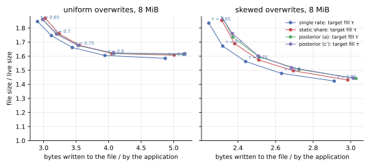
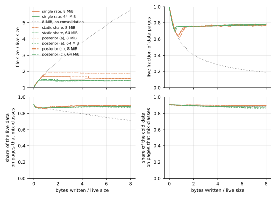
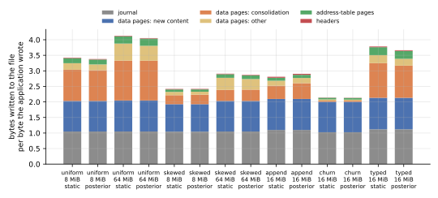
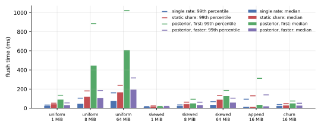

**On kladde-bench's workloads, a posterior per chunk cleans no better than one rate per page, under either rule, and costs more to keep and to rank.**
[The Bayesian draft](../drafts/bayesian-ripeness.md)'s cure model, started from the file's empirical prior, ran on a branch of kladde-rust, deciding by the expected gain, rule (a), and by the option to wait, rule (c′).
Without the consolidator state, its live pages take the same space as the single-rate branch's to within 0.3 % in every run of 8 MiB or more.
It writes as much, to within 0.6 %, under uniform overwrites, on the mixed workload, and under churn, but 0.5 to 1.1 % more under skewed overwrites and 4 to 5 % more under appends.
Rules (a) and (c′) write within 0.7 % of each other without the state, and within 1.2 % with it: (c′) is (a) in effect, as the draft's simulation found.
The consolidator state costs 2.5 to 12.6 % of the bytes written, nearly the static-share branch's 2.7 to 13.8 %, against the single-rate branch's 1.4 to 7.4 %.
And ranking, a mixture over up to some 300 chunks per page, first made flushes take 2.3 to 9.5 times as long as the single-rate branch's; with the index found by regula falsi on logarithms, they take 1.3 to 2.5 times as long, and two thirds to 1.4 times as long as the static-share branch's, in runs of 8 MiB or more.

**The posterior finds static content where the static-share fit found little, and cleaning cannot use it.**
On the mixed workload, where 45 % of the live data never changes, it expects 6 % of the live bytes to be static, against the fit's 2 % at most; yet nine tenths of the cold data share a page with data that changes, on every branch alike, since what a cleaned page's survivors are packed beside does not depend on which page was cleaned.
Where the content it calls static only lives long, logs until they rotate or cold data that still dies slowly, it cleans earlier and moves 5 to 18 % more bytes, which make up most of its extra writes.

**The file's empirical prior is sure of what it has not seen.**
Where fresh pages lose content early, it comes out as the draft intends: sure under uniform overwrites, where they all drain alike, and weak under skewed ones, where they differ.
But where they have lost nothing, as in the fill phase that starts the overwrite workloads and churn, or under appends, whose logs rotate long after a page's first flushes, it comes out at the floor rate with the weight of 1000 loss events, which a page's own losses take some hundred flushes to outweigh.
The pages written in the fill phase then look static while they drain: in the first ten flushes of the skewed and mixed workloads at 8 MiB and of churn, the posterior cleaned 22 to 132 pages where the other branches cleaned three at most, and on the mixed workload, the file's peak, and with it its size for the rest of the run, came out 11 % larger.

## What was measured

**The [same benchmark](consolidation.md#what-was-measured) ran on the `bayesian-ripeness` branch of kladde-rust, which implements [the draft](../drafts/bayesian-ripeness.md) as of kladde-docs commit `369ae0e`, in four configurations: rules (a) and (c′), each with and without the consolidator state.**
The branch is at `9f99a1f`, on top of the static-share branch at `a856b06`; it replaces the fit and its test with the posterior, and the consolidator state's entries with the posterior's, and changes nothing else that the benchmark exercises.
The benchmark is deterministic but for its times, so every number of these runs but the times compares with those of the single-rate branch and main on [Cleaning by ripeness](ripeness.md), and of the static-share branch on [Ripeness with a static share](ripeness2.md), whose tables this page reuses.

The branch takes the draft's constants, `β = 0.1` per flush, a class prior worth `ν_π = 10` chunks, and `R_MIN = 10⁻⁴`, and the draft's recommendations: the cure model per chunk, the empirical prior for all content, and the floor as a cap.
The empirical prior learns from what the pages a flush writes lose in their first ten flushes, the posterior's memory; before it has two pages' worth, from the pages still young, and before any, it is the weakest prior the branch allows, 0.05 loss events over an exposure of one.
`implementation-notes.md` in kladde-rust lists where the branch departs from the draft: a chunk's size is what its statement states, a `Ref` that the cut restates is a new, untouched chunk, and an `Inline` statement's death counts as two loss events.

**This page compares the space the live pages take, as well as the file's size.**
The file's size also counts free pages that have not reached its end, where truncation returns them; the live pages, data pages and leaves, are what cleaning decides.
Both are averaged over the second half of each run, and writes are the bytes written during that half per byte the application wrote, as on the other pages.

**Times compare only within one set of runs.**
The four configurations ran side by side on a host of eight cores, so their times do not compare with the other pages'.
To compare flush times, the single-rate branch at `799c661`, the static-share branch at `a856b06`, the posterior at `9f99a1f`, and the posterior with faster ranking at `08b575d` ran side by side, with the consolidator state, on the uniform, skewed, append, and churn workloads.
They started together, and the faster ones finished first, so the slower ones ran their last parts on a less loaded host, which if anything flatters them.

## Cleaning

**Without the consolidator state, the posterior reaches the single-rate branch's steady states in space, and in writes on three workloads of five.**
Each cell gives the live pages over the live size, and the bytes written per byte the application wrote.

| no state | single rate | static share | posterior, (a) | posterior, (c′) | (a) against single rate |
| --- | --- | --- | --- | --- | --- |
| uniform, 8 MiB | 1.429, 3.342 | 1.429, 3.345 | 1.429, 3.344 | 1.428, 3.349 | 0.0 %, +0.1 % |
| uniform, 64 MiB | 1.432, 3.707 | 1.432, 3.703 | 1.432, 3.723 | 1.432, 3.714 | 0.0 %, +0.4 % |
| skewed, 8 MiB | 1.385, 2.394 | 1.386, 2.397 | 1.386, 2.419 | 1.386, 2.415 | +0.1 %, +1.0 % |
| skewed, 64 MiB | 1.387, 2.648 | 1.387, 2.645 | 1.387, 2.677 | 1.388, 2.663 | 0.0 %, +1.1 % |
| mixed, 8 MiB | 1.382, 2.398 | 1.381, 2.403 | 1.382, 2.389 | 1.382, 2.395 | 0.0 %, −0.4 % |
| mixed, 64 MiB | 1.382, 2.638 | 1.383, 2.636 | 1.383, 2.639 | 1.383, 2.622 | 0.0 %, 0.0 % |
| append, 16 MiB | 1.304, 2.864 | 1.306, 2.854 | 1.299, 3.003 | 1.301, 2.989 | −0.3 %, +4.9 % |
| churn, 16 MiB | 1.353, 2.088 | 1.353, 2.093 | 1.353, 2.090 | 1.354, 2.084 | 0.0 %, +0.1 % |

The files differ more than their live pages: the posterior's mixed 8 MiB file is 1.85 times the live size, against the single-rate branch's 1.66, and its churn file 1.71 against 1.66, with 25 % and 21 % of their pages free against 17 % and 18 %.
[The first flushes](#the-empirical-prior) account for the mixed file; the churn files peak within 0.5 % of each other and differ in when they truncate, and the others differ by less than 2 %.

**With the state, the posterior writes 1 to 6 % more than the single-rate branch, nearly as much as the static-share branch, and its trade-off curve lies with the static-share branch's.**

| with the state | single rate | static share | posterior, (a) | posterior, (c′) | (a) against single rate |
| --- | --- | --- | --- | --- | --- |
| uniform, 8 MiB | 1.435, 3.441 | 1.442, 3.546 | 1.440, 3.532 | 1.440, 3.534 | +0.4 %, +2.7 % |
| uniform, 64 MiB | 1.439, 3.991 | 1.446, 4.286 | 1.444, 4.206 | 1.444, 4.257 | +0.4 %, +5.4 % |
| skewed, 8 MiB | 1.391, 2.441 | 1.399, 2.511 | 1.397, 2.513 | 1.398, 2.508 | +0.5 %, +2.9 % |
| skewed, 64 MiB | 1.394, 2.837 | 1.401, 3.036 | 1.399, 3.009 | 1.399, 3.015 | +0.4 %, +6.1 % |
| mixed, 8 MiB | 1.390, 2.468 | 1.395, 2.534 | 1.394, 2.532 | 1.394, 2.505 | +0.3 %, +2.6 % |
| mixed, 64 MiB | 1.391, 2.852 | 1.398, 3.062 | 1.396, 3.022 | 1.396, 3.020 | +0.4 %, +5.9 % |
| append, 16 MiB | 1.305, 2.955 | 1.311, 3.045 | 1.310, 3.116 | 1.309, 3.141 | +0.4 %, +5.4 % |
| churn, 16 MiB | 1.357, 2.118 | 1.361, 2.153 | 1.361, 2.145 | 1.361, 2.139 | +0.3 %, +1.3 % |
| typed, 16 MiB | 1.419, 3.808 | 1.427, 4.018 | 1.425, 3.835 | 1.425, 3.835 | +0.4 %, +0.7 % |

At the targets from 0.65 to 0.85, the posterior's 8 MiB files hold their live pages in the static-share branch's space to within 0.1 %, and in 0.3 to 0.6 % more than the single-rate branch's.
They write 2.6 to 5.9 % more than the single-rate branch's under uniform overwrites and 2.3 to 4.0 % more under skewed ones, from 1.3 % less to 3.0 % more than the static-share branch's, the more the higher the target; rule (c′) writes as rule (a) does to within 1.5 %.
The figure plots the files' sizes, which also count free pages: under skewed overwrites, at the targets 0.65 and 0.7, the posterior's files are 3.8 to 5.3 % larger than the single-rate branch's for live pages 0.6 % larger.



**Rules (a) and (c′) clean alike.**
Without the state, they write within 0.7 % of each other in every run, and their live pages take the same space to within 0.1 %; with the state, within 1.2 %.
The draft's simulation found the same: the predictive that (c′) weighs later losses by trusts the posterior it is drawn from, so the option to wait is worth little where the expected gain is, and (c′) cleans as (a) does.

## What the posterior calls static

**The posterior expects a static share on every workload, where the static-share fit found one on few pages, but mostly a small one.**
For the static-share branch, each cell gives the pages with a static share and the live bytes in those shares; for the posterior, the pages expected at least a tenth static and the live bytes expected static; all averaged over the second half of each run, with the state.

| second half | static share | posterior, (a) | posterior, (c′) |
| --- | --- | --- | --- |
| uniform, 8 MiB | 0.15 %, 0.12 % | 0.45 %, 2.4 % | 0.44 %, 2.4 % |
| uniform, 64 MiB | 0.16 %, 0.14 % | 0.53 %, 4.2 % | 0.52 %, 4.3 % |
| skewed, 8 MiB | 2.6 %, 2.3 % | 6.1 %, 5.8 % | 5.8 %, 5.7 % |
| skewed, 64 MiB | 0.57 %, 0.66 % | 5.8 %, 6.1 % | 5.6 %, 6.1 % |
| mixed, 8 MiB | 4.3 %, 1.9 % | 15 %, 6.6 % | 13 %, 6.3 % |
| mixed, 64 MiB | 0.05 %, 0.05 % | 12 %, 6.0 % | 12 %, 6.0 % |
| append, 16 MiB | 2.4 %, 2.6 % | 2.6 %, 4.9 % | 2.7 %, 4.8 % |
| churn, 16 MiB | 0.53 %, 0.13 % | 2.2 %, 1.4 % | 2.2 %, 1.3 % |
| typed, 16 MiB | 0.70 %, 0.60 % | 19 %, 7.0 % | 19 %, 7.0 % |

A page's expected static share is the mixture's weight on its untouched chunks being static; under uniform overwrites, where no content is static, it comes to 2 to 4 % of the live bytes, spread thinly: all but half a percent of the pages are expected less than a tenth static.

**The mixed workload's cold data stays where it was, on pages that mix classes.**
[Its allocations](ripeness.md#hot-cool-and-cold-allocations-on-shared-pages), four to a page, are hot, cool, or cold at random, and the cold ones, 45 % of the live data, never change.
The posterior expects 6 % of the live bytes to be static, where 45 % are.
A chunk counts as static for outliving what drains around it, and two things weaken that evidence here.
The pages written in the fill phase start sure that they drain at the floor rate, [as below](#the-empirical-prior), and at that rate an untouched chunk's survival says nothing about its class.
And a page's hot content dies within a few flushes; once its losses stop, their weight fades at `β` per flush, and the class prior, which starts fresh content at all draining with the weight of ten chunks, takes over again.
Whatever it finds, 88 to 90 % of the cold data share a page with data that still changes, on all three branches, with and without the state: cleaning moves a ripe page's survivors into the room of the pages the flush writes anyway, beside fresh content, and which page is ripe does not change that.



**Where the content the posterior calls static only lives long, cleaning it early costs writes.**
Under appends, logs are truncated to nothing when they reach 64 KiB, so a page loses nothing for hundreds of flushes and then all of a log's records at once.
At the same price of space, about $10^{-4}$ on all branches, the posterior moves 0.65 bytes of survivors per byte the application writes, against 0.55 on the single-rate and static-share branches, 18 % more, for live pages 0.3 % smaller.
Under skewed overwrites, whose cold data still dies, only slowly, it moves 5 to 7 % more: 0.369 and 0.475 bytes per byte at 8 and 64 MiB, against 0.345 and 0.451, for the same space.
These are the runs without the state, rule (a); rule (c′) moves as much to within 2.5 %.

## The empirical prior

**Where fresh pages lose content in their first flushes, the empirical prior comes out as the draft intends.**
A replay of the uniform and skewed workloads at 4 MiB, which asked the store for its priors every 50 flushes, found the data pages' prior at 1000 loss events and a rate of 0.06 per flush under uniform overwrites, and the leaves' at 170 to 190 events and 0.04; under skewed overwrites, both at 0.3 to 0.6 events.
Under uniform overwrites, fresh pages drain alike, the method of moments finds no spread beyond the Poisson noise, and the prior is as sure as the floor on its spread lets it be, a thousandth of its mean squared; under skewed ones, hot and cold pages differ, and the prior is weak.

**Where fresh pages lose nothing, the empirical prior takes both of its floors, and is sure that pages hardly drain.**
With no losses, the mean rate is the floor `R_MIN`, and the spread the floor under it, so the prior weighs 1000 loss events at a rate of $10^{-4}$, over an exposure of $10^7$ events.
The overwrite workloads and churn start with a fill phase in which nothing is lost; the replays found both priors, the data pages' and the leaves', at those floors when it ended, under uniform and skewed overwrites alike, so the pages written in it, most of the file, start from them.
Discounted by `β` per flush, such a prior's exposure outweighs a page's own for about a hundred flushes, so the posterior's rate stays near the floor while the page drains, and the page looks static.
At 8 MiB, the posterior cleaned 132 pages in the first ten flushes under skewed overwrites, where the single-rate and static-share branches cleaned 2 and 3, and 64 on the mixed workload, where they cleaned none and one; at 16 MiB under churn, 22 against none.
On the mixed workload, the controller answered by lowering the price of space from $1.4 \cdot 10^{-3}$ to $2.6 \cdot 10^{-4}$, the file grew to 3791 pages where the single-rate branch's peaked at 3425, and the holes stayed: no truncation returned them in the rest of the run.
Under appends, which have no fill phase but whose logs rotate hundreds of flushes after a page is written, the replay found the prior at the floors in its first flushes too, and afterwards, as rotations came in bursts, swinging between 0.01 and 1.1 events, with means from $2 \cdot 10^{-3}$ to 0.09.

## What it costs

**The consolidator state costs 2.5 to 12.6 % of the bytes written, 0.7 to 0.93 times the static-share branch's.**
An entry holds the posterior's discounted loss events, its exposure, and its count of touched chunks as `f32`s, and the class prior as a byte, 13 bytes against the static-share branch's 16, beside the page, its epoch, its coverage, and the estimate's epoch as varints, some 7 bytes more.
The draft has the state record every page the fold drains, so what a flush records grows with the entry, and the costs' ratio is mostly near the entries', some 20 bytes against 23.
Each cell gives the bytes written per byte the application wrote over the whole run, with the state and without it, and the state's share of the former.

| whole run | single rate | static share | posterior, (a) | posterior, (c′) |
| --- | --- | --- | --- | --- |
| uniform, 8 MiB | 3.317, 3.228, 2.7 % | 3.422, 3.233, 5.5 % | 3.380, 3.210, 5.0 % | 3.380, 3.215, 4.9 % |
| uniform, 64 MiB | 3.861, 3.605, 6.6 % | 4.128, 3.600, 12.8 % | 4.054, 3.620, 10.7 % | 4.096, 3.610, 11.9 % |
| skewed, 8 MiB | 2.354, 2.306, 2.0 % | 2.418, 2.311, 4.4 % | 2.419, 2.326, 3.9 % | 2.413, 2.320, 3.8 % |
| skewed, 64 MiB | 2.714, 2.532, 6.7 % | 2.908, 2.530, 13.0 % | 2.869, 2.550, 11.1 % | 2.874, 2.542, 11.5 % |
| mixed, 8 MiB | 2.387, 2.329, 2.5 % | 2.454, 2.334, 4.9 % | 2.455, 2.325, 5.3 % | 2.437, 2.329, 4.4 % |
| mixed, 64 MiB | 2.747, 2.544, 7.4 % | 2.950, 2.542, 13.8 % | 2.903, 2.543, 12.4 % | 2.905, 2.538, 12.6 % |
| append, 16 MiB | 2.736, 2.653, 3.0 % | 2.810, 2.654, 5.6 % | 2.904, 2.788, 4.0 % | 2.912, 2.779, 4.6 % |
| churn, 16 MiB | 2.108, 2.079, 1.4 % | 2.141, 2.083, 2.7 % | 2.134, 2.080, 2.5 % | 2.128, 2.076, 2.5 % |



**Ranking a mixture takes time, and as the draft describes it, most of a flush's.**
A page's index is the root of a sum over the mixture's components, one for each number of its untouched chunks that may drain: some 20 on a data page, and on a leaf, whose chunks are its statements, up to some 300, of which some 250 carry weight.
The first version of the branch found the root by bisection, 32 steps, each looking every component up in the table of `Φ` with two logarithms, and computed the weights with six `ln Γ` each; run under callgrind on the uniform workload at 1 MiB, ranking took three quarters of the flushes' instructions, the table's one-off construction aside, and in the side-by-side runs its flushes took 2.3 to 9.5 times as long as the single-rate branch's, and 1.1 to 3.8 times as long as the static-share branch's.
At `08b575d`, regula falsi on the logarithms of what waiting saves and what cleaning gains finds the root in about 10 evaluations, a shape's row of the table is found once per page, and the weights follow from one another by recurrence; ranking then takes a third of the flushes' instructions, and the indices agree with bisection's to within $10^{-8}$.
The runs at `08b575d` clean as those at `9f99a1f` do: identically, but for 0.08 % more writes under uniform overwrites at 64 MiB.
The table itself takes about 0.3 s to build, once per process, at the first ranking.

Each cell gives the median flush time of a side-by-side run, in milliseconds; the faster ranking shortens the posterior's flushes 1.5 to 4.2 times in runs of 8 MiB or more.

| median flush, ms | single rate | static share | posterior, first | posterior, faster ranking |
| --- | --- | --- | --- | --- |
| uniform, 1 MiB | 23 | 41 | 90 | 32 |
| uniform, 8 MiB | 47 | 119 | 446 | 107 |
| uniform, 64 MiB | 77 | 165 | 608 | 194 |
| skewed, 1 MiB | 11 | 17 | 12 | 13 |
| skewed, 8 MiB | 21 | 43 | 49 | 32 |
| skewed, 64 MiB | 34 | 89 | 127 | 59 |
| append, 16 MiB | 14 | 13 | 34 | 19 |
| churn, 16 MiB | 21 | 29 | 49 | 27 |



**In memory, a page's estimate takes 36 bytes, against the static-share branch's 24, and each statement 5 more.**
The estimate holds the posterior's three sums, its class prior, and the draining share the ranking last found as `f32`s, and its epoch; the page table adds the count and bytes of its untouched chunks.
Each statement's slab record adds the size its statement states and whether it has lost bytes, where the draft asks for one bit and takes the size from the fragment at the first loss.

## What to change in the draft

- **Keep one rate per page for cleaning.**
  On kladde-bench's workloads, the cure model cleans no better than the single-rate draft, writes more where content lives long, and costs nearly twice the single-rate draft's state and, with the faster ranking, 1.3 to 2.5 times its flush time.
  This page does not test the single-rate posterior, the draft's Gamma posterior without the static share, which would keep the single-rate draft's entry and cost a ranking of one component per page.
- **Weigh the empirical prior by the losses it has seen.**
  The floor on the spread, a thousandth of the mean squared, lets the prior claim 1000 loss events when it has seen none, as at the end of a file's fill phase, and those pages then look static for some hundred flushes; a prior of `A₀` events should rest on at least that many, `A₀ ≤ Σ kᵢ`, or on a fixed weak prior until the file's fresh pages have lost that much.
- **Watch pages for longer than their first flushes, or expect the prior to miss lifetimes.**
  Logs rotated every few hundred flushes lose nothing in a page's first ten; the prior then says nothing about how long content lives, only that it has not died yet.
- **Expect nothing from finding static content until survivors are placed by class.**
  Cleaning packs a ripe page's survivors beside the flush's fresh content, so no estimate of which content is static changes that nine tenths of the cold data share pages with data that changes.
- **Say what finding the index costs, and how to find it.**
  The draft counts `O(n)` work per loss for the weights, but ranking costs the weights plus a root-finding over them, some 250 components on a leaf; with bisection, flushes took up to 9.5 times as long as the single-rate draft's, and regula falsi on logarithms, which the index's slope makes nearly linear, shortens them 1.5 to 4.2 times.
- **Keep leaves out of the cure model.**
  A leaf's statements die whole, where the draft's simulation found the cure model gaining least over the static-share fit, and a leaf holds a few hundred of them, which the mixture pays for on every ranking.

## Reproducing

The runs of this page ran from kladde-rust's branch `bayesian-ripeness` at `9f99a1f`, and the side-by-side runs also at `08b575d`, `799c661` on `ripeness`, and `a856b06` on `ripeness2`:

```sh
git checkout bayesian-ripeness
git checkout 9f99a1f
cargo build --release -p kladde-bench
./target/release/kladde-bench /tmp/bench-gain
KLADDE_BENCH_OPTION=1 ./target/release/kladde-bench /tmp/bench-option
KLADDE_BENCH_NO_STATE=1 ./target/release/kladde-bench /tmp/bench-gain-no-state uniform skewed mixed append churn
KLADDE_BENCH_OPTION=1 KLADDE_BENCH_NO_STATE=1 ./target/release/kladde-bench /tmp/bench-option-no-state uniform skewed mixed append churn
```

For the side-by-side runs, build `kladde-bench` at each of the four commits and run each with `uniform skewed append churn` at the same time.
In kladde-docs, keep the tables gzipped under `content/evaluation/data/bayesian-ripeness/`, in `gain/`, `gain-no-state/`, `option/`, `option-no-state/`, and `timing/`, and draw the figures with those of the other ripeness pages:

```sh
D=content/evaluation/data
O=content/evaluation/figures/bayesian-ripeness
tools/plot-evaluation.py --only tradeoff,mixed --out $O "single rate=$D/ripeness/ripeness" \
    "static share=$D/ripeness2/ripeness2" "posterior (a)=$D/bayesian-ripeness/gain" \
    "posterior (c′)=$D/bayesian-ripeness/option"
tools/plot-evaluation.py --only write-breakdown --out $O "static=$D/ripeness2/ripeness2" \
    "posterior=$D/bayesian-ripeness/gain"
tools/plot-evaluation.py --only flush-latency --out $O "single rate=$D/bayesian-ripeness/timing/single" \
    "static share=$D/bayesian-ripeness/timing/static" "posterior, first=$D/bayesian-ripeness/timing/bayes-9f99a1f" \
    "posterior, faster=$D/bayesian-ripeness/timing/bayes-08b575d"
```

The empirical priors quoted above come from a replay of the workloads that asks the store for them with `Store::describe_priors`, which is not part of the benchmark.
