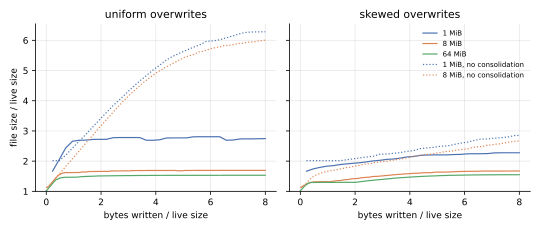
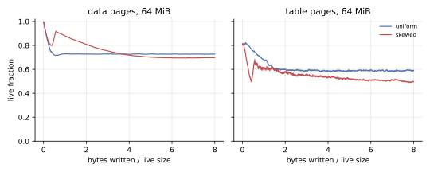
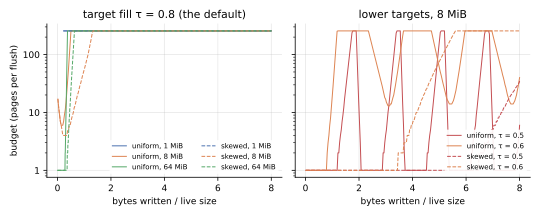
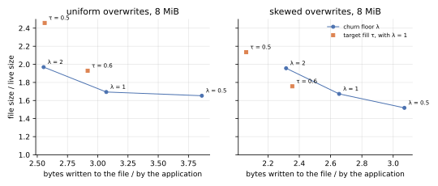
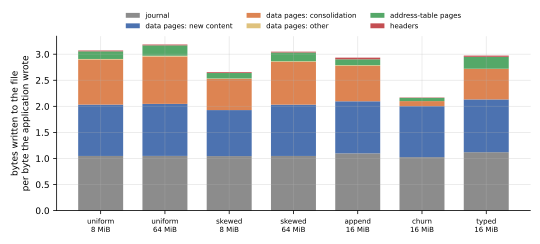
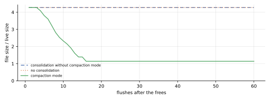
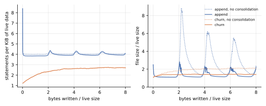
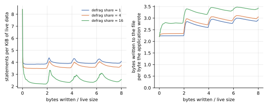
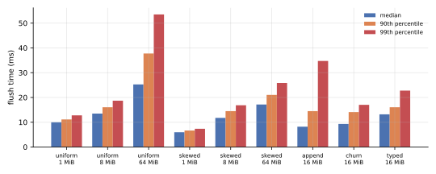
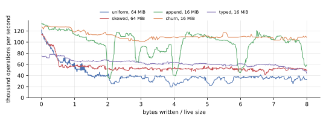

**Consolidation keeps a file at 1.5 to 1.7 times its live size under sustained overwrites, where the same file grows to 6 times without it, for about one more byte written per byte the application writes.**
After three quarters of a file are freed at once, it gives the space back within 16 flushes.
Flushes that do this take 6 to 25 ms at the median.

Two of its constants do less than [the design](../impl/consolidation.md) intends.
The target fill `τ = 0.8` is out of reach under the churn floor `λ = 1`, so the budget sits at its cap and `λ` alone sets the fill, to within a percent of what a one-line model predicts.
And description defragmentation's reserved page per flush merges next to nothing under appends: sixteen pages cut the statements by a third.

The benchmarks also found four defects, all fixed in the measured commit.

## What was measured

**Six workloads, and variants of three of them, ran on real files, each until the application had written eight times the file's live size, with a flush after every 1000 operations.**

| workload | live size | what the application does | what it exercises |
| --- | --- | --- | --- |
| uniform | 1, 8 and 64 MiB | writes of 1 to 511 bytes at random offsets of random 16 KiB allocations | evacuation and the page rewrite |
| skewed | 1, 8 and 64 MiB | the same, with 90 % of the writes going to 10 % of the allocations | scoring, with hot and cold content mixed in pages |
| append | 16 MiB | 512 logs, appended to in records of 16 to 240 bytes and truncated to nothing once a record would take one past 64 KiB | description fragmentation, and mass frees when the logs rotate, nearly in step |
| churn | 16 MiB | values of 16 to 128 bytes, or one in five of 1 to 8 KiB, each operation replacing one with a new allocation, rewriting one whole, or patching 1 to 64 bytes of one | allocation turnover, id recycling, and `Inline` statements |
| shrink | 64 MiB | allocations of 64 KiB, three quarters of them freed at once, then 400 flushes of 100 patches of 1 to 64 bytes each | compaction mode and truncation |
| typed | 16 MiB | a `Kladde<PersistableHashMap<u64, PersistableString>>` of strings of 50 to 500 bytes: 40 % of the operations replace a string, 30 % append to one, 20 % insert one, 10 % remove one | the typed layers |
| variants | 8 and 16 MiB | uniform and skewed at 8 MiB with `λ` of 0.5 and 2, or `τ` of 0.6 and 0.5; append with 4 and 16 pages of defragmentation share | the constants |

The *live size* is the sum of the allocations' sizes, and every ratio below is taken against it.
A workload first fills its file, which is not measured, and then records one row per flush: the file's pages by kind and their coverage, and everything written since the fill.
The horizontal axis of most figures is the application's bytes written since the fill, over the live size.
After the last flush, each run reopens its file and compares every byte with a model of what the application wrote.

Times include each flush's `fsync`.
Journal appends are not fsynced, as [the journal's specification](../spec/journal.md) prescribes: an operation survives a crash of the application once its call returns, and a power cut once the next flush has returned.

The runs measured [kladde-rust](../rust/) at commit `cb34576`, built with `--release` by Rust 1.97.1, with the default [options](../rust/store.md) unless a variant says otherwise, on an Intel Core i7-1165G7 with 16 GB of memory under Linux 7.0, in a development container whose files live on an overlay file system.
Identical configurations differed by up to 20 % in median flush time from one run to the next, so only differences well beyond that are worth reading into the times.

## Space

**Consolidation holds overwritten files at about 1.5 times their live size once they are much larger than what a few flushes write; without it, uniform overwrites grow the file sixfold.**



| file size / live size, at the end | 1 MiB | 8 MiB | 64 MiB |
| --- | --- | --- | --- |
| uniform, consolidating | 2.75 | 1.69 | 1.53 |
| uniform, without consolidation | 6.28 | 6.00 | — |
| skewed, consolidating | 2.28 | 1.67 | 1.55 |
| skewed, without consolidation | 2.85 | 2.67 | — |

Without consolidation, a data page is reused only once every byte on it has been overwritten.
Under uniform overwrites that almost never happens, and data pages end up 18 % live; under skewed ones, hot pages do empty by themselves, and the file grows more slowly.

In the 64 MiB uniform file, data pages take 1.35 times the live size, at 73 % live, address-table pages 0.15 times, at 59 % live, and reusable pages 0.03 times.
Under uniform overwrites, the data pages settle within half a live size of writes and the table pages within two.
Under skewed ones, both keep losing fill for most of the run, as they would if pages froze above the churn floor once their hot content had died, which is [the problem the ripeness draft describes](../drafts/ripeness.md#a-mixed-page-drains-then-freezes).



**Small files pay for the quarantine: a file keeps three to four flushes' worth of written pages free, whatever its size.**
A page that a commit stops referencing can be reused only after the next commit, and the reusable pages that the next flush will write are free as well.
The 1 MiB uniform file keeps 340 pages free and writes 104 pages per flush, the 8 MiB one 430 and 130, and the 64 MiB one 490 and 138.
In the 1 MiB file, where one flush writes 40 % of the live size in pages, that is 1.33 times the live size; at 64 MiB it is 3 %.

## The churn floor sets the fill, not the target

**With the default constants, the budget climbs to its cap of 256 pages within 1.3 live sizes of writes and stays there in every overwrite run, but flushes open only 8 to 59 pages of it: the churn floor admits no more victims.**



**The fill the file reaches is then the churn floor's.**
A victim may be at most `1 / (1 + λ)` live, so under uniform overwrites every data page is written full, loses its content at a steady rate, and is cleaned once it reaches that fill.
A page whose live fraction decays exponentially from 1 to `1 / (1 + λ)` spends its time at an average fill of `λ / ((1 + λ) · ln(1 + λ))`, which matches the measurements to within about a percent:

| churn floor `λ` | data-page fill predicted | measured, uniform | measured, skewed |
| --- | --- | --- | --- |
| 0.5 | 0.822 | 0.825 | 0.819 |
| 1 (the default) | 0.721 | 0.733 | 0.707 |
| 2 | 0.607 | 0.603 | 0.615 |

This is the opposite of the division of labour that [the design](../impl/consolidation.md#the-churn-floor-is-a-parameter-not-an-identity) intends, in which `λ` stays low enough never to decide the fill and the budget converges the file on `τ`.
At `λ = 1`, the 8 MiB files reach a whole-file fill of 0.63, table pages and free pages included, well short of `τ = 0.8`.

**The controller does reach targets that the churn floor allows, but by swinging between its bounds rather than settling.**
With `τ = 0.6`, the 8 MiB files end at whole-file fills of 0.58 (uniform) and 0.59 (skewed), and with `τ = 0.5` at 0.53 and 0.51.
Under uniform overwrites, the budget meanwhile swings between one page and the cap, a swing taking one to two live sizes of writes.
Multiplying the budget by `exp(4 · (τ − fill))` after every flush makes the controller an integral one, and the fill it measures, the whole file's, answers the budget only once new writes reuse the pages cleaning frees, so it overshoots.

**To trade space for writes, `λ` is the better knob: a lower target moves the file along a worse curve, since its budget swings.**



The figure compares steady states: the file size averaged over the second half of each run, and the bytes written during that half per byte the application wrote.
Under uniform overwrites, `λ = 2` writes about as much as `τ = 0.5` (2.59 against 2.57 bytes per byte) and leaves a file 7 % smaller (1.96 against 2.11 times its live size).
Under skewed ones, `τ = 0.6` leaves a file of 1.77 times its live size for 2.68 bytes per byte, 5 % larger than the churn floor's curve passes at those writes.
While the swinging budget is low, the file grows, and what cleaning frees afterwards are holes, which the file keeps until new writes fill them.

## Writes

**Each byte the application writes costs 2.2 to 3.2 bytes written to the file: one in the journal, one in a data page, and up to one more for consolidation.**



The journal takes 1.02 to 1.10 bytes per byte for the raw store, more the smaller the writes, since each record carries a header, and 1.12 through the typed layers.
Consolidation adds 0.9 bytes per byte under uniform overwrites, 0.6 to 0.8 under skewed ones, 0.7 under appends, 0.6 in the typed workload, and 0.1 under churn, whose replaced values free whole allocations.
Address-table pages add 0.02 to 0.23, headers less than 0.04.
Without consolidation, the same workloads write 1.5 to 2.2 bytes per byte: the 8 MiB uniform file 2.13, against 3.07 with it.

The uniform figure is what the churn floor predicts.
Cleaning a victim at a live fraction `u` writes `u / (1 − u)` bytes per byte it frees, 1 at `u = 1/2`, and under uniform overwrites nearly all garbage is freed that way, since pages seldom empty by themselves.

## Mass frees

**After three quarters of a 64 MiB file are freed at once, compaction mode gives the space back within 16 flushes; without it, the file never shrinks.**



The file went from 4.27 to 1.14 times its live size, moving 3,221 data pages to return about 12,300, in 12 flushes in compaction mode and 12 truncations; over the remaining 385 flushes it grew by 2 %, as the patches added statements.
Consolidation without compaction mode moves nothing here: after the frees every page is either full or empty, so no page is a victim, and the holes stay holes until the application writes as much again.

**The append workload's rotations, which free most of the file within a few flushes, are absorbed the same way.**
Without consolidation, the file peaks at 8.8, 6.2 and 5.5 times its live size as the logs rotate, and it has not shrunk back below 1.3 when the next rotation comes.
With it, the peaks are 2.9, 2.3 and 2.3, and the file is back below 1.3 within half a live size of appends.



## The description

**Description defragmentation's reserved page per flush is too small to matter under appends; sixteen pages cut the statements by a third, for a sixth more writes.**

| defragmentation share, pages per flush | statements per KiB of live data | file size / live size | bytes written per byte |
| --- | --- | --- | --- |
| none: consolidation off | 4.06 | 2.80 | 2.21 |
| 1 (the default) | 4.01 | 1.38 | 2.93 |
| 4 | 3.72 | 1.41 | 3.06 |
| 16 | 2.57 | 1.38 | 3.43 |

The statements and the file size are means over the second half of each run, since both swing with the rotations; the bytes written are over the whole run.
Each flush appends about 125 KiB across 512 logs, two records per log on average, which the flush states as about one statement per log.
A share of one page rewrites 4 KiB per flush, 3 % of what was appended, and that is what it did.
What merging buys here is a smaller description, which is what the fragment map in memory holds, and not a smaller file: the share leaves the file's size where consolidation put it.



**Small patches accumulate as statements of their own under every setting measured.**
In the churn workload, statements grow from 1.2 to 2.7 per KiB of live data, with and without consolidation alike.
In the shrink workload's 400 flushes of 100 patches, statements grow from 4,833 to 45,837 and address-table pages from 44 to 439: every patch stays a statement, `Inline` since it is at most 64 bytes.
That is the design working as intended for the writes, which cost the patch and not the page it lands in, but the description has no counterweight at this rate.

## Time

**A flush takes 6 to 25 ms at the median here, roughly in proportion to the pages it writes, and flushes take most of the time: the operations between them cost 1.3 to 3.2 µs each.**



| workload, consolidating | pages written per flush | mean flush time | operations per second, flushes included |
| --- | --- | --- | --- |
| uniform, 1 MiB | 104 | 10.4 ms | 84,000 |
| uniform, 8 MiB | 130 | 14.1 ms | 64,000 |
| uniform, 64 MiB | 138 | 29.6 ms | 32,000 |
| skewed, 64 MiB | 131 | 18.2 ms | 50,000 |
| append, 16 MiB | 64 | 10.1 ms | 87,000 |
| churn, 16 MiB | 192 | 10.3 ms | 110,000 |
| typed, 16 MiB | 82 | 14.5 ms | 57,000 |

The figures are over the second half of each run.
The uniform flush doubles its time per page written between 8 and 64 MiB, from 108 to 214 µs, at about the same pages per flush.
These runs do not say why; the page-table scans a flush makes, over some 25,000 entries, are far too cheap to account for 15 ms.
The 99th-percentile flush of the 64 MiB uniform file takes 54 ms.



Throughput dips while the append workload's logs rotate, when consolidation evacuates what the rotation left sparse.

## The typed layers

**Through the typed layers, a hash map of strings costs what the raw store does per byte: 1.53 times its live size in space, and 2.97 bytes written per byte.**
Its journal takes 1.12 bytes per byte, the framing of its records included.
It holds 9.1 statements per KiB of live data, since each of its 137,000 strings is an allocation of its own.
A flush takes 13 ms at the median, and the map sustains 57,000 operations per second, flushes included.

## Defects the benchmarks found

All four are fixed in the measured commit, and each has a test of its own.

1. **Recycled ids resurrected old content** (fixed in `58dcfa0`).
   A tombstone whose own page a flush dropped was released as if it had outlived its purpose, so after a reopen, older statements of a freed and recycled id could show through; the churn workload's check caught it.
2. **Storing a new string journaled it byte by byte** (fixed in `8a2f7cb`), which made the typed workload's journal 2.8 times as large as its data.
3. **Compaction mode stalled on a full table page at the end of the file** (fixed in `4182b3f`).
   The restatements of a table page are estimated at 1.25 times its coverage, so a tail page more than 80 % full failed the churn floor, from which [the design](../impl/consolidation.md#compaction-mode) means the tail to be exempt: in the shrink workload, a page of `Inline` patches at the end of the file held compaction back for 180 flushes.
   Before the fix, the file was still 3.2 times its live size after 400 flushes.
4. **Compaction mode ran almost permanently in small files** (fixed in `26dcc08`), because it counted pages in quarantine as holes, although they are working space that the next flushes reuse by themselves.
   In the 1 MiB uniform file it ran in 30 of 33 flushes, and the file ended 6 % larger than it does with the fix.

`implementation-notes.md` in kladde-rust records the first, under "Flush"; [Compaction mode](../impl/consolidation.md#compaction-mode) now states the rules the last two fixes follow.

## What to change

- **Make the constants agree.**
  Either lower `τ` to what `λ` allows, which for `λ = 1` is a whole-file fill of about 0.63, or lower `λ` to what `τ` needs; or replace both with a threshold per page, as [the ripeness draft](../drafts/ripeness.md) proposes, which [Cleaning by ripeness](ripeness.md) measures.
  As they stand, the controller only ever raises the budget to its cap, and the cap bounds a flush's work only because the churn floor runs out of victims first.
- **Measure what the controller acts on.**
  [Cleaning by ripeness](ripeness.md) moves a price with the same kind of controller, and its price cycled the same way while it measured the whole file; measured over the data pages and leaves, which answer within the flush, it held within a few percent.
  The budget would likely settle the same way; holes are compaction mode's to return anyway.
- **Scale description defragmentation with the rate at which statements accrue**, rather than reserving one page per flush: appends and patches both outrun it by an order of magnitude.
- **Find out why flushes slow down as files grow**, with a profile of the 64 MiB uniform run.
- **Measure small files with fewer operations per flush**, since with 1000 their free space is set by the quarantine rather than by consolidation.

## Reproducing

In kladde-rust, at the measured commit, run every workload and write one table per workload to a directory:

```sh
cargo run --release -p kladde-bench -- /tmp/kladde-bench
```

In kladde-docs, keep the tables gzipped next to this page and draw the figures from them, with matplotlib installed:

```sh
for f in /tmp/kladde-bench/*.csv; do
    gzip -9 -n -c "$f" > content/evaluation/data/consolidation/$(basename "$f").gz
done
tools/plot-evaluation.py --summary --out content/evaluation/figures/consolidation \
    main=content/evaluation/data/consolidation
```

`--summary` also prints the end state of every run as a table.
The whole benchmark takes about four minutes here.
