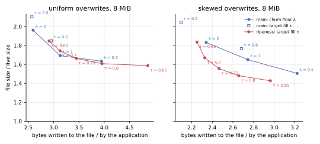
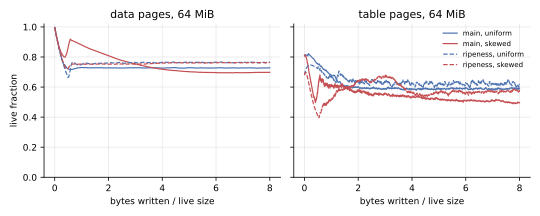
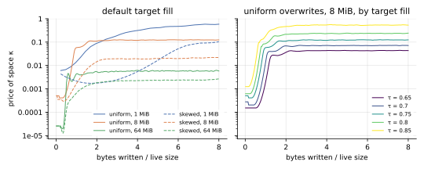
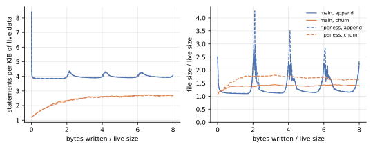
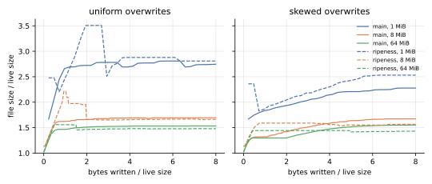
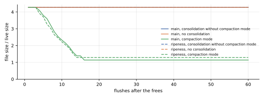
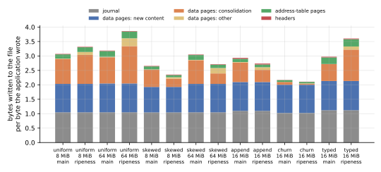
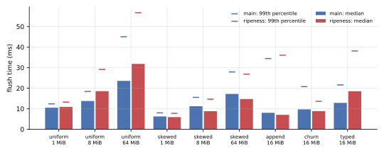

**Updated for the draft's clarifications, as of kladde-docs commit `b33a836`: the branch now measures a page's fill relative to the fill survivors are packed at, which moved no result of 8 MiB or more by more than 1 % in file size or 2 % in writes.**
The clarified draft ranks a page by $h(u/u_0)$, with $u_0 = 1 - \theta$, and never cleans a page at or above $u_0$; the first version ranked pages by $h(u)$, with $1 - \theta$ only as a cap.
The controller absorbs the difference: it settles the price of space 15 to 50 % higher, since $h(u/u_0)$ lies below $h(u)$ at every fill, and the trade-off curves of the two versions lie within 1 % of each other.
The branch also carries the rates that fresh content starts from across sessions now, since the clarified draft rules out estimates that start from nothing; these runs, one session each, do not exercise it.
The ablation that the clarified draft proposes, ranking without the logarithm, writes 3 to 6 % more for the same file size under skewed overwrites, and 1 to 4 % more under uniform ones: see [Without the logarithm](#without-the-logarithm).
This update's runs shared their host with other work, so the flush times on this page are still the first version's; its tables are in kladde-docs commit `08febdf`.

**Cleaning by ripeness, as [the draft](../drafts/ripeness.md) proposes, keeps a file under skewed overwrites 10 to 12 % smaller than the current design for the same writes, or writes 4 to 20 % less for the same file size; under uniform overwrites the two are level, as the draft predicts.**
At the default settings of each, the 8 and 64 MiB skewed files come out 5 to 6 % smaller for 10 to 11 % fewer writes.
It gains where the draft says it should: under skew, [the current design](consolidation.md)'s data pages lose fill for most of a run as pages freeze above the churn floor, and ripeness's hold at 0.76.

It took one change to the draft to work: the controller that sets the price of space must measure the fill of the data pages and leaves, not of the whole file, or the price swings over decades.
Three costs remain.
Recording every page's estimate in the consolidator state takes 1 to 7 % of the writes.
Under churn the file comes out 19 % larger.
And after a mass free the price takes 13 to 19 flushes to climb back from where calm phases left it, so the file peaks higher.

## What was measured

**The [same benchmark](consolidation.md#what-was-measured) ran on the `ripeness` branch of kladde-rust, and on main.**
Main is at commit `cb34576`, as on [the consolidation page](consolidation.md).
Its tables here are from a run made back to back with the first version of the branch, so that their times compare; a run of main for this update reproduced every number in them but the times, as the benchmark is deterministic but for its times.
The branch is at `362210a`, which follows the draft as of kladde-docs `b33a836`; the first version, at `f7d4eab`, ranked pages by their absolute fill.
Two more runs of the branch, at the same commit, measure what the consolidator state costs, by leaving it out, and what the logarithm contributes, by ranking pages without it, as the draft's ablation does.
The experiments this page cites besides, on the controller and on churn, ran on the first version, changed for the purpose, and are not part of the committed code.

The branch fills in what the draft leaves open with a forgetting rate `β = 0.1` per flush, a floor `R_MIN = 10⁻⁴` and a starting price `κ = 0.01` (the draft's own examples), a cursor that gives up pages older than `W = 8` flushes, and a budget of 256 pages per flush, which is now a fixed cap.
Its controller aims the data pages and leaves at a fill `τ = 0.75` by default, where main aims the whole file at 0.8 and never gets there.
`implementation-notes.md` in kladde-rust lists every departure from the draft.

Where main's page compares policies, it uses **steady states**: the file size averaged over the second half of each run, and the bytes written during that half per byte the application wrote.
Both controllers take a live size or more of writes to settle, which end-of-run values would mix in.

## The trade-off

**Under skewed overwrites, ripeness's curve lies below main's everywhere they overlap; under uniform ones, the two curves cross, within 3 % of each other.**



| 8 MiB, steady state | main | ripeness, same writes | ripeness, same file size |
| --- | --- | --- | --- |
| skewed, `λ = 2` | 1.83 times the live size, 2.34 bytes per byte | 1.65 (−10 %) | 2.25 bytes per byte (−4 %) |
| skewed, `λ = 1` | 1.65, 2.74 | 1.46 (−12 %) | 2.34 (−15 %) |
| skewed, `λ = 0.5` | 1.51, 3.22 | below 1.42 | 2.57 (−20 %) |
| uniform, `λ = 1` | 1.69, 3.13 | 1.74 (+3 %) | 3.32 (+6 %) |
| uniform, `λ = 0.5` | 1.63, 3.95 | 1.61 (−2 %) | 3.69 (−7 %) |

The ripeness columns interpolate between its runs at targets 0.65, 0.7, 0.75, 0.8, and 0.85.

**Skew is where ripeness gains, and for the reason the draft gives.**
The churn floor cleans a page only once it is half empty; a page whose hot content has died and whose cold content stays freezes above that, and keeps its garbage.
In main's 64 MiB skewed run, data pages lose fill for most of the run, down to 0.70; in ripeness's, they hold at 0.76, since a frozen page, draining at the floor rate, is ripe at a fill a draining page never is.



**Under uniform overwrites every page drains alike, and ripeness reduces to a single fill threshold, like the churn floor.**
What remains between the curves is noise: a page's estimate comes from its own sporadic losses, so pages that drain alike get different estimates, and a threshold that differs page by page costs a little at light cleaning.

## The controller

**Measuring the whole file, the price controller swung by two to three decades; measuring the data pages and leaves, it holds within about 10 %.**
The draft's controller moves `κ` by `exp(gain · (τ − fill))` after every flush, as main's moves its budget.
The first version's controller measured the whole file, like main's.
But cleaning does not shrink the file at once: the pages it frees stay free until new writes reuse them, so the whole file's fill answers a change of price only many flushes later, and an integral controller on a lagging measure cycles.
At 8 MiB and a target of 0.5, the price swung between `2·10⁻⁴` and 0.09, a swing per one to two live sizes of writes, and at targets of 0.5 to 0.6 the files ended up 8 to 20 % larger than a fixed price gave for the same writes.
The data pages and leaves, which cleaning acts on, answer within the flush.
Measured there, the price holds within about 10 % of its median over the second half of every overwrite run of 8 MiB or more; in the first version, gains of 0.5 and 2 gave the same results, and the steady states fell on the curve that fixed prices traced.
The holes the measure leaves out are compaction mode's to return anyway.
[The consolidation page](consolidation.md#what-to-change) suggests the same change for main's budget.



**The price also has to hold where moving it can change nothing.**
A file starts full, so without that the first flushes drove the price to its floor, and it took one to two live sizes of writes to climb back.
The branch holds the price after a flush that cleaned nothing while the fill is above target, and after one that spent its whole budget while the fill is below; the clarified draft asks for the second.

**That is not enough after a mass free.**
Between the append workload's rotations, the live pages sit above target, and the price drifts down to `3·10⁻⁵` even so, since small moves by free filling count as cleaning.
When the logs rotate, the price needs 13 to 19 flushes to climb three decades, and the file peaks at 4.3, 3.5 and 2.9 times its live size, where main's peaks at 2.9, 2.3 and 2.3.



## At the default settings

**Ripeness at its default target writes less than main at its default under skewed overwrites and appends, and more under uniform overwrites, where its target lies further along the same curve.**

| steady state, file size / live size and bytes written per byte | main | ripeness | change |
| --- | --- | --- | --- |
| uniform, 8 MiB | 1.69, 3.13 | 1.66, 3.44 | −2 %, +10 % |
| uniform, 64 MiB | 1.53, 3.26 | 1.48, 3.99 | −4 %, +23 % |
| skewed, 8 MiB | 1.65, 2.74 | 1.56, 2.44 | −5 %, −11 % |
| skewed, 64 MiB | 1.53, 3.15 | 1.43, 2.84 | −6 %, −10 % |
| append, 16 MiB | 1.38, 3.14 | 1.44, 2.96 | +4 %, −6 % |
| churn, 16 MiB | 1.41, 2.18 | 1.68, 2.12 | +19 %, −3 % |
| typed, 16 MiB | 1.53, 3.04 | 1.46, 3.81 | −5 %, +25 % |



The 1 MiB files are dominated by the quarantine, as on [the consolidation page](consolidation.md#space), and their 33 flushes are too few for either controller to settle; the skewed one comes out 11 % larger with ripeness.

**Under churn, ripeness's file is 19 % larger, and neither a higher target nor more generous free filling closes the gap.**
Main's churn run keeps data pages 91 % full, taking half of its victims for free in the room of pages the flush writes anyway, and moves 14 MB of survivors against ripeness's 4 MB.
In the first version, at a target of 0.85, ripeness's data pages reached 0.88, but its file still kept a third of the live size in free pages, against main's quarter, and ended 9 % larger for about the same writes.
In experiments on the first version, letting free filling take any ripe victim that fits, or any victim at all, changed nothing, or made things worse; why churn leaves ripeness with more free pages remains open.

**After three quarters of a file are freed, compaction mode returns the space as fast as on main, but stops earlier.**
The file reaches 1.29 times its live size within 14 flushes, where main's reaches 1.14 within 16.
Both stop once holes fall below a quarter of the file; ripeness's run crossed that line with 20 % holes left, main's overshot to 11 % in its last step.



## Without the logarithm

**Ranking pages by the myopic $(1 - x)/x$ in place of $h(x)$ writes 3 to 6 % more for the same file size under skewed overwrites, as [the draft's ablation](../drafts/ripeness.md#ablation-without-the-logarithm) predicts, and 1 to 4 % more under uniform ones, where it predicts no difference.**
The ablated branch differs from the full one in nothing but the fill term of the index, and its controller aims at the same targets.
Under uniform overwrites, too, pages do not all drain at one rate: leaves drain at a rate of their own, and each page's estimate strays from its true rate.

| 8 MiB, steady state | ripeness | myopic, same file size |
| --- | --- | --- |
| skewed, `τ = 0.7` | 1.67, 2.32 | 2.41 (+4 %) |
| skewed, `τ = 0.75` | 1.56, 2.44 | 2.55 (+5 %) |
| skewed, `τ = 0.8` | 1.48, 2.63 | 2.78 (+6 %) |
| uniform, `τ = 0.7` | 1.75, 3.12 | 3.16 (+1 %) |
| uniform, `τ = 0.75` | 1.66, 3.44 | 3.52 (+2 %) |
| uniform, `τ = 0.8` | 1.60, 3.94 | 4.09 (+4 %) |

At the default target, the 64 MiB files come out the same size either way, and the myopic rule writes 5 % more under skewed overwrites and 4.5 % more under uniform ones.
Under appends it writes 1.6 % more, under churn 1.5 % more for a file 1 % smaller, and after the mass free it compacts exactly as the full rule does.

**The extra writes are survivors, and they are few because survivors are a small part of what a flush writes.**
Under skew, the myopic rule moves 30 % more survivors per byte the application wrote: 0.44 bytes against 0.34 at 8 MiB, 0.59 against 0.45 at 64 MiB.
The draft's cost table for content that drains slowly, up to seven times the optimum, applies to that share alone, and the flush's own content, which both rules write alike, makes up most of the rest.

**The myopic rule also moves cleaning from leaves to data pages.**
Under skew, the leaves come out at 0.60 against 0.64 at 8 MiB, and 0.46 against 0.56 at 64 MiB, while the data pages gain a little.
That fits the draft's warning: the myopic rule ranks slowly draining pages higher, and they take writes that would free more elsewhere.
Its controller settles the price three to five times lower, since $(1 - x)/x$ exceeds $h(x)$ at every fill.

## What it costs

**Keeping every page's estimate in the consolidator state costs 1 to 7 % of the bytes written, and buys nothing within one session.**
The draft has the state record the estimate of every page the fold drains, which at 1000 operations per flush means an entry for about every page those operations touched, and a snapshot of every page below `u₀` whenever the records outgrow the last one.
Without the state, the 64 MiB runs write 7 % less under both uniform and skewed overwrites, for files 1 % smaller; append writes 3 % less, the 8 MiB runs 2 to 3 %, churn 1 %.
The estimates matter only across a reopen, which these runs do not exercise; a denser encoding, or recording only pages whose estimate moved by a margin, would cut the cost.



**A flush takes time in proportion to the pages it writes, on either branch.**
These times are from the first version's run, made back to back with main's; the pages each writes per flush have changed by 3 % at most since.
Per page written, ripeness's flushes took between 4 % less and 16 % more time than main's in the same session, within the spread identical runs showed before.
Where ripeness writes fewer pages, as under skew, its flushes are faster: at the median over the second half of each run, 9.7 ms against 11.6 for the 8 MiB skewed file, 16.5 against 17.7 at 64 MiB.
Where it writes more, as under uniform overwrites at its default target, they are slower: 34.9 ms against 27.0 at 64 MiB.



**In memory, each page's estimate takes 16 bytes in the page table, and each ranked page takes an entry in one of two ordered sets and one in a map from page to entry.**
The ranking takes `O(log P)` per page that changed and per victim, where main's bucket queues take `O(1)`; the flush times do not show it.

## What to change in the draft

- **Measure the fill the price acts on**: the data pages and leaves, not the whole file, whose fill lags a change of price by many flushes.
- **Hold the price where moving it can change nothing, in both directions.**
  The clarified draft holds it while the budget binds; it should also hold it while the fill is above target and nothing is cleaned, and keep it from sinking in calm phases, where every page is fuller than the target: a floor well above `10⁻⁶`, or holding the price whenever the budget took no ripe page, would spare the file the peaks after a mass free.
- **Record estimates more cheaply.**
  A drain record could leave out the estimate's epoch, which is the record's own, store the rate in a byte on a logarithmic scale, and skip pages whose estimate moved by less than a margin.
- **Keep the logarithm.**
  Without it, skewed overwrites cost 3 to 6 % more writes for the same file size, and nothing is simpler for it.
- **Look into churn**, the one workload where ripeness loses: replaced values free whole allocations every flush, and ripeness leaves more of the file free than main does.
- **Expect noise under uniform overwrites.**
  Estimates from sporadic losses differ between pages that drain alike; a larger `β` or two rates per page, as the draft's open questions consider, trades that noise against how soon a frozen page is recognised.

## Reproducing

The runs of the branch used one checkout of kladde-rust, with main in a worktree of its own:

```sh
git worktree add ../kladde-main main
cargo build --release -p kladde-bench --manifest-path ../kladde-main/Cargo.toml
git checkout ripeness
cargo build --release -p kladde-bench
../kladde-main/target/release/kladde-bench /tmp/bench-main
./target/release/kladde-bench /tmp/bench-ripeness
KLADDE_BENCH_NO_STATE=1 ./target/release/kladde-bench /tmp/bench-ripeness-no-state uniform skewed append churn
KLADDE_BENCH_MYOPIC=1 ./target/release/kladde-bench /tmp/bench-ripeness-myopic uniform skewed append churn shrink tuning
```

In kladde-docs, keep the tables gzipped under `content/evaluation/data/ripeness/`, in `main/`, `ripeness/`, `ripeness-no-state/`, and `ripeness-myopic/`, and draw the figures from them, all but the flush times, which come from the tables of commit `08febdf`:

```sh
D=content/evaluation/data/ripeness
tools/plot-evaluation.py --summary --out content/evaluation/figures/ripeness \
    --only space-amplification,live-fraction,write-breakdown,budget,shrink,description,defrag-share,kappa \
    main=$D/main ripeness=$D/ripeness
tools/plot-evaluation.py --only tradeoff --out content/evaluation/figures/ripeness \
    main=$D/main ripeness=$D/ripeness myopic=$D/ripeness-myopic
```
