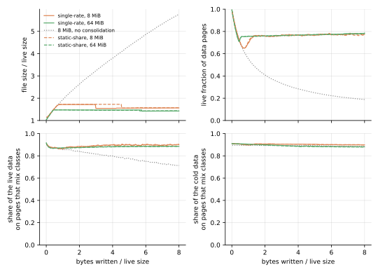
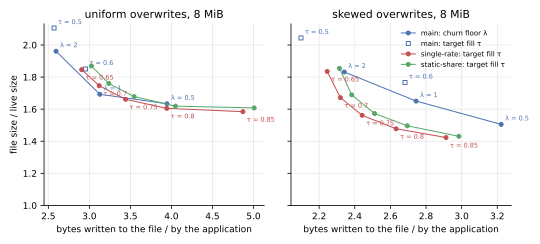
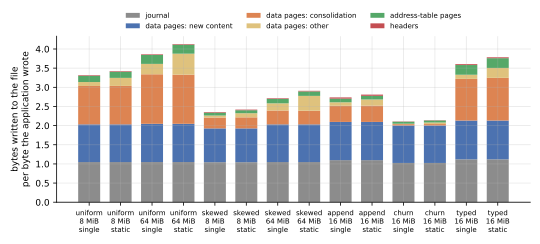

**The static share makes no difference to cleaning on kladde-bench's workloads, not even on one built for it, and costs twice as much to keep.**
Without the consolidator state, the static-share branch and the single-rate branch that [Cleaning by ripeness](ripeness.md) evaluates write within 0.3 % of each other in every run of 8 MiB or more, and their live pages take the same space to within 0.2 %.
With the state, the static-share branch writes 2 to 7 % more at the default target, and all of the difference is its state's larger entries.
Few pages earn a static share, even on the `mixed` workload, where content that never changes makes up 45 % of the live data and nine tenths of it shares pages with content that does: 1.9 % of the live bytes count as static there at 8 MiB, and almost none at 64 MiB.
The fall that would show a static share, a page's hot content dying, comes to a few statements of about 250 bytes, too little evidence for the test to let a static share through, and afterwards a page loses only the rare statements of its cool content, which one share draining slowly explains as well.
The other workloads give the fit less still to find: their cold content still dies, only slowly, and skewed overwrites seldom put hot and cold content on one page.
That matches what the draft's own simulation found: the single-rate draft cleans as cheaply, and needs half the state.

## What was measured

**The [same benchmark](consolidation.md#what-was-measured) ran on the `ripeness2` branch of kladde-rust, which implements [the draft](../drafts/ripeness.md) as of kladde-docs commit `7c343b7`.**
The branch is at `074a0df`, on top of the single-rate branch at `362210a`; the two differ only in how a page's estimate is kept and fitted, and in two counters of static shares, which the benchmark records.
The benchmark is deterministic but for its times, so every number of either branch's runs compares with the other's: the single-rate branch's and main's tables are those of [Cleaning by ripeness](ripeness.md).
A second run of the static-share branch left the consolidator state out, as one of the single-rate branch did, to tell what the policy does from what its state costs.
The `mixed` workload ran later on both branches, with and without the state, at `a856b06` here and `799c661` on the single-rate branch, which add it to kladde-bench and change nothing else.
This page compares no times, since its runs shared their host with other work.

The branch takes the draft's constants, `β = 0.1` per flush, a starting estimate worth `n₀ = 10` flushes of losses, and a test that a static share must pass by `c = 3` statements' worth of log-likelihood, and the single-rate branch's for the rest.
Its fit agrees with the `tested` estimator of `tools/simulate-ripeness.py` to within 0.1 % of the index, where the simulation fits rates on a fine grid, and reproduces the draft's worked example.
`implementation-notes.md` in kladde-rust lists where it departs from the draft: both fits are solved exactly, and the test's unit, the mean statement size, is measured separately for data pages and leaves.

## How often pages earn a static share

**Rarely, even where content that never changes shares pages with content that does: at most 2.6 % of the live bytes count as static, on average over the second half of any run of 8 MiB or more.**

| second half of each run | pages with a static share | live bytes estimated static |
| --- | --- | --- |
| uniform, 8 MiB | 0.15 % | 0.12 % |
| uniform, 64 MiB | 0.16 % | 0.14 % |
| skewed, 8 MiB | 2.6 % | 2.3 % |
| skewed, 64 MiB | 0.57 % | 0.66 % |
| mixed, 8 MiB | 4.3 % | 1.9 % |
| mixed, 64 MiB | 0.06 % | 0.05 % |
| append, 16 MiB | 2.4 % | 2.6 % |
| churn, 16 MiB | 0.53 % | 0.13 % |
| typed, 16 MiB | 0.70 % | 0.60 % |

**The mixed workload is built for a static share, and the fit finds almost none of it.**
[Its allocations](ripeness.md#hot-cool-and-cold-allocations-on-shared-pages), four to a page, are hot, cool, or cold at random, and the cold ones, 45 % of the live data, never change.
Nine tenths of the cold data share a page with content that still changes, 90 % at 8 MiB and 88 % at 64 MiB, on both branches alike.
Yet at most 19 of the 8 MiB file's 2098 data pages hold a static share during the first flushes, while the hot content of the pages written at the start dies, and at most 2.4 % of the live bytes count as static at any time; at 64 MiB, never more than 0.2 %.

**A page's fall is too small to earn a static share.**
A page written at the start holds four allocations of 1 KiB, usually one hot one at most, and that allocation dies within a few flushes: the whole fall, the evidence for a static share, comes to about four statements of 250 bytes, too little for the three statements' worth of log-likelihood the test asks for.
Afterwards the page loses only its cool content, a statement every 40 flushes or so, which one share draining slowly explains as well as a draining share over a static one.
The test counts in statements, and a statement in these files states 100 to 380 bytes of data, so a data page holds 10 to 30 of them.
The draft's simulation found the same: with statements of 32 to 256 bytes, its tested fit costs as much as the single-rate draft, and with larger ones a little less, since the test that keeps it from inventing static shares also keeps it from finding them quickly.
A leaf states some 300 statements of 10 to 14 bytes each, plenty of losses, but its content, statements that the fold supersedes, is no more static than the data they state.

**The other workloads offer less to find.**
Their cold content is not static, only slow: under skewed overwrites, a tenth of the writes go to all allocations alike, so a cold byte of the 8 MiB file dies at about 0.003 per flush, against a price of space of 0.025, a ratio `r/κ` of about 0.12, at which the draft's threshold lies at 0.64.
The 64 MiB file's cold content dies eight times slower, and the price settles eight times lower, at the same ratio.
And skewed overwrites seldom put hot and cold content on one page: their hot allocations hold the lowest ids, their allocations of 16 KiB fill pages of their own, and a flush packs its writes in key order, so that of the 60 or so pages of new content a flush writes at 8 MiB, one mixes hot with cold.

## Cleaning

**Without the consolidator state, the two branches reach the same steady states.**

| steady state, no consolidator state | single rate: file size / live size, bytes written per byte | static share | change |
| --- | --- | --- | --- |
| uniform, 8 MiB | 1.652, 3.342 | 1.650, 3.345 | −0.1 %, +0.1 % |
| uniform, 64 MiB | 1.467, 3.707 | 1.467, 3.703 | 0.0 %, −0.1 % |
| skewed, 8 MiB | 1.548, 2.394 | 1.547, 2.397 | −0.1 %, +0.1 % |
| skewed, 64 MiB | 1.415, 2.648 | 1.417, 2.645 | +0.1 %, −0.1 % |
| mixed, 8 MiB | 1.660, 2.398 | 1.606, 2.403 | −3.2 %, +0.2 % |
| mixed, 64 MiB | 1.412, 2.638 | 1.412, 2.636 | 0.0 %, −0.1 % |
| append, 16 MiB | 1.420, 2.864 | 1.424, 2.854 | +0.3 %, −0.3 % |
| churn, 16 MiB | 1.655, 2.088 | 1.655, 2.093 | 0.0 %, +0.2 % |

The mixed 8 MiB files differ in size only because their free pages reached the file's end, where truncation returns them, at different times; in every run here, the live pages take the same space on both branches to within 0.2 %, 1.38 times the live size in the mixed ones.
The 1 MiB files, dominated by the quarantine and too short for the controller to settle, differ by up to 2 %.



**With the state, the static-share branch writes 2 to 7 % more, and its trade-off curve lies 3 to 7 % to the right of the single-rate branch's.**

| steady state, with the state | single rate | static share | change |
| --- | --- | --- | --- |
| uniform, 8 MiB | 1.66, 3.44 | 1.68, 3.55 | +1 %, +3 % |
| uniform, 64 MiB | 1.48, 3.99 | 1.49, 4.29 | +1 %, +7 % |
| skewed, 8 MiB | 1.56, 2.44 | 1.57, 2.51 | +1 %, +3 % |
| skewed, 64 MiB | 1.43, 2.84 | 1.45, 3.04 | +1 %, +7 % |
| mixed, 8 MiB | 1.56, 2.47 | 1.59, 2.53 | +2 %, +3 % |
| mixed, 64 MiB | 1.44, 2.85 | 1.44, 3.06 | 0 %, +7 % |
| append, 16 MiB | 1.44, 2.96 | 1.44, 3.05 | 0 %, +3 % |
| churn, 16 MiB | 1.68, 2.12 | 1.67, 2.15 | −1 %, +2 % |
| typed, 16 MiB | 1.46, 3.81 | 1.47, 4.02 | +1 %, +6 % |

At the targets from 0.65 to 0.85, the 8 MiB files write 3 to 6 % more under skewed overwrites and 5 to 7 % more under uniform ones for the same file size.
Main's curve stays where [Cleaning by ripeness](ripeness.md#the-trade-off) puts it: under skew, both ripeness branches lie below it.



## What it costs

**The static-share branch's consolidator state costs twice what the single-rate branch's does: 3 to 14 % of the bytes written, against 1 to 7 %.**
An entry holds the fit's two sums, its rate, and its share, four `f32`s where the single-rate branch's holds one rate, and the draft has the state record every page the fold drains.
At 64 MiB, the state takes 14 % of the writes under uniform overwrites and 13 % under skewed ones, against 7 %; at 8 MiB, 6 and 5 %, against 3 and 2 %; under appends 6 % against 3 %, and under churn 3 % against 1 %.
It also takes space: with it, the live pages hold up to 1.1 % more than without, where the single-rate branch's adds up to 0.7 %.



**In memory, a page's estimate takes 24 bytes, against 16.**
The ranking keeps its two ordered sets, and a page's entry also holds the key of its floor, which the single-rate branch derives from its estimate.

**Each flush fits every page that lost content**, with two bisections of 50 steps, each step a handful of exponentials and logarithms.
The runs shared their host with other work, so this page does not say what that costs in time.

## What to change in the draft

- **Keep one rate per page**: on kladde-bench's workloads, including one where 45 % of the data never changes and shares pages with data that does, the static share changes nothing, and doubles the state.
- **Expect a static share to pay only where a page's losses are plentiful.**
  The evidence for one is a page's fall, and a page of statements of 250 bytes shows a fall of a few statements at most, too little for the test; the draft's simulation found a static share paying only on small statements, and then only without the test.
- **If the static share stays, record less of it.**
  A page's rate and share follow from its two sums, its age, and its coverage, which an entry holds already, so they could be fitted again at open, for 8 bytes an entry less.
- **Say which statements the test counts in.**
  The draft speaks of the file's mean statement size, but a data page loses the bytes statements state, 100 to 380 per statement in these files, and a leaf their encoding, 10 to 14.

## Reproducing

The static-share branch ran from one checkout of kladde-rust, at `074a0df`, and the mixed workload later, at `a856b06`; at `a856b06`, these commands run all of it:

```sh
git checkout ripeness2
cargo build --release -p kladde-bench
./target/release/kladde-bench /tmp/bench-ripeness2
KLADDE_BENCH_NO_STATE=1 ./target/release/kladde-bench /tmp/bench-ripeness2-no-state uniform skewed mixed append churn
```

In kladde-docs, keep its tables gzipped under `content/evaluation/data/ripeness2/`, in `ripeness2/` and `ripeness2-no-state/`, and draw the figures with those of [Cleaning by ripeness](ripeness.md#reproducing):

```sh
D=content/evaluation/data
tools/plot-evaluation.py --only tradeoff --out content/evaluation/figures/ripeness2 \
    main=$D/ripeness/main single-rate=$D/ripeness/ripeness static-share=$D/ripeness2/ripeness2
tools/plot-evaluation.py --only write-breakdown --out content/evaluation/figures/ripeness2 \
    single=$D/ripeness/ripeness static=$D/ripeness2/ripeness2
tools/plot-evaluation.py --only mixed --out content/evaluation/figures/ripeness2 \
    single-rate=$D/ripeness/ripeness static-share=$D/ripeness2/ripeness2
```

`tools/simulate-ripeness.py example` prints the draft's worked example, which the unit test `the_fit_follows_the_drafts_example` in kladde-rust checks the fit against.
