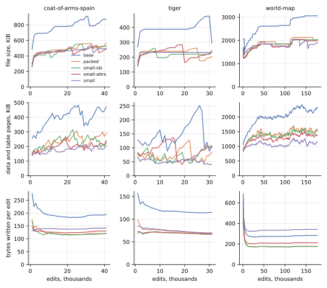
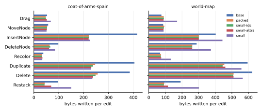

**Packing kladde-svg's lists of enums makes its drawings 14 to 38 % smaller on file, and a drawing editor's edits write 37 to 40 % fewer bytes.**
Small values then take most allocations and nearly every address-table page out of the files, and a quarter of the memory.
But they make edits write more wherever they put large content inline, because kladde-rs rewrites everything a splice shifts.

The benchmarks first ran as they were, on the branch of kladde-rs that implements [packed places](../spec/schema/type-descriptors.md#places).
The drawings and the 1,803 files of the corpus hold the same bytes as on main, but for 216 bytes less schema each.
Edits write 18 to 21 % less, all of it in the journal, which on the branch records a stored value as one record.

The four layouts after that add to each other, one step at a time:

- **Packed lists of enums.**
  With children, transforms, attributes and path data packed, the drawings' live bytes fall by 41 % on the tiger and the coat of arms, and by 18 % on the world map.
  The world map's path data is 92 % cubic Béziers, the largest variant, which packs to the 26 bytes of its slot.
  An open drawing takes 13 to 17 % more memory, since a packed vector is 24 bytes larger in memory than a slotted one, even when empty, and an element holds four or five.
- **Small ids.**
  Small strings for element ids take one allocation and one statement per id out of the file, and up to a sixth of the memory, and change little else.
- **Small attribute lists and strings.**
  These take out half the allocations that remain, settle the files 4 to 12 KiB smaller, and take 10 to 17 % less memory than the slotted layout.
  But the edits write 8 % more on the coat of arms, and 20 % more on the world map, than with packed lists alone.
- **Small child lists, transforms and path data.**
  These leave 99 to 630 allocations per drawing, next to no table pages, and a quarter less memory than the slotted layout.
  But they nearly double the world map's writes per edit over packed lists, to 342 bytes, more than the slotted layout's 283.

**Of those 342 bytes, 181 rewrite the tails of lists that a change of size shifted.**
kladde-rs writes the bytes behind a splice afresh, where [the design](../impl/packed-values.md#the-size-changes) restates their statements, and a small layout puts whole subtrees behind the splice point.

On the corpus's 1,800 small files, the schema outweighs the content: an empty drawing takes 1.9 KB, nearly all of it schema.
Packing shrinks the content beyond that by 40 %, and every layout settles the median file at four pages.

## What was measured

**kladde-svg, a crate of kladde-rs, stores SVG drawings in a model of `#[derive(Persistable)]` types, and edits them as a drawing editor would.**
An `Element` holds five things:

- its tag, with the tag's core geometry, in an enum `ElementKind`;
- its transform list;
- its other attributes, as a list of an enum `Attr`, which has a variant for each typed attribute and one, `Other`, that keeps an attribute verbatim;
- its inline style declarations, as a second list of `Attr`;
- its children, as a list of an enum `Node`.

A path's data is a list of an enum `PathSegment`, whose variants take from 2 bytes, a `ClosePath`, to 26, a cubic Bézier, with coordinates as `f32`s.
Anything the model does not type it keeps as a string, so every SVG fits, and its canonical form survives the trip through kladde byte for byte.

**Three drawings from Wikimedia Commons, and resvg's test suite at v0.48.1, are the workloads**, pinned by the crate's `corpus/fetch.sh`:

| drawing | SVG bytes | elements to edit | paths | path segments | of them cubic | live bytes, slotted |
| --- | --- | --- | --- | --- | --- | --- |
| the Ghostscript tiger | 68,630 | 481 | 240 | 2,510 | 52 % | 102,775 |
| the coat of arms of Spain, from Inkscape | 197,965 | 606 | 494 | 5,612 | 53 % | 202,815 |
| a blank world map | 1,101,801 | 2,528 | 2,213 | 29,666 | 92 % | 971,531 |

The test suite contributes 1,800 small files that cover SVG's features; a 1,801st, not UTF-8, is skipped.

**`svg-roundtrip` stores every file, closes it, reopens it, and checks that it writes the same canonical SVG.**
All 1,803 round trips were exact in every layout.
It records the live bytes, allocations and statements, and the file's size *settled*, once two more sessions have opened and closed it, since a new file holds free pages that only the following flushes return.

**`svg-bench` edits a drawing with a seeded mix of what a drawing editor does**, flushing every 1000 edits and recording a row in [kladde-bench's](consolidation.md#what-was-measured) format:

| share | edit | what it does to the model |
| --- | --- | --- |
| 30 % | drag a shape | set the translation that leads its transform list, or insert one; nine drags in ten go to a tenth of the shapes |
| 20 % | move a path node | set two coordinates of a segment |
| 8 % / 7 % | insert / delete a path node | insert or remove a segment |
| 15 % | recolor | set a fill's colour, in the attributes or the style, or add a fill attribute where there is none |
| 8 % / 7 % | duplicate / delete a shape | insert a deep copy right above it, or remove and free it |
| 5 % | restack | remove a shape and insert it elsewhere among its siblings, in one transaction |

The mix gives text edits 5 % of their own, which these drawings, having no text, turn into recolors.
Each run makes a fixed number of edits, the same edits in every layout: 31,613 on the tiger, 41,130 on the coat of arms, and 177,831 on the world map, which is where main's runs had stored eight times the live size.
The tables end at the last full thousand.

`--only` runs of 20,000 edits of one kind each measured what each kind costs, on the coat of arms and the world map.
A run of duplications alone keeps the drawing within a fifth of its size by deleting every other time, and so does a run of deletions, so those two kinds measure the same half-and-half mix.

**The layouts are type aliases in the model, which cargo features select:**

| layout | feature | what it changes |
| --- | --- | --- |
| slotted | none | every list is a `PersistableVec`, whose elements take fixed slots, and every string a `PersistableString` |
| packed | `packed` | children, transforms, attributes and path data are `PackedPersistableVec`s, and everything inside their elements is packed: element kinds, lengths, pointers |
| small ids | `small-ids` | as packed, and an element's `id` is a `SmallPersistableString`, inline in its attribute while short |
| small attributes | `small-attrs` | as small ids, and attribute lists are `SmallPersistableVec`s and every string a `SmallPersistableString`; the document is a packed root |
| small | `small` | as small attributes, and transforms, path data, points and child lists are `SmallPersistableVec`s too |

Lists of points and of lengths, whose elements all have one size, stay slotted until the last step, where they become small.
[Containers](../rust/containers.md) describes each container.

The runs measured kladde-rs's `variable-size` branch at `9430c31`, and main at `113cfc3` for the baseline.
Both were built with `--release` by Rust 1.99.0, with the default options, on an Intel Core i7-1165G7 with 16 GB of memory under Linux 7.0, in a development container.
Memory is the heap that opening a drawing allocates, counted by a global allocator in a separate program.
The times to open are medians of 21 opens; other times come from single runs and are noisy.
The bytes the flush rewrote behind splices were counted by a counter added to kladde-store's fold for that purpose and not committed.

## The baseline: the benchmarks as they were

**The branch stores every drawing's content in the same allocations and bytes as main, apart from a schema 216 bytes smaller.**
That holds for all 1,803 files: every file's live bytes are exactly 216 fewer, and its allocations the same.
Seven files, the three drawings among them, state the same allocations in 1 to 246 fewer statements.

| live bytes | main | branch, slotted |
| --- | --- | --- |
| tiger | 102,991 | 102,775 |
| coat of arms | 203,031 | 202,815 |
| world map | 971,747 | 971,531 |
| corpus, 1,803 files | 6,662,168 | 6,272,720 |

**The closed files differ by a few pages, in both directions, a matter of where pages fall rather than of what they hold.**
The drawings' data and table pages agree to within two pages.
Settled, the tiger takes 116 KiB against main's 128, the coat of arms 216 against 228, and the world map 1,020 against 1,012.
In the corpus, 1,525 files settle at the same size and 273 settle one page larger, at 16 KiB, where 1,473 others settle on both branches.
On main, those 273 had a larger creation journal, which pushed them to 20 KiB when first closed, with a free page that let the next sessions bring them down to 12 KiB.

**The edits write 18 to 21 % less, and all of the difference is the journal.**
The branch writes a stored value as one record, where main wrote one per scalar, so the journal shrinks by 42 to 51 %, while the pages written stay the same.

| bytes written per edit | main | slotted | journal: main | slotted | data pages: main | slotted |
| --- | --- | --- | --- | --- | --- | --- |
| tiger | 145 | 115 | 76 | 44 | 48 | 49 |
| coat of arms | 240 | 194 | 110 | 59 | 103 | 104 |
| world map | 345 | 283 | 128 | 63 | 181 | 184 |

## The layouts at a glance

**On file, packing makes the drawings smaller, and small values then trade allocations and table pages for data pages.**

| | slotted | packed | small ids | small attributes | small |
| --- | --- | --- | --- | --- | --- |
| **tiger** live bytes | 102,775 | 60,988 | 60,509 | 59,988 | 59,746 |
| allocations | 1,453 | 1,453 | 971 | 485 | 99 |
| data + table pages | 20 + 7 | 13 + 3 | 13 + 3 | 14 + 2 | 15 + 0 |
| settled file, KiB | 116 | 72 | 72 | 68 | 68 |
| **coat of arms** live bytes | 202,815 | 119,350 | 118,744 | 117,951 | 117,806 |
| allocations | 2,007 | 2,007 | 1,398 | 638 | 239 |
| data + table pages | 44 + 8 | 26 + 6 | 26 + 5 | 28 + 2 | 30 + 0 |
| settled file, KiB | 216 | 136 | 132 | 128 | 128 |
| **world map** live bytes | 971,531 | 800,986 | 798,461 | 795,189 | 793,689 |
| allocations | 8,542 | 8,542 | 6,014 | 2,775 | 630 |
| data + table pages | 218 + 34 | 169 + 36 | 169 + 34 | 177 + 23 | 196 + 1 |
| settled file, KiB | 1,020 | 880 | 872 | 860 | 852 |

Each drawing's statements number its allocations plus 2 to 81.

**Under the edits, packing cuts the writes by more than a third; the small layouts give back nearly a third of that saving on the coat of arms, and more than all of it on the world map.**

| bytes written per edit | slotted | packed | small ids | small attributes | small |
| --- | --- | --- | --- | --- | --- |
| tiger | 115 | 69 | 67 | 67 | 70 |
| coat of arms | 194 | 121 | 121 | 131 | 142 |
| world map | 283 | 177 | 175 | 212 | 342 |
| **of which data pages** | | | | | |
| tiger | 49 | 21 | 20 | 25 | 31 |
| coat of arms | 104 | 55 | 55 | 69 | 88 |
| world map | 184 | 95 | 94 | 135 | 272 |
| **of which journal** | | | | | |
| tiger | 44 | 32 | 31 | 31 | 32 |
| coat of arms | 59 | 41 | 40 | 40 | 43 |
| world map | 63 | 51 | 50 | 50 | 53 |

The rest is table pages and headers, 7 to 36 bytes per edit, which fall as the allocations go.

**The live pages shrink at nearly every step, but the file does not follow once the writes grow**, since a small file keeps [three to four flushes' worth of written pages free](consolidation.md#space) in quarantine.

| over the second half of each run, KiB | slotted | packed | small ids | small attributes | small |
| --- | --- | --- | --- | --- | --- |
| tiger: data and table pages | 165 | 79 | 75 | 77 | 51 |
| file | 410 | 224 | 221 | 222 | 232 |
| coat of arms: data and table pages | 431 | 259 | 244 | 205 | 191 |
| file | 836 | 526 | 518 | 481 | 486 |
| world map: data and table pages | 2,202 | 1,524 | 1,472 | 1,360 | 1,115 |
| file | 2,917 | 2,036 | 1,972 | 1,929 | 1,867 |



Flushes took 5.6 to 13.2 ms at the median, and their differences between layouts stayed within the noise of single runs.

## Packed lists of enums

**Packing saves what the slots padded, so it saves most where variants differ most.**
A path segment's slot takes 26 bytes, the size of a cubic Bézier, while a line takes 10 and a close 2.
On the tiger, the path data packs to 75 % of its slotted size, on the coat of arms to 68 %, and on the world map, 92 % of whose segments are cubic, to 95 %.
The child lists save more: a `Node`'s slot takes 38 bytes, where a packed node, an element whose lists are pointers, takes 9 or 10, as the bytes a restack stores show.
Attributes shrink in the same way: an attribute's slot takes 17 bytes, a fill colour packed 6.

| live bytes saved by packing | slotted | packed | saved |
| --- | --- | --- | --- |
| tiger | 102,775 | 60,988 | 41 % |
| coat of arms | 202,815 | 119,350 | 41 % |
| world map | 971,531 | 800,986 | 18 % |

The world map's coordinates are what remains, four bytes each, which only a narrower number would shrink, as [floats as decimals](../drafts/decimal-floats.md) measures.

**Every kind of edit writes less, except on the world map, where drags, node moves and recolors write 7 to 18 % more.**
A packed value is smaller, so its records are: the journal shrinks by 19 to 31 % in the mix.
A restack stores 9.5 bytes instead of 38, and an inserted path node about 10 instead of 26.
And a size change shifts less: the slotted layout also splices, when it inserts into or removes from a list, and a packed list has a shorter tail to rewrite.



On the world map, a drag that adds the first translation to a shape's transform list creates the list's allocation.
The shape's pointer grows from the one byte of a null pointer to the two of an id, and the shape's encoding grows with it, a splice in its parent's child list.
Drags alone rewrite 11 bytes of shifted tails per edit in the packed layout, where the slotted layout's four-byte pointer slot takes the id in place.
Moving a path node and recoloring change no size once a shape has a fill, and their few bytes more are mostly table pages.

## Small ids

**Small ids take one allocation and one statement per id out of the file, and with them up to a sixth of the memory; the bytes and the writes stay as they were.**
An id in a packed place is a varint pointer, one or two bytes, to an allocation of a few bytes.
Small, it is a one-byte tag and the same bytes, inline in its attribute: the tiger loses 482 allocations, the coat of arms 609, and the world map 2,528.
Those allocations were stored [inline in the address table](../impl/flush.md#the-inline-threshold), so up to two table pages go, and the data pages stay.
Writes and the time to open move by a few percent, within the noise; memory falls by 5 to 17 %, the price of the allocations removed.

## Small attribute lists and strings

**Small attribute lists halve the remaining allocations again, and shrink the table pages, but put each attribute list inside its element.**
The tiger falls to 485 allocations, the coat of arms to 638, the world map to 2,775.
Table pages fall by 1 to 11 and data pages grow by 1 to 8, since content that the table held inline now lies in its element's list, and the settled files take 4 to 12 KiB less.

An element now changes size whenever its attribute list does, and splices its parent's child list.
The world map colours its shapes through CSS classes, so its first recolor of a shape adds a fill attribute: recolors rewrite 20 bytes of shifted tails per edit, against none with packed lists alone, and the mix 69, against 39.
So the edits write 8 % more than with packed lists on the coat of arms, and 20 % more on the world map; on the tiger, 3 % less.

## Small child lists, transforms and path data

**With every list small, a drawing is a few hundred allocations, the address table nearly empty, and its memory a quarter smaller than slotted; but whole subtrees lie inside their parents' child lists.**
The tiger keeps 99 allocations, the coat of arms 239, the world map 630: the root's child list, the child lists of groups, and path data too long to stay inline.
The live pages, over the second half of the runs, are 26 to 35 % fewer than with packed lists.

But a list that changes size now shifts its siblings' whole content, and the flush rewrites what it shifts.
On the world map, whose root holds 234 children and whose largest group 286, the edits write 342 bytes each, 93 % more than with packed lists, and 21 % more than slotted:

| world map, bytes per edit | slotted | packed | small attributes | small |
| --- | --- | --- | --- | --- |
| written, the mix | 283 | 177 | 212 | 342 |
| tails rewritten, the mix | 87 | 39 | 69 | 181 |
| tails rewritten: drag | 0 | 11 | 23 | 90 |
| recolor | 0 | 0 | 20 | 69 |
| restack | 50 | 12 | 26 | 100 |
| insert a path node | 192 | 161 | 161 | 261 |
| delete a path node | 142 | 147 | 147 | 231 |

A drag that inserts a translation grows a transform list inline, and with it the shape; a restack moves a whole shape's content, 72 bytes on average instead of 9.5; a path node inserted into inline path data grows the path element.
Each splices a child list, and the flush rewrites the list's tail.
On the coat of arms, the mix rewrites 37 bytes of tails per edit against 15 with packed lists, and on the tiger, 11 against 7.

**The tails, and consolidating what they leave behind, are the whole of the regression.**
The difference between the small layout's and the packed layout's writes on the world map, 165 bytes per edit, is the 143 bytes more of rewritten tails, plus 21 bytes more of consolidation moving the pages they leave dead.
If kladde-rs restated a shifted tail's statements, as [the flush's design](../impl/flush.md#per-record-rules) does, a splice would cost a statement or two per fragment behind it in place of the tail's bytes.

## The corpus: small files

**The corpus's files are dominated by the schema, which every layout carries: an empty drawing takes 1,930 to 1,968 bytes, nearly all of it schema.**
Beyond that, packing shrinks the content by 40 %, and small values save allocations but not bytes: in a small file a pointer takes one byte, as a tag does, and the content takes the same bytes inline as in an allocation of its own.

| corpus, 1,803 files | slotted | packed | small ids | small attributes | small |
| --- | --- | --- | --- | --- | --- |
| live bytes | 6,272,720 | 5,162,539 | 5,164,297 | 5,096,806 | 5,130,927 |
| beyond an empty drawing each | 2,724,416 | 1,625,053 | 1,621,402 | 1,617,016 | 1,616,880 |
| allocations | 59,061 | 59,061 | 47,077 | 14,787 | 6,470 |
| statements | 60,962 | 60,947 | 48,963 | 16,679 | 8,390 |
| settled files, MB | 30.78 | 30.61 | 30.59 | 30.59 | 30.58 |

The small layout's schema is 19 bytes larger than the small-attribute layout's, which outweighs what its small lists save in most small files.
Of the 1,800 small files, 1,775 hold their content in one page in the slotted layout and 1,777 in every other, and the median file settles at 16 KiB in all five.

## Memory and opening

**Packed lists cost memory and small values save it, a quarter of it once every list is small.**

| heap after opening, KiB | slotted | packed | small ids | small attributes | small |
| --- | --- | --- | --- | --- | --- |
| tiger | 407 | 459 | 435 | 366 | 307 |
| coat of arms | 680 | 767 | 651 | 563 | 518 |
| world map | 2,929 | 3,420 | 2,853 | 2,501 | 2,211 |

A packed vector keeps its offsets, a `u32` per element plus one, in a vector of their own, whose 24 bytes stand in the value: a packed vector takes 56 bytes in memory, a slotted one 32.
So an `Element`, with four lists and a fifth in a path's kind, grows from 168 bytes in memory to 280, whether its lists hold anything or not.
Each allocation the small layouts remove saves 50 to 230 bytes, by the differences between the layouts, and from small attributes on, those savings more than repay the offsets on every drawing.

| opening, median of 21, ms | slotted | packed | small ids | small attributes | small |
| --- | --- | --- | --- | --- | --- |
| tiger | 1.2 | 1.8 | 1.8 | 1.8 | 1.0 |
| coat of arms | 2.0 | 2.1 | 1.9 | 1.7 | 1.5 |
| world map | 7.6 | 8.8 | 7.5 | 6.2 | 5.7 |

Opening follows memory: packed lists decode their elements one by one and build their offsets, and fewer allocations mean fewer statements to load.
Opening the world map takes less than parsing its SVG into the model in every layout, 5.7 to 8.8 ms against 9.1 to 9.4; on the smaller drawings, the two are within a millisecond of each other.

## What to change

- **Restate a shifted tail rather than rewriting it, in kladde-rs.**
  `implementation-notes.md` records the shortcut and its price: rewriting a spliced tail "makes a `remove(0)` on a large vector cost the vector's size".
  These runs put a number on it: half of what the small layout writes on the world map, 13 to 31 % of what the slotted layout writes, and on the world map about half of what inserting or deleting a path node costs in any layout.
  It is the precondition for small child lists and small path data.
- **Until then, keep small values to ids and strings, and to attribute lists where memory counts for more than writes**; keep child lists and path data in packed vectors.
  Packed vectors for every list of enums whose variants differ in size pay on all three drawings, in space and in writes, for 13 to 17 % more memory, which small ids nearly win back.
- **Keep a packed vector's offsets behind one pointer, allocated with the first element**, so that they take 8 bytes in the value rather than a vector's 24.
  Most of the lists in a drawing are empty: a path has no children, and in these drawings at most one element in six has a style, and fewer a transform.
- **Declare a pointer that changes from null to an id often `#[kladde(slotted)]`**, as an element's transform list, so that creating the allocation writes the four bytes in place rather than growing its owner.
  It costs three bytes per element on file; with restated tails, it would buy little.

## Reproducing

The corpus comes from `crates/kladde-svg/corpus/fetch.sh` in kladde-rs, and each layout is one build of kladde-svg's two programs, from `9430c31` on the `variable-size` branch:

```sh
C=crates/kladde-svg/corpus
for layout in base packed small-ids small-attrs small; do
    features=$([ $layout = base ] || echo "--features $layout")
    cargo build --release -p kladde-svg $features
    ./target/release/svg-roundtrip --csv rt-$layout.csv $C/drawings $C/resvg
    ./target/release/svg-bench $C/drawings/tiger.svg mix-$layout --edits 31613
    ./target/release/svg-bench $C/drawings/coat-of-arms-spain.svg mix-$layout --edits 41130
    ./target/release/svg-bench $C/drawings/world-map.svg mix-$layout --edits 177831
    for kind in Drag MoveNode InsertNode DeleteNode Recolor Duplicate Delete Restack; do
        for d in coat-of-arms-spain world-map; do
            ./target/release/svg-bench $C/drawings/$d.svg only-$layout-$kind --edits 20000 --only $kind
        done
    done
done
```

Main's runs, at `113cfc3`, are `svg-roundtrip` on the same paths and `svg-bench` on each drawing without `--edits`.

The tables are kept gzipped under `content/evaluation/data/variable-size/`:

- the mix in `<layout>/`, with `base` for the slotted layout, and main's in `main/`;
- the round trips in `roundtrip/<layout>.csv.gz`;
- the runs of one kind in `kinds/<layout>-<kind>/`, summed up per edit in `kinds/edit-kinds.tsv`;
- memory and the time to open in `memory.txt`, measured with `memory.rs` built against each layout, and an empty drawing's live bytes in `empty.txt`;
- the rewritten tails in `hoisted.txt`, counted with `hoist-counter.patch` applied to kladde-rs.

The figures are drawn from them:

```sh
D=content/evaluation/data/variable-size
tools/plot-evaluation.py --only svg-layouts --out content/evaluation/figures/variable-size \
    base=$D/base packed=$D/packed small-ids=$D/small-ids small-attrs=$D/small-attrs small=$D/small
tools/plot-evaluation.py --only svg-edit-kinds --out content/evaluation/figures/variable-size kinds=$D/kinds
```
