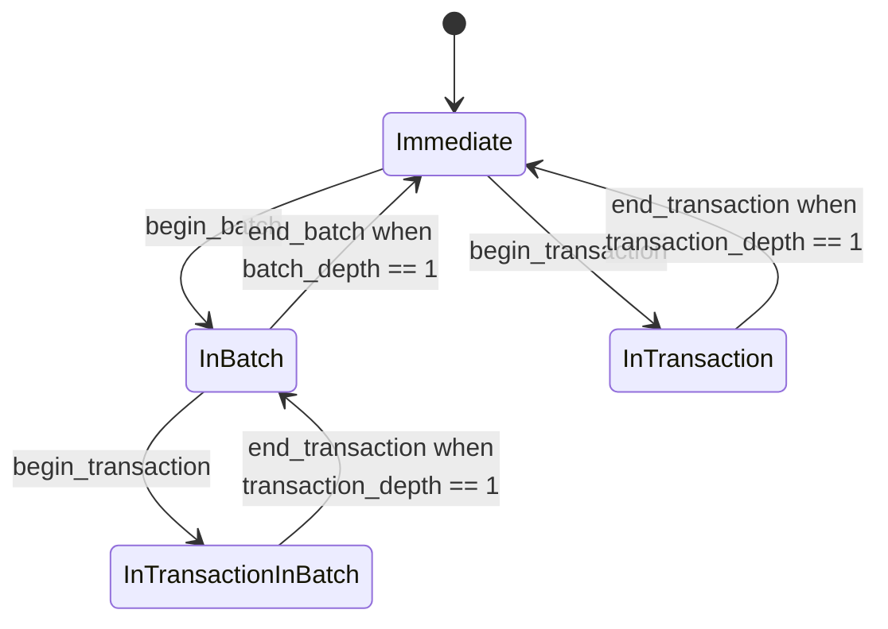

How application operations are grouped into the [transactions](../spec/journal.md#transactions) the journal records.

**Status:** not implemented; the design is settled apart from the explicitly stated open questions.

Transactions are normative — they are the unit of atomicity an application builds on.
**Batches are not**: they are an implementation's mechanism for turning a long run of operations into reasonably sized transactions, and an implementation is free to offer something else or nothing at all.
Both exist only to affect how mutations are *persisted*; the accompanying in-memory mutations are always immediate.

## Three mechanisms over one journal

| mechanism | effect on the journal | what it is for | when to use |
| --- | --- | --- | --- |
| **transaction** | wraps a sequence of operations in a single journal transaction, appended atomically when the caller commits | **correctness**: either all or none of the operations are persisted, so a crash can't expose an invalid intermediate state | whenever intermediate state would be invalid |
| **batch** | cuts a long sequence of operations into reasonably sized subsequences, respecting nested transactions, and wraps each in a transaction | **optimization**: fewer I/O operations, while still bounding the journal's size and any individual write | when many operations happen at once with valid intermediate states — a large import, a paste |
| **bare operation** | recorded as its own transaction | **simplicity**: changes persist immediately | single mutations, prototyping |

**Transactions enforce correctness.**
In complex data types, one semantic operation often produces several journal records — appending to a vector grows it and then writes the element — and interrupting between them leaves an invalid state: uninitialized data, or a leak.
The same happens in application code, where a transition between two valid states sometimes passes through invalid ones.

**Batches are an optimization, and a necessary one.**
Kladde's promise to persist every mutation immediately carries a small unavoidable per-transaction overhead.
That is usually worth it, but it adds up when an action triggers a large or unbounded burst — and for such bursts, per-operation durability buys little anyway.
It is tempting to wrap the burst in a transaction instead, but **very large transactions perform poorly**, because the journal, and therefore the file, must temporarily grow in proportion to the number and size of the operations.
A batch is the middle ground: the backend decides how to divide the sequence, respecting any explicit transaction inside it.

### Recommendations

- For most application code, reach for a **batch or a bare operation**.
  Batches are cheaper for multiple operations, have no I/O overhead over a bare operation even for one, and cost a handful of instructions and no allocation.
  But remember that **batches delay persistence**: they are only guaranteed committed when ended, so holding one open for a long time defeats the point of immediate persistence.
- Use **transactions** when application logic requires atomicity, and keep them short.
  Needing a very long transaction almost always means either that the application's state transitions pass through too many invalid intermediate states, or that the wrong data type was chosen — a vector where a rope or an ordered tree belongs.
  When atomicity is genuinely required for a large mutation, it can usually be imposed at the application level instead: import into a structure that is not yet user-facing, then publish a pointer to it in one operation.
- For a long sequence where *some parts* need atomicity, use a **batch with a few smaller transactions inside**.
  This is the pattern the design is arranged around.

## Nesting

Transactions and batches nest arbitrarily, so that a container's `push` can open a transaction without caring whether its caller already did.
The backend flattens the nesting, because the journal only deals with a flat sequence of transactions.

| ↓ outer; inner → | transaction in a … | batch in a … |
| --- | --- | --- |
| **… transaction** | only outer transaction survives | only the transaction survives *(shouldn't usually occur)* |
| **… batch** | both survive | only outer batch survives |

- **Transaction in a transaction ⇒ outer.** The inner one is meaningless; its atomicity is already enforced. Expected often in composable code.
- **Transaction in a batch ⇒ both.** The inner transaction enforces atomicity, so no cutting point may lie inside it. Expected often.
- **Batch in a batch ⇒ outer.** The inner one is meaningless; deferral is already in effect. Fine, but not useful.
- **Batch in a transaction ⇒ the transaction.** The inner batch is meaningless, since the transaction already forces the operations to commit as one group.
  A potential code smell: batches are for large or unbounded sequences, transactions should be short, so this combination implies a long chain of state transitions with only invalid intermediate states.

## The buffering state machine

The backend keeps an in-memory buffer `ops` of serialized operations, not all of which are necessarily in the file yet, and a state:

```rust
enum TransactionState {
    Immediate,
    InBatch              { batch_depth: NonZero, committed_cursor: usize },
    InTransaction        { transaction_depth: NonZero, batch_depth: u32,
                           committed_cursor: usize },
    InTransactionInBatch { transaction_depth: NonZero, batch_depth: NonZero,
                           committed_cursor: usize, ready_cursor: usize },
}
```

`transaction_depth` and `batch_depth` count begins minus ends, with an implied zero in any variant where they are absent.
Two cursors, `committed_cursor <= ready_cursor <= ops.len()`, divide the operations since the last flush into three segments:

- `committed := ops[..committed_cursor]` — written to the on-storage journal;
- `ready := ops[committed_cursor..ready_cursor]` — pending operations of the current batch, ready to be appended;
- `transaction := ops[ready_cursor..]` — pending operations of an ongoing transaction.



**Why four states and not three.**
`InTransaction` carries a `batch_depth` that may be positive, so it overlaps with `InTransactionInBatch` in depth alone.
What distinguishes them is **which scope was opened first**.
`InTransactionInBatch` is *batch outside, transaction inside* — the useful nesting, where ending the transaction returns to `InBatch` and persistence stays deferred.
`InTransaction { batch_depth > 0 }` is *transaction outside, batch inside* — the code-smell nesting, where the batch is subsumed and its depth is tracked only so that its end can be matched.

### Transitions in detail

The `error` cells are all the same mistake: ending one scope while a scope nested inside it is still open — *interleaving* rather than nesting.
An implementation should make that unrepresentable at the API level rather than checking for it.

| | `Immediate` | `InBatch` | `InTransaction` | `InTransactionInBatch` |
| --- | --- | --- | --- | --- |
| **`transaction_depth`** | `0` (implicit) | `0` (implicit) | `> 0` | `> 0` |
| **`batch_depth`** | `0` (implicit) | `> 0` | any | `> 0` |
| **`committed_cursor`** | `ops.len()` (implicit) | explicit | explicit | explicit |
| **`ready_cursor`** | `ops.len()` (implicit) | `ops.len()` (implicit) | `committed_cursor` (implicit) | explicit |
| **`begin_transaction()`** | `InTransaction { t: 1, b: 0 }` | `InTransactionInBatch { t: 1, .. }` | `transaction_depth += 1` | `transaction_depth += 1` |
| **`end_transaction()`** | error | error | `−1`; at `0`: `Immediate` if `batch_depth == 0`, else error | `−1`; at `0`: `InBatch` |
| **`begin_batch()`** | `InBatch { b: 1 }` | `batch_depth += 1` | `batch_depth += 1` | `batch_depth += 1` |
| **`end_batch()`** | error | `−1`; at `0`: `Immediate` | `batch_depth -= 1` | `−1`; at `0`: error |

## Flush triggers

Upward state transitions and the recording of bare operations can trigger a flush.
All the rules follow one policy:

> **Never grow the journal allocation while it is non-empty.**
> If what is at hand does not fit alongside what the journal already holds, first write out whatever *does* fit, then flush — which empties the journal — and only then deal with the remainder.

The rules:

- **`InTransaction` → `Immediate`:** if `committed` is nonempty and `committed ++ transaction` would overflow the journal, flush.
  Then, regardless, append `transaction` to the on-disk journal as a single transaction.
  - **Analogously, recording an operation in `Immediate`:** if `committed` is nonempty and `committed ++ op` would overflow, flush.
    Then append `op` to both the on-disk journal and the in-memory buffer.
- **`InTransactionInBatch` → `InBatch`:** if `committed ++ ready` is nonempty and `committed ++ ready ++ transaction` would overflow: append `ready` alone to the journal as a single transaction if nonempty, advance `committed_cursor`, and flush *before* the transition — which then consumes `transaction` into `ready`.
  - **Analogously, recording an operation in `InBatch`:** same check; append `ready` without the operation, advance the cursor, flush.
    Then append the operation to the in-memory buffer only.
- **`InBatch` → `Immediate`:** append `ready` to the journal as a single transaction. Don't flush.

**Why `ready` alone always fits.**
`ready` only ever grows while `committed ++ ready ++ next` still fits, because the moment one more operation would overflow, `ready` is drained into `committed` and the journal is flushed.
So `committed ++ ready` never exceeds capacity, and appending `ready` to a journal already holding `committed` never overflows.

**Oversized transactions.**
The one case the rules cannot absorb is a single transaction, or bare operation, larger than the journal's whole capacity: flushing empties the journal but the subsequent append still does not fit.
The resolution is to **grow the journal allocation**, and the policy guarantees this happens only while the journal is **empty** — so there are no contents to relocate, and the allocation can simply be freed and re-allocated larger.
It shrinks back at the next flush.

### Why the "only grow an empty journal" policy is worth keeping

Traced against all five trigger rules, the invariant holds: `committed ++ ready` never exceeds capacity, so every "append `ready`" is safe, and the only append that can overflow is the one immediately after a flush — at which point `committed` is empty by construction.
The `InTransactionInBatch` case is the subtle one and it also works: an oversized `transaction` is folded into `ready` and sits in memory, so it does not force growth until the *next* operation triggers a drain, and `committed` is still empty then.

It is a real simplification rather than just a smaller window.
Growing an empty allocation does not merely avoid copying journal contents — it means the journal can be freed and re-allocated rather than resized in place, so it can move anywhere with space rather than needing room to grow where it sits.
That is a much weaker demand on placement, and it is the strongest argument for the policy.

Three things it does **not** solve, none fatal:

1. **Crash safety of the growth itself.** Freeing and re-allocating the journal is a mutation that cannot be journalled, there being no journal at that moment by construction. It still depends on the surrounding persistence being crash-safe — the "empty" property makes the operation *simple*, not *free*.
2. **Memory is not bounded by journal capacity.** The in-memory buffer holds the whole transaction regardless of what the file does, so an oversized transaction is still an unbounded in-memory buffer. Worth saying in the recommendations, since the prose above implies the cost of a huge transaction is file size.
3. **The capacity number is undefined.** Is it fixed, does it scale with file size, and does the shrink-back target the original value or a high-water mark? The last matters: shrinking to the original on every flush will thrash if an application does oversized transactions regularly.

### Consequence for write-phase geometry

Because a flush can occur while a completed `transaction` or bare operation is still sitting in the buffer past `committed_cursor`, the write-phase geometry no longer describes the same point in the sequence as the flush does.
It must therefore be **repopulated** from those remaining operations after the flush, rather than simply cleared.

Under the rules exactly as written this affects the two `InTransaction → …` transitions and nothing else, since those are the only ones where a completed `transaction` is already buffered when the flush runs.
In the two operation-recording rules the operation is appended *after* the flush, so nothing outlives it.
This is sensitive to implementation order — appending a bare operation to the buffer *before* the overflow check would make that case need repopulation too — so the ordering is worth keeping explicit in the code rather than relying on it implicitly.

## Checkpoint versus commit

**Undecided, and consequential.**

The confusion this resolves is that the journal does **two jobs** which are currently fused:

- **Durability** — make a mutation survive a crash.
  Requires that records reach stable storage before the call returns, and that a torn tail is detectable.
- **Deferral** — avoid touching the file's compact form on every mutation.
  Requires only that the journal be replayable later; nothing about it needs to be durable for this purpose.

Today both are served by the same structure at the same moment, which is why the question below is open at all.
Separating them is what would let an implementation bound its memory inside a long transaction.

- A **checkpoint** applies buffered work so the in-memory journal can be released. Triggered by resource pressure; lands wherever that pressure falls.
- A **commit** is a boundary the recovered state may snap to. Triggered by the application's notion of a completed change.

Today they are the same event, which gives atomicity for free.
The intended model separates them: application authors never call flush, and when the journal grows too long the guard method that would overflow it checkpoints automatically.
A flush triggered by buffer size cannot also be a durability boundary, or durability would be set by how much memory the journal happens to use.

Three consequences follow immediately:

**Flush needs only shared access to the backend.**
The auto-checkpoint fires from inside a mutating call, which holds no exclusive reference to the whole structure.
This is safe — callers hold ids and offsets, never addresses, and writes resolve locations at write time, so relocation under a live mutation is transparent.
Note that it is a *reentrant* call, so no write path may hold an interior borrow across a callback.

**The trigger belongs at operation boundaries**, not at append time.
A check on append can fire between two records of one logical mutation.
An operation is the natural atomic unit, being the smallest thing an application author perceives as one change.

**Flush splits into two knobs**: fold-and-apply, which bounds memory, and truncate-the-journal, which is only safe up to the last commit.

What is *not* decided is how uncommitted data is kept out of the recovered state — write-ahead logging with undo, or checkpointing only committed prefixes.
The first bounds memory inside long transactions and needs undo; the second is far simpler and does not.

## Open questions

- The journal's capacity, as above.
- Whether the interaction between on-file state changes and the journal, and whether an *actively used* journal allocation ever needs to grow for hoisting, make the simpler "grow on demand" policy available — in which case much of the trigger machinery can go.
