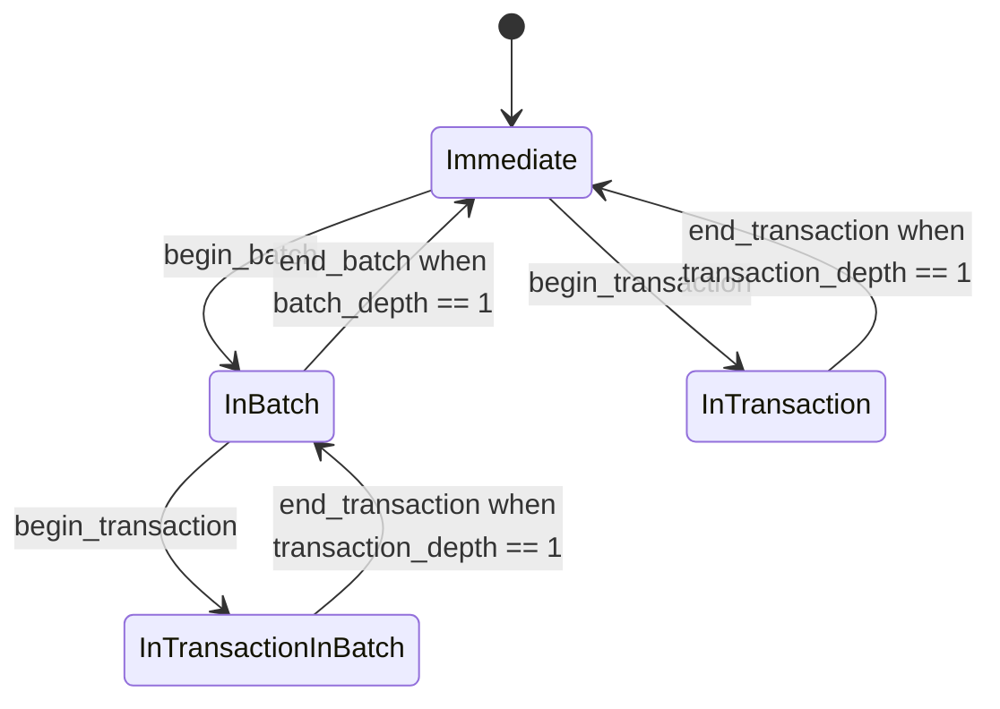

How application operations are grouped into the [transactions](../spec/journal.md#transactions) the journal records.

**Status:** not implemented; the design is settled apart from the explicitly stated open questions.

Transactions are normative — they are the unit of atomicity an application builds on.
**Batches are not**: they are an implementation's mechanism for turning a long run of operations into reasonably sized transactions, and an implementation is free to offer something else or nothing at all.
Both exist only to affect how mutations are *persisted*; the accompanying in-memory mutations are always immediate.

## Three mechanisms over one journal

| mechanism | effect on the journal | what it is for | when to use |
| --- | --- | --- | --- |
| **transaction** | wraps a sequence of operations in a single journal transaction, appended atomically when the caller commits | **correctness**: either all or none of the operations are persisted, so a crash can't expose an invalid intermediate state | whenever intermediate state would be invalid |
| **batch** | cuts a long sequence of operations into reasonably sized subsequences, respecting nested transactions, and wraps each in a transaction | **optimization**: fewer I/O operations, while still bounding the journal's size and any individual write | when many operations happen at once with valid intermediate states — a large import, a paste |
| **bare operation** | recorded as its own transaction | **simplicity**: changes persist immediately | single mutations, prototyping |

**Transactions enforce correctness.**
In complex data types, one semantic operation often produces several journal records — appending to a vector grows it and then writes the element — and interrupting between them leaves an invalid state: uninitialized data, or a leak.
The same happens in application code, where a transition between two valid states sometimes passes through invalid ones.

**Batches are an optimization, and a necessary one.**
Kladde's promise to persist every mutation immediately carries a small unavoidable per-transaction overhead.
That is usually worth it, but it adds up when an action triggers a large or unbounded burst — and for such bursts, per-operation durability buys little anyway.
It is tempting to wrap the burst in a transaction instead, but **very large transactions perform poorly**, because the whole transaction is held in memory until it ends, and the journal, and therefore the file, must then temporarily grow in proportion to the number and size of the operations.
A batch is the middle ground: the backend decides how to divide the sequence, respecting any explicit transaction inside it.

### Recommendations

- For most application code, reach for a **batch or a bare operation**.
  Batches are cheaper for multiple operations, have no I/O overhead over a bare operation even for one, and cost a handful of instructions and no allocation.
  But remember that **batches delay persistence**: they are only guaranteed committed when ended, so holding one open for a long time defeats the point of immediate persistence.
- Use **transactions** when application logic requires atomicity, and keep them short.
  Needing a very long transaction almost always means either that the application's state transitions pass through too many invalid intermediate states, or that the wrong data type was chosen — a vector where a rope or an ordered tree belongs.
  When atomicity is genuinely required for a large mutation, it can usually be imposed at the application level instead: import into a structure that is not yet user-facing, then publish a pointer to it in one operation.
- For a long sequence where *some parts* need atomicity, use a **batch with a few smaller transactions inside**.
  This is the pattern the design is arranged around.

## Nesting

Transactions and batches nest arbitrarily, so that a container's `push` can open a transaction without caring whether its caller already did.
The backend flattens the nesting, because the journal only deals with a flat sequence of transactions.

| ↓ outer; inner → | transaction in a … | batch in a … |
| --- | --- | --- |
| **… transaction** | only outer transaction survives | only the transaction survives *(shouldn't usually occur)* |
| **… batch** | both survive | only outer batch survives |

- **Transaction in a transaction ⇒ outer.** The inner one is meaningless; its atomicity is already enforced. Expected often in composable code.
- **Transaction in a batch ⇒ both.** The inner transaction enforces atomicity, so no cutting point may lie inside it. Expected often.
- **Batch in a batch ⇒ outer.** The inner one is meaningless; deferral is already in effect. Fine, but not useful.
- **Batch in a transaction ⇒ the transaction.** The inner batch is meaningless, since the transaction already forces the operations to commit as one group.
  A potential code smell: batches are for large or unbounded sequences, transactions should be short, so this combination implies a long chain of state transitions with only invalid intermediate states.

## The buffering state machine

The backend keeps an in-memory buffer `ops` of serialized operations, not all of which are necessarily in the file yet, and a state:

```rust
enum TransactionState {
    Immediate,
    InBatch              { batch_depth: NonZero, committed_cursor: usize },
    InTransaction        { transaction_depth: NonZero, batch_depth: u32,
                           committed_cursor: usize },
    InTransactionInBatch { transaction_depth: NonZero, batch_depth: NonZero,
                           committed_cursor: usize, ready_cursor: usize },
}
```

`transaction_depth` and `batch_depth` count begins minus ends, with an implied zero in any variant where they are absent.
Two cursors, `committed_cursor <= ready_cursor <= ops.len()`, divide the operations since the last flush into three spans:

- `committed := ops[..committed_cursor]` — written to the on-storage journal;
- `ready := ops[committed_cursor..ready_cursor]` — pending operations of the current batch, ready to be appended;
- `transaction := ops[ready_cursor..]` — pending operations of an ongoing transaction.



**Why four states and not three.**
`InTransaction` carries a `batch_depth` that may be positive, so it overlaps with `InTransactionInBatch` in depth alone.
What distinguishes them is **which scope was opened first**.
`InTransactionInBatch` is *batch outside, transaction inside* — the useful nesting, where ending the transaction returns to `InBatch` and persistence stays deferred.
`InTransaction { batch_depth > 0 }` is *transaction outside, batch inside* — the code-smell nesting, where the batch is subsumed and its depth is tracked only so that its end can be matched.

### Transitions in detail

The `error` cells are all the same mistake: ending one scope while a scope nested inside it is still open — *interleaving* rather than nesting.
An implementation should make that unrepresentable at the API level rather than checking for it.

| | `Immediate` | `InBatch` | `InTransaction` | `InTransactionInBatch` |
| --- | --- | --- | --- | --- |
| **`transaction_depth`** | `0` (implicit) | `0` (implicit) | `> 0` | `> 0` |
| **`batch_depth`** | `0` (implicit) | `> 0` | any | `> 0` |
| **`committed_cursor`** | `ops.len()` (implicit) | explicit | explicit | explicit |
| **`ready_cursor`** | `ops.len()` (implicit) | `ops.len()` (implicit) | `committed_cursor` (implicit) | explicit |
| **`begin_transaction()`** | `InTransaction { t: 1, b: 0 }` | `InTransactionInBatch { t: 1, .. }` | `transaction_depth += 1` | `transaction_depth += 1` |
| **`end_transaction()`** | error | error | `−1`; at `0`: `Immediate` if `batch_depth == 0`, else error | `−1`; at `0`: `InBatch` |
| **`begin_batch()`** | `InBatch { b: 1 }` | `batch_depth += 1` | `batch_depth += 1` | `batch_depth += 1` |
| **`end_batch()`** | error | `−1`; at `0`: `Immediate` | `batch_depth -= 1` | `−1`; at `0`: error |

## Flush triggers

> **Append whole transactions, and flush once the journal segment has outgrown its page budget.**

The budget is a trigger, not a capacity.
The journal is a [chain of pages](../spec/journal.md#pages), so a transaction larger than what is left of the budget — or larger than the whole budget — needs no special case: it is appended whole, spanning as many pages as it needs, and the flush that follows folds it.

The rules, all applied at operation boundaries:

- **Recording an operation in `Immediate`**, and **`InTransaction` → `Immediate`:** append the operation, or `transaction`, to the journal as one transaction; then flush if the segment is over budget.
- **Recording an operation in `InBatch`:** add it to `ready`; if `ready` has reached the batch size, append `ready` as one transaction, then flush if the segment is over budget.
- **`InTransactionInBatch` → `InBatch`:** `transaction` joins `ready`, and the same check follows as when recording an operation in `InBatch` — which is why a batch is never cut inside a transaction.
- **`InBatch` → `Immediate`:** append `ready` as one transaction, then flush if the segment is over budget.
- **An explicit `flush()`:** append `ready`, which lies outside any open transaction, then flush.
- **Opening a file whose recovered journal is non-empty:** flush before the first append, as [the journal requires](../spec/journal.md#the-start-of-a-session).

The batch size decides how much a batch may hold back from the journal, trading the per-transaction overhead against what an application crash can lose; it is independent of the segment budget.

**The budget bounds the file, not memory.**
An open transaction is held in memory in full, whatever the budget, because nothing can [fold an unfinished transaction](../spec/journal.md#checkpoint-versus-commit); a huge transaction costs memory in proportion to its size, and journal pages in proportion too once it is appended.

### Consequence for write-phase geometry

Every automatic flush runs right after an append, with `ready` and `transaction` empty, so it folds exactly the operations the write-phase geometry has seen, and the geometry can simply be cleared.

An explicit `flush()` inside a transaction is the exception.
The open transaction's operations stay buffered past `committed_cursor`, so the geometry no longer describes the same point in the sequence as the fold, and it must be **repopulated** from those operations after the flush rather than cleared.

## Checkpoint versus commit

**Decided: a checkpoint never splits a commit** — see [the journal](../spec/journal.md#checkpoint-versus-commit).

A *checkpoint* is a flush triggered by resource pressure, and a *commit* is a transaction boundary the recovered state may snap to.
The open question was whether a checkpoint could fold part of an unfinished transaction, to bound the memory the transaction holds.
It cannot: the header it committed would describe a state inside the transaction, and undoing that part on recovery would need a mechanism the format does not have.
So every flush folds complete transactions only, and the memory an open transaction holds is bounded only by [keeping transactions short](#recommendations).

What remains is that application authors need never call `flush()`: the operation that pushes the journal over its budget flushes automatically.
Two consequences follow:

**Flush needs only shared access to the backend.**
The auto-checkpoint fires from inside a mutating call, which holds no exclusive reference to the whole structure.
This is safe — callers hold ids and offsets, never addresses, and writes resolve locations at write time, so relocation under a live mutation is transparent.
Note that it is a *reentrant* call, so no write path may hold an interior borrow across a callback.

**The trigger belongs at operation boundaries**, not at append time.
A check on append can fire between two records of one logical mutation.
An operation is the natural atomic unit, being the smallest thing an application author perceives as one change.

## Open questions

- The segment's page budget and the batch size: whether each is fixed or scales with the file, and whether either should adapt to an application whose transactions routinely exceed it.
