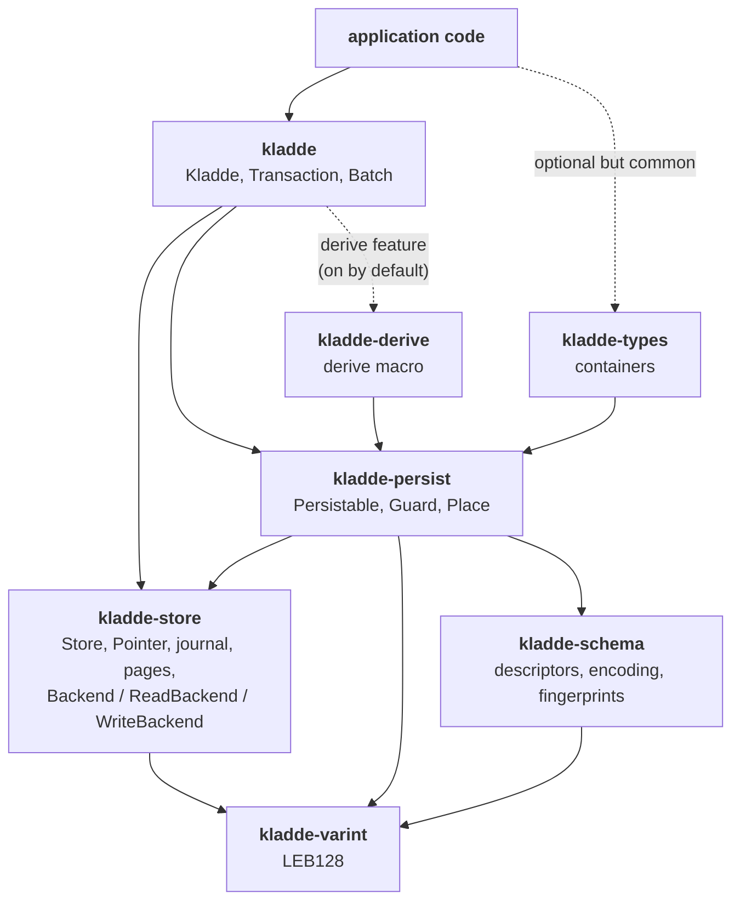

The workspace, what depends on what, and where the language-neutral half ends.

## The crates

| crate | role |
| --- | --- |
| `kladde-store` | the storage layer: the file, pages, the address table, the journal, the flush, and consolidation, behind the `Backend` traits. Type-agnostic; knows nothing about serialization. |
| `kladde-persist` | the serialization layer: `Persistable`, `Slottable`, `Guard`, the two encodings, `Place` and `Location`, the scalar guards, and the schema binding. |
| `kladde-schema` | type descriptors, their canonical encoding, and fingerprints. Depends on nothing but `kladde-varint`. |
| `kladde-varint` | LEB128 varints. |
| `kladde-types` | the built-in containers: vector, packed vector, string, small string and small vector, hash map, blob. The default collection, not a layer — it uses only the public API any library could. |
| `kladde-derive` | the `#[derive(Persistable)]` macro. Reached through `kladde`'s `derive` feature; applications do not depend on it directly. |
| `kladde` | the application-facing entry point: creating and opening files, the root value, transactions and batches. Re-exports the derive macro and everything a `Persistable` impl names, so an application needs this crate and nothing below it. |

The dependency direction is strictly downward, and `kladde-store` deliberately depends on nothing but `kladde-varint` — it is usable on its own as a persistent store of byte allocations, independently of anything above it.

## The parts

### `kladde-store` — the storage layer

Owns the file.
It implements everything [the implementation notes](../impl/) describe, and adds only what Rust needs: the `Backend` traits the layer above calls, the `Store` that implements them, and a `Storage` trait with two implementations, a real file and a byte vector in memory.
See [The store](store.md) for the Rust-specific half.

### `kladde-persist` — the serialization layer

Where types meet bytes.
`Persistable` with its two encodings, its `Guard` counterpart, `Place` and the `Node`s a value in a packed place reports its changes of size to, and the guards of the scalar types.
Knows about the store's traits; knows nothing about any particular container or derived type.

### `kladde-schema` — type descriptors

The Rust implementation of the [language-independent schema model](../spec/schema/).
It depends on neither the store nor `Persistable`, deliberately, because it must be portable and testable on its own; the binding between a Rust type and its descriptor lives one layer up, in `kladde-persist`.
See [Schema binding](schema-binding.md).

### `kladde-types` and `kladde-derive` — the type vocabulary

The built-in containers, and the macro that turns user types into backed ones.
Both build on `kladde-persist`, and neither depends on the other.

The macro is re-exported from `kladde`, not from `kladde-types`, so that an application can use the containers without the macro machinery and vice versa — and because generated code is rooted at `::kladde`, which is where the items it names are re-exported from.

### `kladde` — the entry point

`Kladde<T>` pairs a root value with a `Store`, and is what application code holds.
It writes the root's descriptor table and fingerprint into the file at creation, checks the fingerprint at open, and hands out guards, transactions, and batches.

## The seam

For anyone porting kladde, one boundary matters more than the rest.

**Below `kladde-persist`, the design is language-neutral.**
The address table, the journal, the flush, the consolidation policy, and the schema model all translate more or less directly; they are documented in [Specification](../spec/) and [Implementation](../impl/) rather than here.

**At and above `kladde-persist`, the design is Rust-specific and should be redone.**

- `Persistable`/`Guard` exists because Rust cannot intercept a field assignment.
- The `&self` write / `&mut self` read split exists because Rust's borrow checker can then enforce "no reading stale data mid-write" for free.
- `SLOTTED_SIZE` as an associated constant, and the encoding as a type parameter, exist because Rust can compute the offsets of slotted fields at compile time and fold away the code for the encoding a place does not hold.
  A language without compile-time constant folding will compute offsets some other way — probably once per type at startup, which is fine, but it changes the shape of the code.
- `Slottable` and `#[kladde(packed_only)]` exist so that a type without a fixed encoding in a slotted place is a compile error; a language without a static type check of this kind checks it when it builds a type's descriptor, by the [rules of nesting](../spec/schema/type-descriptors.md#the-rules-of-nesting).

A Python port should keep the storage layer almost verbatim and throw away the guards entirely.
A C++ one might use proxy objects with `operator=`; a Java one might use bytecode enhancement, which is what db4o did.

## Cross-cutting concerns

**Crash consistency** is a property of the journal and the flush, but every container must uphold the [ordering discipline](../spec/journal.md#ordering) for it to hold, and no type system enforces it.

**Freeing** is a type-driven hook that spans the persistence layer and the store; see [Freeing](freeing.md).

**Schema evolution** touches the load path, the mutation path, and the flush, because a value read at a foreign layout must not then be mutated at native offsets; see [the specification](../spec/schema/evolution.md).
Until it exists, a file whose root fingerprint differs from the application's is refused at open.
