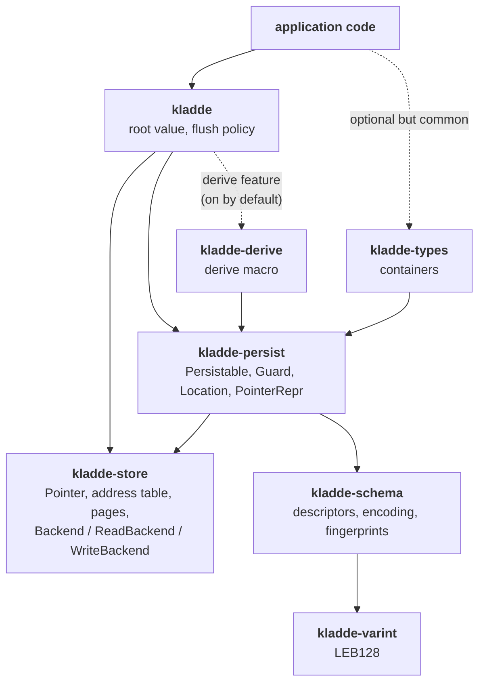

The workspace, what depends on what, and where the language-neutral half ends.

## The crates

| crate | role |
| --- | --- |
| `kladde-store` | the storage layer: pages, the address table, the journal, and the storage backends. Type-agnostic; knows nothing about serialization. |
| `kladde-persist` | the serialization layer: `Persistable`, `Location`, the pointer byte encoding, and the typed conveniences on top of a backend. |
| `kladde-schema` | type descriptors, their canonical encoding, and fingerprints. Depends on nothing but `kladde-varint`. |
| `kladde-varint` | LEB128 varints. |
| `kladde-types` | the built-in containers: vector, hash map, string, blob. The default collection, not a layer — it uses only the public API any library could. |
| `kladde-derive` | the `#[derive(Persistable)]` macro. Reached through `kladde`'s `derive` feature; applications do not depend on it directly. |
| `kladde` | the application-facing entry point: opening files, the root value, the default backend. Re-exports the derive macro and everything a `Persistable` impl names, so an application needs this crate and nothing below it. |

The dependency direction is strictly downward, and `kladde-store` deliberately depends on none of the others — it is usable on its own as a persistent, relocatable store, independently of anything kladde-specific.

The dashed edge is optional: `kladde-derive` arrives through `kladde`'s `derive` feature, which is on by default.

## The parts

### `kladde-store` — the storage layer

Owns the file.
It knows which allocation's content lives where, which pages are reusable, and how to reclaim them.
It is **type-agnostic**: it has no notion of serialization, schema, or any kladde-specific concept.

That independence is deliberate.
The layer above can be replaced without touching it, which is exactly what a port to another language would do.
Everything it implements is described language-neutrally in [the implementation notes](../impl/); this crate is one binding of it.

### `kladde-persist` — the serialization layer

Where types meet bytes.
`Persistable`, its `Guard` counterpart, `Location`, and the on-file pointer encoding.

Knows about the store; knows nothing about any particular container or derived type.

### `kladde-schema` — type descriptors

The Rust implementation of the [language-independent schema model](../spec/schema/).

Depends only on `kladde-varint`.
It depends on neither the store nor `Persistable` — deliberately, because it must be portable and testable on its own; the arrow in the diagram points the other way, from `kladde-persist` into it.
The binding between a Rust type and its descriptor lives one layer up; see [Schema binding](schema-binding.md).

### `kladde-types` and `kladde-derive` — the type vocabulary

The built-in containers, and the macro that turns user types into backed ones.
Both build on `kladde-persist`, and neither depends on the other.

The macro is re-exported from `kladde`, not from `kladde-types`, so that an application can use the containers without the macro machinery and vice versa — and because generated code is rooted at `::kladde`, which is where the items it names are re-exported from.

Neither is load-bearing: nothing below them depends on either, and `kladde-types` uses only the public surface any third-party library could use.
It is the default collection of backed types, not a layer of the system.

### `kladde` — the entry point

The crate application code depends on: opening files, the root value, flush policy, and the default backend.

## The seam

For anyone porting kladde, one boundary matters more than the rest.

**Below `kladde-persist`, the design is language-neutral.**
The address table, the journal, the flush, the consolidation policy, and the schema model all translate more or less directly.
They are shaped by the file format, not by Rust, and they are documented in [Specification](../spec/) and [Implementation](../impl/) rather than here.

**At and above `kladde-persist`, the design is Rust-specific and should be redone.**

- `Persistable`/`Guard` exists because Rust cannot intercept a field assignment.
- The `&self` write / `&mut self` read split exists because Rust's borrow checker can then enforce "no reading stale data mid-write" for free.
- `INLINE_SIZE` as an associated constant exists because Rust can compute field offsets at compile time.

A Python port should keep the storage layer almost verbatim and throw away the guards entirely.
A C++ one might use proxy objects with `operator=`; a Java one might use bytecode enhancement, which is what db4o did.

**Watch out for `INLINE_SIZE`.**
It is what makes field offsets free in Rust, and a language without compile-time constant folding will need to compute offsets some other way — probably once per type at startup, which is fine, but it changes the shape of the code.

## Cross-cutting concerns

Three things do not belong to any single crate.

**Crash consistency** is a property of the journal and the flush, but every container must uphold the [ordering discipline](../spec/journal.md#ordering) for it to hold, and no type system enforces it.

**Freeing** is designed as a type-driven recursive hook, so it spans the persistence layer and the store.
See [Freeing](freeing.md).

**Schema evolution** touches the load path, the mutation path, and the flush, because a value read at a foreign layout must not then be mutated at native offsets.
See [the specification](../spec/schema/evolution.md).
