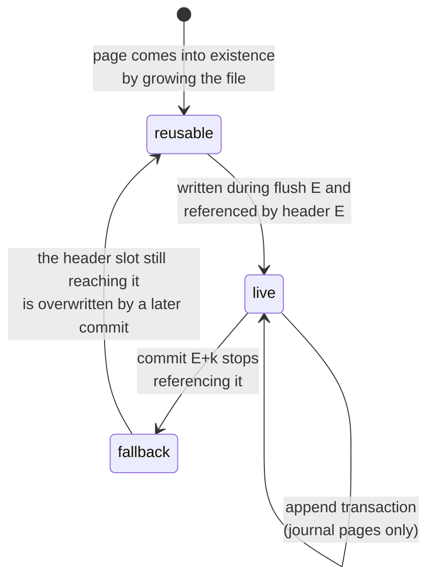

# CoW Kladde Redesign

Proposal for a redesign of the on-file structure of kladde files around copy-on-write (CoW) pages.
This document began as a draft sketch and has been worked out into a concrete design; a feasibility assessment, including the trade-offs against the current design, is in [[#Assessment]].

**Goal:** orient the layout of both the address table and the allocations on fixed-size pages from the ground up, in order to (i) reduce the actual I/O per flush, measured in physically written pages, and (ii) guarantee durability under power outage — by *preventing* damage to committed state rather than merely detecting it — by never overwriting live data.

**Trade-off:** files are somewhat larger during operation, because superseded pages linger until consolidation rewrites them.
This overhead is bounded by the consolidation policy (see [[#Consolidation]]) rather than automatically constant, and a file can always be bulk-compacted into a tight new file, e.g., upon clean close.

## Guiding principles

### What remains

- The API for application authors and for authors of `Persistable` implementations is unchanged.
- Allocations are still addressed by an abstract id, mapped to file locations by a data-type-agnostic *address manager* (the name "heap" no longer fits: it neither hands out contiguous ranges nor manages a single flat address space).
- Reads are still bulk: the file (in the future, one section) is read once at open into in-memory representations optimized for lookup.
  On-file representations are therefore optimized for compactness and cheap incremental edits, never for random access — this constraint is what lets the design below stay much simpler than a database engine.
- Writes are still journaled as a sequence of transactions that are durable under application crash, exactly as before.
  The journal's op set and the fold that turns ops into per-range content descriptions (piece tables) are untouched by this redesign; only the *execution* of a flush changes.

### What changes

- **Durability under power outage becomes a guarantee.**
  After a power cut — even one during `fsync` — recovery reaches the state of some transaction boundary, including at least every transaction folded by the last completed `flush()`.
  Transactions issued after the last completed flush survive up to a valid journal prefix, exactly as under the application-crash guarantee, minus whatever the OS never wrote out.
- **A flush writes whole pages, and only to locations that nothing can still depend on.**
  Live pages are never overwritten (journal appends excepted); every flush write targets pages that are unreachable from every state recovery could still fall back to.
- **Allocations are no longer contiguous on file** but chunked into at most `ceil(allocation_size / MAX_PAGE_CONTENT) + 1` chunks, each contained in a single page (see [[#Allocations and chunks]]).
- **The conflict/WAL/hoisting apparatus of the current flush design disappears.**
  Because no flush write ever destroys bytes that anything still reads, there are no read/write conflicts, no write-ahead copies, and no restartability analysis: a crashed flush is simply re-run against the untouched previous state.
- A future design of `Section`s becomes more approachable, because all state is reachable from a root rather than discovered by scanning.

## Pages

A kladde file is a sequence of fixed-size pages.
The page size is recorded in the file header; this document assumes 4 KiB throughout.
Nothing below depends on the exact value — 16 KiB works identically — and 4 KiB is the default because it matches the write-back granularity of common file systems, which is what makes the whole page the honest unit of I/O: the OS rewrites a full page even when the application modifies one byte of it.
Whether 16 KiB pays on platforms with 16 KiB native pages is a measurement question, not a design question ([[#Open questions]]).

Outside of journal appends, kladde only ever writes entire pages at once, and only to pages that are reusable per the rule in [[#Life cycle of pages]].

### On-file page format

Every page except the two header pages concatenates the following fields, in this order, without delimiters:

- `kind` and `content_size` (16 bits combined) —
  `kind` (2 bits) is one of `Data`, `AddressTable`, `Index`, or `Journal`;
  `content_size` (14 bits) is the size of `content` in bytes.
- `epoch` (64 bits) — the flush counter at the time the page was written (see [[#Epochs]]).
- `content` (`content_size` bytes, at most `MAX_PAGE_CONTENT`).
- `crc` (32 bits) — checksum over all preceding bytes of the page.
  A page whose CRC does not validate **must be ignored** during loading; the design guarantees that no committed state ever references a page whose write did not complete, so an invalid CRC can only belong to garbage that nothing references.
- `padding` — arbitrary bytes up to the page boundary; excluded from the CRC; may be absent for the file's last page.

`MAX_PAGE_CONTENT` is the page size minus 14 bytes (2 + 8 + 4), i.e., 4082 bytes for 4 KiB pages.

There is deliberately **no `Free` kind and no free marker**, resolving two TODOs of the draft.
Liveness is not a property recorded in a page; it is defined by reachability from a committed header ([[#Life cycle of pages]]).
A page therefore needs no on-disk state transition to die, dead pages need no explicit demotion before reuse, and the extra marker write the draft contemplated for releasing tombstone dependencies has no purpose (tombstone lifetime is handled in [[#Tombstones]] without it).

### Header pages

Pages 0 and 1 are the two **header pages**, used alternately: the flush with epoch `E` writes header slot `E mod 2`.
Each holds a fixed-size structure:

- `magic` and format version,
- `page_size`,
- `epoch` (64 bits),
- the page numbers of the [[#The index|index]] pages of this epoch,
- the start page of the *next* journal segment (the one that will collect transactions after this flush; see [[#Flushing]]),
- `crc` over all of the above.

On open, both header pages are read; the CRC-valid one with the higher epoch governs.
A torn header write can only damage the slot being written, which held the older of the two headers, so the previous state remains reachable through the other slot.
This is LMDB's alternating meta-page scheme, and it is the only fixed-location, overwritten-in-place structure in the entire file.

### Epochs

The **epoch** is a monotone counter, incremented by one per flush, stored in every page and in each header.
It exists for three purposes: it orders contradicting statements between address-table pages ([[#Statements and shadowing]]), it salts the journal's CRC chain so that stale bytes in a reused page can never impersonate a valid journal, and it serves as an end-to-end assertion — a page reachable from the header of epoch `E` must carry an epoch `≤ E`, and the epoch the index records for an address-table page must equal the epoch stored in that page, so any violation reveals that the platform broke the `fsync` contract and the file must be treated as damaged rather than silently misread.

**Wrap-around** (the draft's question): use 64 bits and do not handle wrapping.
At one flush per millisecond, 64 bits last half a billion years; this is what modern systems do (ZFS transaction groups and LMDB transaction ids are 64-bit).
The 32-bit alternative requires actively rewriting laggard pages before the counter catches up to them — this is exactly PostgreSQL's transaction-id wraparound "freezing", a notorious operational burden that PostgreSQL carries only because its on-disk format predates the lesson.
A new format should simply pay the 4 extra bytes per page; they are 0.1 % of a 4 KiB page.

Epochs are **replay-stable** for free: the epoch of a flush is the committed header's epoch plus one, so a flush re-run during recovery reproduces the same epoch (this resolves the draft's TODO about making the counter crash-resistant — it lives in the headers, and nowhere else).

### Life cycle of pages

Page states are **derived, not stored**.
Define the **world** of a header as everything reachable from it: its index pages, the address-table pages the index lists, the data pages those reference, and the journal segment it names.
At any moment, the two on-disk header slots define at most two worlds, and every page is in exactly one of three states:

- **live** — reachable from the newer on-disk header's world;
- **fallback** — reachable only from the older on-disk header's world;
- **reusable** — reachable from neither.

**The reuse rule, which the whole durability argument rests on:** a flush may write only to reusable pages, or extend the file.
In steady state this means a page that the commit of epoch `E` stopped referencing becomes writable in flush `E + 2`: during flush `E + 1` the on-disk headers are those of `E` and `E − 1`, and the page — live in world `E − 1` — is still reachable from the latter; only when commit `E + 1` overwrites header slot `E − 1` does it become unreachable from both.

A page dropped by commit `E` is part of world `E − 1`, whose header occupies a slot until commit `E + 1` overwrites it; the page is therefore reusable from flush `E + 2` on.
The same rule covers reopening after a crash with no special cases: whatever headers are on disk define the worlds to respect.

This resolves the draft's TODO about whether `Data` pages can be "dead" as opposed to "free": the distinction does not exist.
A data page's liveness is governed entirely by whether an indexed address-table page references any byte of it; when the last reference goes, the page follows the diagram above like every other page.
The in-memory `coverage` counter ([[#Coverage accounting]]) merely tracks how close a page is to that point; it is bookkeeping for the consolidation policy, not an on-disk state.

## Flushing

Journal segment `E` collects the transactions issued between flush `E − 1` and flush `E`.
Appends to it are protected by the chained, epoch-salted transaction CRCs and are **not** fsynced individually — exactly the current design's application-crash guarantee.

Flush `E` then proceeds (this replaces the draft's nine steps):

1. **Fold** segment `E` in memory into per-chunk content descriptions — the existing fold, unchanged.
2. **Choose target pages**: reusable pages, else grow the file.
3. **Write data pages**: every chunk whose content changed, written whole.
   Remaining space in each new page is filled with live chunks relocated from the pages with the lowest live fraction — consolidation that costs no extra page writes.
4. **Write budgeted consolidation pages** beyond that, per [[#Consolidation]].
5. **Write address-table delta pages**: statements for everything written in steps 3–4, plus resizes, plus tombstones per [[#Tombstones]].
6. **Rewrite the index pages**, and pick a reusable start page for journal segment `E + 1`.
   That page needs no write: segment `E + 1`'s CRC chain is salted with epoch `E + 1`, so whatever stale bytes the page holds cannot validate as journal content.
7. **`fsync`** — the only one.
8. **Write the header** into slot `E mod 2`: epoch `E`, index page numbers, segment `E + 1`'s start page, CRC.

Flush `E + 1` may begin immediately; nothing waits for the header write to become durable.

**Why one `fsync` suffices** (the draft asked for exactly this).
The protocol maintains two invariants:

- **I1 — a header is issued only after an `fsync` that covered everything it references, and covered the previous header.**
  The header write of epoch `E` happens after `fsync` `E` returns; `fsync` `E` also flushed the header of epoch `E − 1`, which was issued before it.
  Consequence: a header found on disk implies its entire world is durable — there is no such thing as a valid header pointing at missing writes, so recovery never needs to validate a world before trusting it.
- **I2 — flush writes touch only pages unreachable from both on-disk headers** (the reuse rule).
  Consequence: no matter where a power cut lands, both worlds that recovery might fall back to are physically intact.

**Recovery** is then: read both header pages, keep the CRC-valid ones, take the one with the higher epoch, bulk-load its world, and replay the valid prefix of the journal segment it names.
Case analysis for a power cut during flush `E + 1`:

- Header `E + 1` reached the disk.
  By I1 its world is durable; recover to state `E + 1`, then replay whatever prefix of segment `E + 2` survived.
- Header `E + 1` did not reach the disk.
  The governing header is `E`; by I2 its world is intact; segment `E + 1` was made durable by `fsync` `E + 1` if that call returned, and truncates at its valid prefix otherwise.
  Recovery lands on state `E` plus that prefix — at worst losing transactions that no completed `fsync` ever covered, which is within the guarantee.

Note what makes `flush()`'s return value honest: when flush `E` returns, `fsync` `E` has completed, so header `E − 1` and segment `E` are durable, so state `E` is recoverable even though header `E` itself may not be durable yet — recovery would land on header `E − 1` and replay segment `E` in full.
The header write is thus a *representation* change, not the durability point; durability is established by the `fsync`, one write earlier than intuition suggests.

**`fsync` failure** must be treated as fatal for the session: after a failed `fsync`, the OS may mark dirty pages clean without having written them, so the only sound reaction is to discard all in-memory state and reopen from disk (the "fsyncgate" lesson).

## Allocations and chunks

To application code and `Persistable` implementations, an allocation is a contiguous byte sequence.
On file, it is broken into **chunks**, each contained entirely in one page:

- at most one *head* chunk of size `1 ≤ s < MAX_PAGE_CONTENT` at an arbitrary offset within a shared page;
- zero or more *middle* chunks of exactly `MAX_PAGE_CONTENT` bytes, each filling one page's content;
- at most one *tail* chunk of size `1 ≤ s < MAX_PAGE_CONTENT` in a shared page.

An allocation smaller than `MAX_PAGE_CONTENT` is a single head chunk; many such chunks pack into one shared page.
The partial head exists so that a front splice can change an allocation's alignment without rewriting every middle chunk: the head absorbs the misalignment and the middles stay put.
A chunk may reference the reserved **null page** to state that its content is uninitialized, so growing an allocation costs address-table bytes only.

The distinction between resizable and fixed-size allocations is dropped (confirming the draft's suspicion): it existed so that neighbors of a fixed-size allocation could rely on it not moving, and in this design nothing is adjacent to anything — every reshape is a chunk-list edit.

A flush rewrites every chunk that the fold marked dirty, **whole**, even for a one-byte change.
This is not new cost in disguise: the OS would have rewritten the surrounding 4 KiB page in place anyway.
What is new is that the old chunk's bytes remain behind as garbage until consolidation reclaims them; that cost is accounted in [[#Assessment]].

## The address table

The address table maps each allocation id to its size and the locations of its chunks.
Its on-file representation lives in pages of kind `AddressTable`, found through the index, and updated by **shadowing**: a flush writes a small delta page rather than rewriting every page an entry lives in.

### Statements and shadowing

The unit of shadowing is the **statement** — the draft's option (b), refined.
Three kinds:

- `shape(id) = (size, head_len)` — the allocation's size and its head chunk's length, from which the number and sizes of all chunks follow;
- `chunks(id, k, …)` — the locations of chunks `k, k+1, …` as an extent list ([[#Encoding]]);
- `tombstone(id)` — the id is unallocated.

A statement in a page with a higher epoch shadows any statement *about the same thing* in a page with a lower epoch; the index records each address-table page's epoch, so precedence needs no scan and no wrapping arithmetic.
The draft's two worked questions come out as hoped:

- Updating only chunk 3 of an allocation writes the single statement `chunks(id, 3, new_location)`; nothing else is restated.
- Shrinking an allocation writes only a new `shape`.
  Chunk statements beyond the new size become **void**: the reader derives the chunk count from `shape`, so dangling `chunks` statements for higher indices are ignored, and the in-memory coverage of the pages they referenced decreases accordingly.
  The necessary counterpart: a *grow* must restate every chunk that enters the new size range, if only as null chunks — otherwise a void statement from before an earlier shrink could resurrect.
  Since a grow has to say something about the new range anyway (even "uninitialized" is information), this costs nothing extra.

### Encoding

Within a page, statements are sorted by id and encoded compactly:

- ids as varint deltas from the predecessor — for densely handed-out ids this is one byte, which exploits the density assumption without the draft's worry about maintaining long ascending runs *across* pages: runs are not maintained, they are **restored**, because consolidation rewrites statements in sorted order anyway ([[#Consolidation]]);
- sizes and lengths as varints;
- chunk locations as **extents**: a run of consecutive middle chunks in consecutive pages is one `(start_page, count)` pair; head and tail chunks are `(page, offset)`.

**Large allocations** (the draft's 4 MiB / 1000-chunk concern, and its question about file systems).
File systems have given both answers historically: FFS/ext2 used fixed-depth radix trees of block pointers (indirect, double-indirect blocks), while every modern system — ext4, XFS, NTFS, btrfs — moved to extents precisely because real files are mostly contiguous, escalating to a per-file extent *tree* only when fragmentation forces it.
Kladde can take the same position with a cheaper escalation, because it never needs to search the structure on disk:

- a freshly written large allocation is laid out in consecutive pages, so its 1000 chunks are one or two extents costing ~10 bytes;
- as random rewrites fragment it, the extent list grows; consolidation counteracts this by re-linearizing chunks, and it should prefer doing so for allocations whose extent lists have grown long;
- if an extent list nevertheless outgrows a threshold (say, a quarter page), it **spills**: the entry's statement becomes a reference to one or more dedicated `AddressTable` pages holding only that allocation's extents.
  One level of indirection, used rarely, in place of a general tree.

### The index

The **index** is the small rooted structure that makes scanning unnecessary: a list of `(page_number, epoch)` for every live `AddressTable` page, held in pages of kind `Index`, whose page numbers are in the header.
It is rewritten in full every flush.

Sizing, to justify "small": with ~8 bytes per address-table entry, a million allocations occupy ≈ 8 MB ≈ 2000 table pages; at ≈ 6 bytes per index entry that is ≈ 12 KB ≈ 3 index pages per flush.
If the table ever grows to where the full index rewrite hurts, the index gets a second level and only the changed leaves are rewritten — a two-level CoW tree.
That is the honest boundary of the "no trees" stance: trees are unnecessary for *lookup* here, but a bounded incremental commit of a large directory is legitimately what they are for, and the design should escalate then and not before.

Because the index is rewritten atomically with the commit, membership in it is authoritative: an address-table page not listed is dead, whatever its bytes say.
This is what keeps the shadowing scheme free of the reclamation-ordering subtleties that a scan-based design has to solve — resolution never depends on the *absence* of an unreferenced page, only on the listed set and their epochs.

### Tombstones

A `tombstone(id)` must exist as long as any **indexed** address-table page states the id as allocated at a lower epoch; otherwise freeing an id would let the older statement win again.
Because the index commits atomically, the lifetime rule is purely logical, with none of the durable-invalidation lag a scan-based design needs: a tombstone becomes droppable in exactly the commit that removes or consolidates away the last lower-epoch page stating the id live — "durably removed" in the draft's phrasing simplifies to "no longer in the committed index".
Likewise, re-allocating the id supersedes the tombstone immediately: the new `shape` statement shadows it.
Tombstones count toward their page's coverage like any statement, so pages holding mostly dead tombstones become consolidation victims and the tombstones evaporate with them.

### Coverage accounting

`coverage` — the number of content bytes in a page that current state still relies on — is **in-memory only** and is what the consolidation policy steers by.
Maintaining it is O(1) per shadowed statement:

- the in-memory address table stores, alongside each resolved statement, where its current encoding physically lives: `(page, encoded_length)`;
- when a new statement shadows an old one (or a shrink voids one), decrement the old page's counter by that length;
- for data pages, the same bookkeeping per chunk: replacing or dropping a chunk decrements its old page's counter by the chunk length.

At open, the counters are rebuilt for free during the bulk read: resolve all statements, then count winners per page.
Nothing about coverage is ever persisted, which is what allowed deleting the draft's dead/free on-disk transitions.

### Consolidation

Consolidation rewrites live content out of sparse pages so their slots become reusable.
It runs inside every flush, in two forms: the free filling of step 3 (new data pages are topped up with relocated chunks), and an explicit budget of extra pages in step 4.

- **Victim selection** for data pages is the classic greedy rule of log-structured file systems: lowest live fraction first, refined by age the way LFS and SSD flash translation layers refine it — prefer pages that are sparse *and* old, because a page still being actively shadowed will get sparser without help.
- **Address-table pages** are consolidated by *id range* rather than page identity: pick the range whose live statements are spread across the most pages per byte, gather all of them, and write them densely and sorted.
  This is what re-establishes the delta-encoding density the draft was unsure how to maintain, and it removes the need for any cleverer invariant.
- **Pacing**: each flush consumes at least one reusable page (often only a few), so consolidation must reclaim at least that many on average.
  The situation where no good victim exists is the situation where pages are largely full — i.e., there is little garbage and the file is close to its live size — so "cleaning cannot keep up" and "the file is honestly this large" coincide, which is the benign coincidence.
  The one obligation this leaves is **headroom**: CoW needs free pages to make progress, so the design must reserve enough slack (or grow the file early enough) that a nearly-full disk cannot deadlock the very consolidation that would free space — the reason ZFS reserves slop space.

## Assessment

### Feasibility

The design is sound, and none of its load-bearing pieces is novel: never-overwrite plus cleaning is Rosenblum's log-structured file system, the alternating header commit is LMDB's meta pages, CoW-with-checksums is ZFS/WAFL/btrfs, and extents-with-escalation is ext4/XFS/NTFS.
What *is* different from all of those systems is that kladde reads in bulk and looks nothing up on disk, and every difference cuts toward simplicity: no on-disk search tree, a flat rewritten index instead of path-copied interior nodes, whole-world validation available for free at open, and a single `fsync` per flush where LMDB needs two — because kladde can afford to let the header lag one write behind and lean on journal replay, which a random-access database cannot.

### What it buys

1. **It deletes the hardest part of the current design.**
   The in-place flush needs conflict detection, write-ahead copies of overwritten sources, hoisting, and a restartability analysis, all because executing a flush destroys bytes that re-executing it would need.
   Here a flush writes only to pages no recoverable state references, so re-execution always starts from an intact previous state: the fold survives unchanged, and everything downstream of it in the current flush design is simply gone.
2. **Power-outage durability by prevention.**
   The current design can at best detect page-granularity collateral damage to untouched neighbors ("passenger corruption"); this design has no untouched neighbors in the write path at all, and the previously chosen detect-only compromise becomes obsolete.
3. **Fewer physical writes for scattered small updates.**
   The draft's argument is correct and worth stating precisely: modifying 10 bytes in 10 scattered locations costs the OS 10 in-place page writes today, invisibly; here the 10 dirty chunks concatenate into as few pages as they fit in, visibly.
   The old design's I/O was not cheaper — it was unaccounted.
4. **One `fsync` per flush** instead of two, with an argument (I1/I2 above) small enough to audit.
5. **A rooted file**, which is the precondition for `Section`s ever loading part of a file.

### What it costs

1. **Cleaning debt.**
   Every dirty chunk is written once at flush and, on average, a fraction of a time again when consolidation later relocates its page-mates or itself.
   The worst case is uniform random small writes across a large file — the same workload that hurts every log-structured system.
   The mitigations are the standard ones (greedy-by-age victim selection, filling flush pages for free), and the honest statement is that total bytes written exceed the in-place design's, in exchange for those bytes never landing on live data.
2. **Space overhead is a policy outcome, not a constant.**
   The draft conjectured a constant overhead; that is not quite right.
   Garbage accrues in proportion to write traffic and drains in proportion to consolidation effort, so the steady state is set by the budget: enforcing "consolidate until live fraction ≥ τ" bounds the file at `live_size / τ` for a chosen τ, at the price of the corresponding cleaning work.
   What *is* true is that the bound is controllable and independent of file size in relative terms.
3. **Loss of contiguity.**
   Chunk gather/scatter at open and flush, and per-allocation metadata that can grow with fragmentation (bounded by extents and the spill escape hatch, and actively reduced by consolidation's re-linearization).
4. **A format break.**
   Migration is a bulk rewrite old-file → new-file, which the bulk-read model makes straightforward; but it is a flag day for the on-disk format.
5. **A minimum flush of ~4–6 pages** (data + address-table delta + index + header) even for a tiny transaction, where the current design might touch fewer.
   The crossover favors this design as soon as writes scatter at all, but a workload of frequent single-byte flushes pays more here.
6. **Full trust in `fsync`.**
   True of the current design as well, but this design leans on it harder (single barrier, header issued unsynced).
   The epoch cross-checks in [[#Epochs]] turn a broken contract into a detected failure rather than silent corruption, and a failed `fsync` must abort the session.
7. Both header pages corrupting **simultaneously** is unrecoverable without a scan.
   They are single-sector writes at opposite ends of a two-page span, never written in the same flush, so this requires two independent failures; if it worries us, headers can be replicated at two more fixed locations for two extra page writes per flush — probably not worth it.

### Verdict

Adopt.
The machinery this removes (WAL, hoisting, conflict analysis, torn-write compromises) is bespoke and was the riskiest part of the current design; the machinery it adds (chunking, shadowing, cleaning) is well-trodden and its failure modes are understood and bounded.
The one workload that regresses — high-frequency tiny flushes — is measurable, and if it matters, batching flushes attacks it directly.

## Open questions

- Page size: 4 KiB vs 16 KiB, to be measured on macOS/iOS and Linux; a per-file header property either way.
- Consolidation constants: the live-fraction target τ, the per-flush page budget, and the age weighting in victim selection.
- Whether index entries should also carry each address-table page's id range, which costs a few bytes per entry now and buys partial loading (`Section`s) later.
- The exact header field list, including whether to reserve space for future roots (e.g., per-section indexes).
- Migration tooling from the current format.
