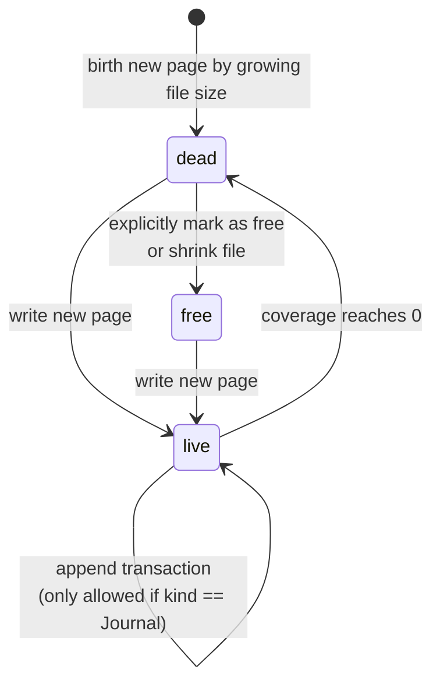

# CoW Kladde Redesign

Draft of a radical redesign of the structure of Kladde files.

**Goal:** orient the layout of both the id table and the allocations on (4 KiB) pages from the ground up in order to reduce actual I/O operations per flush (measured in number of flushed pages) and provide strong durability guarantees even in case of power outage by relying fully on copy-on-write (CoW) per page.

**Trade-off:** this redesign probably lead to a bit larger files during operation.
However, that overhead should be mostly constant (a few 4 KiB pages, independent of file size), and files can be bulk-compacted to new files if a tight representation is requested (e.g., upon closing an app).

## Guiding principles

### What remains

- The API for application authors and authors of implementations of `Persistabel` data types remains unchanged.
- Allocations are still addressed by an abstract ID which is mapped to region(s) in address space by a data-type agnostic address manager (formerly known as heap, not sure if that name is still appropriate).
- Reads from the file are still performed in bulk (currently entire file at a time, in the future one section at a time), and on-file representations don't need to be optimized for fast lookup since the bulk read reads them into in-memory representations that are optimized for that task.
- Writes to the file are still journaled in a sequence of transactions that are guaranteed to be durable under application crash (not power outage).

### What changes

- Extended durability guarantees: in addition to durability under application crash (guaranteeing recovery to the last transaction boundary, as before), we now also guarantee a durability under power outage (even if it happens during `fsync`): after a power outage, recovery is guaranteed to resume to a state between any transaction boundary since the last flush.
- Flushing writes to a bounded number of pages rather than scattering its writes across lots of pages.
- Allocations are no longer guaranteed to live in a contiguous memory range but may be chunked into at most `allocation_size / (4 KiB - ε) + 2` chunks (where `ε ≈ 10 bytes`, depending on final on-file page representation).
- A future design of `Section`s will probably be easier, but this is still speculative.

## Pages

We view a kladde file as a sequence of fixed-size pages.
For simplicity, this document assumes 4 KiB pages, but this should be at least a constant and maybe even a property stored in the file header, and the design makes 16 KiB pages possible in principle as well (unsure if this is useful — even on Mac and iOS, which uses 16 KiB pages, since the file system on these systems appears to be CoW anyway).

Outside of journaling (which operates on dedicated pages that are only used for the journal, and which implements its durability guarantees via its own transaction CRCs), kladde always writes entire pages at once.

### Epochs and live cycle of pages

A global `journal_epoch` counter is incremented on each flush and can be read off from the journal (TODO: how can this be made crash resistent?).
Each page is considered either `live`, `free`, or `dead`, see state transition diagram below, and each `live` page has an associated `coverage > 0`, a `kind` (address table, data, or journal), and an `epoch` (which is the `journal_epoch` at the time the page was written).
Since `fsync` writes out full pages at once, so does kladde when flushing.
Kladde never writes to `live` pages except when appending transactions to the journal.
In all other cases (i.e., during flushing), kladde only writes to free or dead pages, or appends new pages to the end of the file, and it writes entire pages at a time.
Once a new page has been written, it becomes live with a `coverage > 0` (the liveness becomes durable after the next `fsync` completes — before that it might can be either live already with the correct content, free, or dead, but not live with unintended content because the content is protected by an epoch counter and a CRC).

Each page makes a number of statements — either about rows in the address table, about the contents of chunks of allocations, or about the file header.
Which part of which page makes statements about which content is tracked only in pages with kind "address table" so that this state can be tracked without requiring a full file scan.
If two live pages make contradicting statements they must have a different `epoch` and the one with the smaller value of `journal_epoch.wrapping_sub(page.epoch)` takes precedence (this ensures that newer pages take precedence while excluding pages from a not-yet persisted flush).
This mechanism allows us to *logically* overwrite content of an existing page without explicitly writing to the existing page.
For each byte that is logically overwritten (aka "shadowed" by a newer page), the `coverage` of the older page decreases by one.
Once a page reaches `coverage == 0` it implicitly transitions to the "dead" state.
This state transition is durable after the next `fsync`, and only then the now dead page may be overwritten with a new page (or with an explicit `free` marker that may be useful in rare cases to remove dependencies, see next paragraph).

The transition to the `dead` state is irreversible: the only way to bring a page out of the `dead` state is by *explicitly* overwriting it with a new page.
This means that, until the `dead` page is durably overwritten (with a new page, a `free` marker, or by shrinking the file size to less than the page start), any other pages that contributed to reducing this page's `coverage` must not be overwritten.

**TODO:** can `Data` pages ever reach the `dead` state or do they transition directly to `free` because the address table governs which parts of a `Data` page are live?

### Page properties

Each page stores some `content` of at most `MAX_PAGE_CONTENT` bytes, where `MAX_PAGE_CONTENT` is 4 KiB minus about 10 bytes (depending on final on-disk page layout) for page header and CRC.
The current draft of the on-disk representation of each page concatenates the following fields, in this order without delimiters:

- `kind` and `slack` (16 bit combined)
	- `kind` (2 lowest bits) — one of `Free`, `AddressTable`, `Data`, or `Journal`.
	  If `Free` then none of the subsequent fields are defined.
	  TODO: reconsider whether having an explicit `Free` kind is really useful (it might be useful for transferring a "dead" page to a "free" one so that other pages can release tombstones; but it might turn out that it's always better to just overwrite the page with a live one or shrink the file).
	- `content_size` (14 remaining bits) — size (in bytes) of the `content` field below.
	  This is also the `coverage` of the page at the time it was written.
	  Coverage of a live page decreases with every new live page that becomes durable and that shadows part of the content of the old page.
	  Once coverage of a page reaches zero the page is considered free.
- `epoch` (32 bit) — the value of the `journal_counter` at the time this page was written.
  Must never be overtaken by the `journal_counter` (which could happen when the `journal_pointer` wraps around and arrives at `epoch` again — we have to ensure somehow to retire pages before that — or just expand `epoch` to 64 bit and hope this never happens? @Claude: is there a common solution to this?).
- `file_header` (0 bit unless page number ∈ {0, 1}) — the first two pages each contain a fixed-size structure with header information (TBD).
- `content` (variable size, `<= MAX_PAGE_CONTENT) — the page content.
- `crc` (32 bit) — checksum over all bytes in this page up to the end of `content`.
  If invalid then the page is corrupted and must not be ignored during loading.
  A corrupted page must never be referenced by a live pointer in the address table.
- `padding` (variable size) — arbitrary bytes to fill up the page until the next page boundary.
  Ignored by a reader, not included in the CRC calculation, and may even be missing for the last page in the file.

On top of the above on-file stored fields, the in-memory representation of a kladde file also maintains a number `coverage` per live page that keeps track of how many bytes in the page's `content` field currently represent live state.
Upon page creation, its `coverage` is initialized to the page's `content_size`, it never increases, and it decreases with every new page that shadows live content in the page.
When `coverage` reaches `0`, the page is considered `dead`.

## Allocations

`Persistable` data types persist their state to a collection of allocations that are addressed by stable ids.
It probably no longer makes sense to distinguish resizeable from fixed-sized allocations since compaction will be done very different now anyway.

As far as authors of application code and type implementations are concerned, an allocation is a contiguous sequence of bytes.
In the on-file representation, however, allocations are broken up into chunks of at most `MAX_PAGE_CONTENT` bytes, where each chunk lives entirely in a single page:

- zero or one chunk of size >= 1 and < `MAX_PAGE_CONTENT` bytes (where `MAX_PAGE_CONTENT` is 4 KiB minus roughly 10 bytes for the page header and CRC, see page properties below); followed by
- zero or more chunks of size exactly `MAX_PAGE_CONTENT` bytes; followed by and
- zero or one chunk of size >= 1 and < `MAX_PAGE_CONTENT` bytes.

The [[#The Address Table|address table]] tracks where each chunk of each allocation lives.
Each chunk may reference a special `null` page with uninitialized data, indicating that the chunk contains only uninitialized data.

When an application overwrites chunks of an allocation, kladde records this as a `write` op in the journal (similarly to the previous design).
When the journal gets flushed, kladde performs the following steps:

1. Identify all chunks of allocations that were overwritten.
2. Write new pages that contain these updated chunks (the whole chunks, not just their updated parts).
	- Fill up any not completely full pages with the content of existing pages with lowest `coverage`, thus reducing those page's `coverage` further and possibly turning them `dead` so that their address space can be reused).
3. Possibly do some more compaction similar to that implicitly done already in Step 2 above: write out some new pages by consolidating existing live pages with low `coverage`.
4. Designate a currently unused page for the next journal and write `journal_counter + 1` to it.
5. Write out new pages of kind `AddressTable` to redirect the file pointers to the new chunks written in stages 2 and 3.
6. `fsync`
7. Update the journal pointer in the currently unused of the two header pages (the first two pages of the file).
8. `fsync`
9. In the in-memory representation of the address manager, mark any pages that have become `dead` as reusable.

**@Claude:** I'm not sure about the above steps.
Check if they achieve what I want to do and if there's a simpler way (especially one with only a single `fsync`).

## The Address Table

The address table maps each allocation ID to its size and the start addresses and sizes (where not implied) of its chunks.
Its on-file representation is maintained in the pages with `kind == AddressTable`.

**@Claude:** propose a suitable on-file representation that is compact and can be overwritten incrementally.
Along with that, propose a data structure and algorithm to maintain the `coverage` of each page of `kind == AddressTable`, and a strategy to consolidate pages with low coverage (or combining multiple pages whose ID ranges combine to long runs that can be encoded efficiently, see 3rd point below).
A few unordered thoughts to also consider:

- The fundamental decision is probably: what is a "statement" in the sense of Section [[#Epochs and live cycle of pages]], i.e., what is the smallest unit of information that can be individually shadowed by a newer page?
  I can imagine a few decisions:
	- (a) the whole entry for a given allocation ID (i.e., its size and all of its chunk addresses) is a statement (which can be large for large allocations, see last item in this list); or
	- (b) there two kinds of statements: "allocation `X` has size `N`" and "chunk `k` of allocation `X` is `Y`", which are typically encoded in a row where we can imply `X` and `k` for most statements from the previous statement, but we can still shadow each statement individually; or
	- (c) a statement is something else of size in-between, e.g., some kind of B-tree node.
  **Example:** consider an allocation `A` with a given `size` that is split into chunks `C1(addr1, size1), C2(page_number2), C3(page_number3), C4(addr4)}` (where the sizes of `C2`, `C3`, and `C4` are implied)
	- If an update changes content within `C3`, can a newer `AddressTable` page overwrite the page number of `C3` without restating anything else?
	- If an update only shrinks the size of `A` (say, to a point somewhere in the middle of `C2`) without changing the remaining content of `A`, can a new `AddressTable` page overwrite only the `size` property of allocation `A` and rely on the reader to infer that the page with `page_number3` is now `dead`, and that the page with `page_number2` and the page in which `addr4` falls now have reduced `coverage`?
- Take tombstones into account: tombstones for currently unused IDs have to outlive any page (even an older page) that assigns an address to that ID, but they can be removed (i.e., they no longer count towards the `coverage` of the page that contains the tombstone) as soon as either all those other pages that assign an address to the ID are durably removed, or once a new address go durably assigned to that ID.
- The encoding should be compact:
	- only store the parts of chunks that aren't implied (i.e., once the size of the allocation and its first chunk are known, the number and sizes of all subsequent chunks can be derived).
	- if possible, make use of the assumption that IDs are handed out dense (i.e., leave out most IDs and imply them to be 1+last ID, but reserve codes for starting a new run of IDs).
	  However, it's unclear to me how one can dynamically maintain `AddressTable` pages that contain IDs in long ascending runs.
	  The criterion for consolidating `AddressTable` pages would probably have to be more complicated than just greedy in the pages with lowest `coverage`.
- In this CoW design, it's probably OK to have a variable-size encoding for statements.
  In particular, (runs of) tombstones don't need to reserve space for addresses that might replace them because we never directly write into a live `AddressTable` page anyway.
- If the on-file representation of the address table has to store a pointer to each chunk of an allocation, then large allocations can take up quite a lot of space in the on-file representation of the address table (an allocation of size about 4 MiB has about 1000 chunks, so its entries in the address table would no longer fit into a page).
  Is this unavoidable or is it not a problem?
  How do file systems typically do this, i.e., how do they keep track of blocks of large files?
  Do they try to arrange blocks sequentially when possible and then do some sort of run-length encoding?
  Or do they just bite the bullet and use a giant B-Tree for all blocks (possibly across many files)?

## Discussion

### Risks

- Flushing will probably write a lot more data than in the previous design because it doesn't overwrite in-place.
	- However, I think, *at least the impact on I/O cost* is limited, or it might even turn out in favor of the redesign: if I understand the behavior of file systems correctly, in the old design, any modification of 10 bytes that were scattered around the file would have required all up to 10 affected pages to be re-written.
	  In the CoW design, we now take the chunks of the allocations that these 10 writes touched and concatenate them densely into new pages.
	  Thus, at least if the allocations were considerably shorter than 4 KiB, we should end up with fewer page writes.
	- What this *does* cost is fragmentation: we leave the old chunks behind in their respective pages, which can only be compacted by writing new pages that consolidate several old pages with low `coverage`.
	  However, I think the above argument applies to compaction too: since we now effectively optimize "compaction steps" to write to as few pages per compacted data as possible, compaction should now be cheaper per affected byte, so we can probably run more compaction.
	  I still expect that the CoW leads to more fragmentation, but I could imagine that the overhead to the file size is constant rather than proportional to the file size (because compaction always has to be 1 journal flush behind, so it's lag is controlled by the journal size, not the file size).

**@Claude:** assess correctness and relevance of the above points and add any risks you see with the CoW design.

### Open Questions

- Can we reduce the number of required `fsync` in this design to 1?