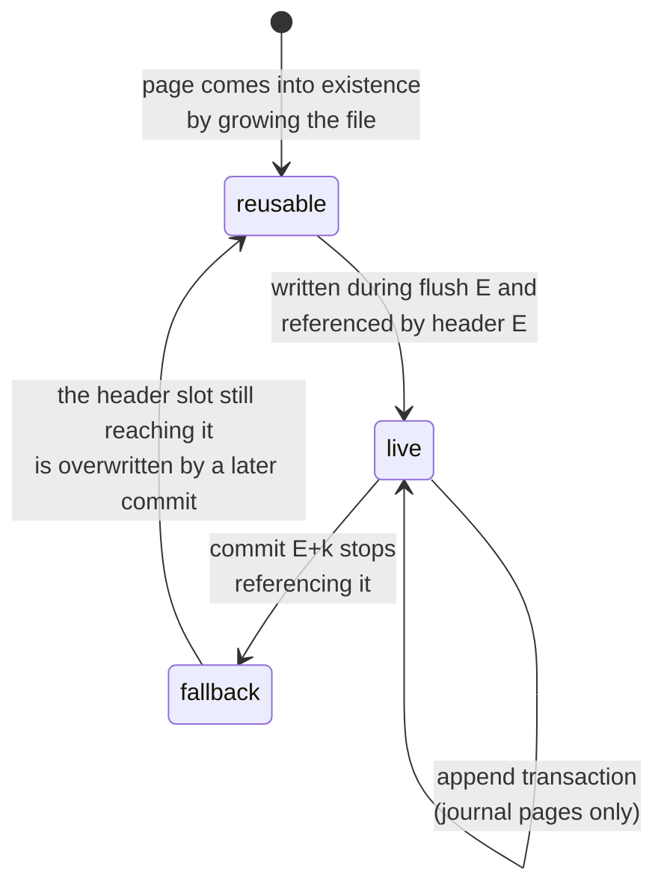

# CoW Kladde Redesign

Proposal for a redesign of the on-file structure of kladde files around copy-on-write (CoW) pages.
This document began as a draft sketch and has been worked out into a concrete design; a feasibility assessment, including the trade-offs against the current design, is in [[#Assessment]].

**Goal:** orient the layout of both the address table and the allocations on fixed-size pages from the ground up, in order to (i) reduce the actual I/O per flush, measured in physically written pages, and (ii) guarantee durability under power outage — by *preventing* damage to committed state rather than merely detecting it — by never overwriting live data.

**Trade-off:** files are somewhat larger during operation, because superseded pages linger until consolidation rewrites them.
This overhead is bounded by the consolidation policy (see [[#Consolidation]]), and a file can always be bulk-compacted into a tight new file, e.g., upon clean close.

## Guiding principles

### What remains

- The API for application authors and for authors of `Persistable` implementations is unchanged.
- Allocations are still addressed by an abstract id, mapped to file locations by a data-type-agnostic *address manager* (the name "heap" no longer fits: it neither hands out contiguous ranges nor manages a single flat address space).
- Reads are still bulk: the file (in the future, one section) is read once at open into in-memory representations optimized for lookup.
  On-file representations are therefore optimized for compactness and cheap incremental edits, never for random access — this constraint is what lets the design below stay much simpler than a database engine.
- Writes are still journaled as a sequence of transactions that are durable under application crash, exactly as before.
  The journal's op set and the fold that turns ops into per-range content descriptions (piece tables) are untouched by this redesign; only the *execution* of a flush changes.

### What changes

- **Durability under power outage becomes a guarantee.**
  After a power cut — even one during `fsync` — recovery reaches the state of some transaction boundary, including at least every transaction folded by the last completed `flush()`.
  Transactions issued after the last completed flush survive up to a valid journal prefix, exactly as under the application-crash guarantee, minus whatever the OS never wrote out.
  ("Minus whatever the OS never wrote out": journal appends are not fsynced, so they sit in the OS page cache until the OS writes them back on its own schedule.
  An application crash loses none of them, because the OS survives and completes the write-back; a power cut freezes whichever subset of journal pages the OS happened to have written by then — and write-back is not ordered, so a later journal page can be on disk while an earlier one is not.
  The chained transaction CRCs deliberately refuse to skip such a hole: what recovery keeps is the longest valid *prefix* ending at a transaction boundary, which can be shorter than the raw journal bytes that survived, because everything past the first gap is discarded even if its bytes are intact.)
- **A flush writes whole pages, and only to locations that nothing can still depend on.**
  Live pages are never overwritten (journal appends excepted); every flush write targets pages that are unreachable from every state recovery could still fall back to.
- **Allocations are no longer contiguous on file** but stored as a sequence of chunks, each at most `MAX_PAGE_CONTENT` bytes and each contained in a single page (see [[#Allocations and chunks]]).
- **The conflict/WAL/hoisting apparatus of the current flush design disappears.**
  Because no flush write ever destroys bytes that anything still reads, there are no read/write conflicts, no write-ahead copies, and no restartability analysis: a crashed flush is simply re-run against the untouched previous state.
- A future design of `Section`s becomes more approachable, because all state is reachable from a root rather than discovered by scanning.

## Pages

A kladde file is a sequence of fixed-size pages.
The page size is recorded in the file header; this document assumes 4 KiB throughout.
Nothing below depends on the exact value — 16 KiB works identically — and 4 KiB is the default because it matches the write-back granularity of common file systems, which is what makes the whole page the honest unit of I/O: the OS rewrites a full page even when the application modifies one byte of it.
Whether 16 KiB pays on platforms with 16 KiB native pages is a measurement question, not a design question ([[#Open questions]]).

Outside of journal appends, kladde only ever writes entire pages at once, and only to pages that are reusable per the rule in [[#Life cycle of pages]].

### On-file page format

Every page except the two header pages concatenates the following fields, in this order, without delimiters:

- `kind` and `content_size` (16 bits combined) —
  `kind` (2 bits) is one of `Data`, `AddressTable`, `Index`, or `Journal`;
  `content_size` (14 bits) is the size of `content` in bytes.
- `epoch` (64 bits) — the flush counter at the time the page was written (see [[#Epochs]]).
- `content` (`content_size` bytes, at most `MAX_PAGE_CONTENT`).
- `crc` (32 bits) — checksum over all preceding bytes of the page.
  A page whose CRC does not validate **must be ignored** during loading; the design guarantees that no committed state ever references a page whose write did not complete, so an invalid CRC can only belong to garbage that nothing references.
- `padding` — arbitrary bytes up to the page boundary; excluded from the CRC; may be absent for the file's last page.

`MAX_PAGE_CONTENT` is the page size minus 14 bytes (2 + 8 + 4), i.e., 4082 bytes for 4 KiB pages.

There is deliberately **no `Free` kind and no free marker**.
Liveness is not a property recorded in a page; it is defined by reachability from a committed header ([[#Life cycle of pages]]).

**How much of this framing is load-bearing?**
Less than it looks, and it is worth being precise about what the crash-consistency argument actually rests on.
Only two checksums in the whole file are load-bearing: the **header** CRCs (a header is written without a covering `fsync` before it matters, so a torn or missing header write must be detectable) and the **journal**'s per-transaction CRC chain (journal appends are likewise never fsynced before a power cut can hit them).
These are the only checks the recovery argument in [[#Flushing]] uses.
The framing on `Data`, `AddressTable`, and `Index` pages is *not* load-bearing: invariant I1 guarantees that any page a valid header can reach was fsynced before that header was written, so recovery never meets a referenced page whose write did not complete, and all interpretation of those pages comes from the address table and the index — a `Data` page in particular is nothing but bytes that entries point into.

The framing is kept on every page anyway, as defense in depth rather than protocol.
The `crc` turns *later*, silent damage — bit rot, a misdirected write by other software, a kladde bug that writes to a live page — into a detected failure instead of quietly wrong data; the `epoch` is the fsync-contract assertion of [[#Epochs]]; and `kind` plus `content_size` keep every page self-describing, which keeps a last-resort scavenger possible (both headers destroyed → scan for CRC-valid pages) and keeps the page writer uniform.
The price is 14 bytes in 4096, or 0.34 %; if that ever mattered, `Data` pages are the ones that could shed their framing, and the design keeps it because the check is worth more than the bytes.
### Header pages

Pages 0 and 1 are the two **header pages**, used alternately: the flush with epoch `E` writes header slot `E mod 2`.
Each holds a fixed-size structure:

- `magic` and format version,
- `page_size`,
- `epoch` (64 bits),
- the page numbers of the [[#The index|index]] pages of this epoch,
- the start page of the *next* journal segment (the one that will collect transactions after this flush; see [[#Flushing]]),
- `crc` over all of the above.

On open, both header pages are read; the CRC-valid one with the higher epoch governs.
A torn header write can only damage the slot being written, which held the older of the two headers, so the previous state remains reachable through the other slot.
This is LMDB's alternating meta-page scheme, and it is the only fixed-location, overwritten-in-place structure in the entire file.

### Epochs

The **epoch** is a monotone counter, incremented by one per flush, stored in every page and in each header.
It exists for three purposes: it orders contradicting statements between address-table pages ([[#Statements and shadowing]]), it salts the journal's CRC chain so that stale bytes in a reused page can never impersonate a valid journal, and it serves as an end-to-end assertion — a page reachable from the header of epoch `E` must carry an epoch `≤ E`, and the epoch the index records for an address-table page must equal the epoch stored in that page, so any violation reveals that the platform broke the `fsync` contract and the file must be treated as damaged rather than silently misread.

**No epoch wrap-around:** at one flush per millisecond, 64 bits last half a billion years, so epoch wrap-around is not an issue; this is what modern systems do (ZFS transaction groups and LMDB transaction ids are 64-bit).
The alternative of using 32-bit epochs would require actively rewriting laggard pages before the counter catches up to them — this is exactly PostgreSQL's transaction-id wraparound "freezing", a notorious operational burden that PostgreSQL carries only because its on-disk format predates the lesson.
A new format should simply pay the 4 extra bytes per page; they are 0.1 % of a 4 KiB page.

Epochs are **replay-stable** for free: the epoch of a flush is the committed header's epoch plus one, so a flush re-run during recovery reproduces the same epoch.

### Life cycle of pages

Page states are **derived, not stored**.
Define the **world** of a header as everything reachable from it: its index pages, the address-table pages the index lists, the data pages those reference, and the journal segment it names.
At any moment, the two on-disk header slots define at most two worlds, and every page is in exactly one of three states:

- **live** — reachable from the newer on-disk header's world;
- **fallback** — reachable only from the older on-disk header's world;
- **reusable** — reachable from neither.

**The reuse rule, which the whole durability argument rests on:** a flush may write only to reusable pages, or extend the file.
In steady state this means a page that the commit of epoch `E` stopped referencing becomes writable in flush `E + 2`: during flush `E + 1` the on-disk headers are those of `E` and `E − 1`, and the page — live in world `E − 1` — is still reachable from the latter; only when commit `E + 1` overwrites header slot `E − 1` does it become unreachable from both.

A page dropped by commit `E` is part of world `E − 1`, whose header occupies a slot until commit `E + 1` overwrites it; the page is therefore reusable from flush `E + 2` on.
The same rule covers reopening after a crash with no special cases: whatever headers are on disk define the worlds to respect.

## Flushing

Journal segment `E` collects the transactions issued between flush `E − 1` and flush `E`.
Appends to it are protected by the chained, epoch-salted transaction CRCs and are **not** fsynced individually — exactly the current design's application-crash guarantee.

Flush `E` then proceeds:

1. **Fold** segment `E` in memory into content descriptions for each allocation's dirty ranges — the existing fold, unchanged.
2. **Choose target pages**: reusable pages, else grow the file.
3. **Write data pages**: the dirty ranges, cut into chunks at the flush's discretion ([[#Allocations and chunks]]) and written whole.
   Remaining space in each new page is filled with live chunks relocated from the pages with the lowest live fraction — consolidation that costs no extra page writes.
4. **Write budgeted consolidation pages** beyond that, per [[#Consolidation]].
5. **Write address-table delta pages**: fresh entries for every allocation touched in steps 3–4 or resized, plus tombstones per [[#Tombstones]].
6. **Rewrite the index pages**, and pick a reusable start page for journal segment `E + 1`.
   That page needs no write: segment `E + 1`'s CRC chain is salted with epoch `E + 1`, so whatever stale bytes the page holds cannot validate as journal content.
7. **`fsync`** — the only one.
8. **Write the header** into slot `E mod 2`: epoch `E`, index page numbers, segment `E + 1`'s start page, CRC.

Flush `E + 1` may begin immediately; nothing waits for the header write to become durable.

**Why one `fsync` suffices**.
The protocol maintains two invariants:

- **I1 — a header is issued only after an `fsync` that covered (i) everything the new header references and (ii) the previous header.**
  The header write of epoch `E` happens after `fsync` `E` returns; `fsync` `E` also flushed the header of epoch `E − 1`, which was issued before it.
  Consequence: a header found on disk implies its entire world is durable — there is no such thing as a valid header pointing at missing writes, so recovery never needs to validate a world before trusting it.
- **I2 — flush writes touch only pages unreachable from both on-disk headers** (the reuse rule).
  Consequence: no matter where a power cut lands, both worlds that recovery might fall back to are physically intact.

**Recovery** is then: read both header pages, keep the CRC-valid ones, take the one with the higher epoch, bulk-load its world, and replay the valid prefix of the journal segment it names.
Case analysis for a power cut during flush `E + 1` (see the [[#Detailed walk-through of an epoch]] below for a finer-grained version):

- Header `E + 1` reached the disk.
  By I1 its world is durable; recover to state `E + 1`, then replay whatever prefix of segment `E + 2` survived.
- Header `E + 1` did not reach the disk.
  The governing header is `E`; by I2 its world is intact; segment `E + 1` was made durable by `fsync` `E + 1` if that call returned, and truncates at its valid prefix otherwise.
  Recovery lands on state `E` plus that prefix — at worst losing transactions that no completed `fsync` ever covered, which is within the guarantee.

Note what makes `flush()`'s return value honest: when flush `E` returns, `fsync` `E` has completed, so header `E − 1` and segment `E` are durable, so state `E` is recoverable even though header `E` itself may not be durable yet — recovery would land on header `E − 1` and replay segment `E` in full.
The header write is thus a *representation* change, not the durability point; durability is established by the `fsync`, one write earlier than intuition suggests.

**`fsync` failure** must be treated as fatal for the session: after a failed `fsync`, the OS may mark dirty pages clean without having written them, so the only sound reaction is to discard all in-memory state and reopen from disk (the "fsyncgate" lesson).

### Detailed walk-through of an epoch

> **Claude:** checked — the structure and every conclusion hold; two corrections were needed, neither changing an outcome.
> (i) Pages of world `E - 2` are `fallback` only where they are *not* also part of world `E - 1`; most belong to both worlds and are simply `live`.
> (ii) "Header `E - 1` has an invalid CRC" is not the only way the newest header can be absent: if its write never reached the disk *at all*, its slot still holds the previous occupant — header `E - 3`, stale but with a **valid** CRC — and that is the more common sub-case, since a torn single-sector write is rarer than an unwritten one.
> Recovery is indifferent, because it selects the valid header with the *highest epoch* rather than merely a valid one, but the case labels below now read "the slot does (not) hold header X" so that both the torn and the never-arrived sub-case are covered; the same applies to the step-8 cases at the end.

- **State during journaling phase of epoch `E`:**
	- Header for epoch `E - 2` still exists and has been `fsync`ed.
	- Header for epoch `E - 1` was written but not `fsync`ed yet.
	- Journal for epoch `E` is partially written but not `fsync`ed yet.
	- All `Data`, `AddressTable`, and `Index` pages that are live at `E - 1` have been `fsync`ed and still exist as `live` (which means this flush must not overwrite them).
	- All `Data`, `AddressTable`, and `Index` pages of world `E - 2` that are *not* also part of world `E - 1` have been `fsync`ed and still exist as `fallback` (they are reachable from header `E - 2`, which hasn't been overwritten yet, and from nothing newer); these pages also must not be overwritten during this flush. Pages belonging to both worlds are simply `live` and covered by the previous point.
	- Similarly, the journal for epoch `E - 1` has been `fsync`ed and still exists as `fallback` (because it is referenced by header `E - 2`, which hasn't been overwritten yet; this means it too must not be overwritten during this flush).
	If a power outage occurs now, then recovery rewinds to a (possibly empty) prefix of journal `E`, at a transaction boundary, by the same argument that holds for the discussion of power outage during Steps 1-7 below.
- **Steps 1-7:** write `Data`, `Index`, and `AddressTable` pages for epoch `E` and then `fsync`.
  Doesn't touch any header pages yet.
  If a power outage occurs during or after this step, then:
	- **If the slot written by flush `E - 1` holds header `E - 1` intact** (guaranteed once `fsync` of flush `E` completed; possible earlier)**:**
		- State `E - 1` is recovered (since all `Data`, `AddressTable`, and `Index` pages that are live at `E - 1` have been `fsync`ed, existed at the beginning of the flush, and must not have been overwritten by a partial flush because they are `live`).
		- The start page of journal `E` is found (because it is referenced in header `E - 1`) but the page itself may be invalid.
		- A (possibly empty) prefix up to a transaction boundary of journal `E` is recovered, marking the recovered state.
    - **If that slot does not hold header `E - 1`** (its write tore, leaving an invalid CRC — or it never reached the disk, leaving stale header `E - 3` with a *valid* CRC; either way, header `E - 2` in the other slot has the highest epoch among the valid headers and governs):
	    - Header `E - 2` is recovered (since it existed at the beginning of the flush, has been `fsync`ed, and hasn't been overwritten yet — that happens only in Step 8 below).
	    - State `E - 2` is recovered (since all `Data`, `AddressTable`, and `Index` pages of world `E - 2` have been `fsync`ed, existed at the beginning of the flush, and must not have been overwritten by a partial flush because they are `fallback` or `live`).
	    - Journal `E - 1` is fully recovered (since its start page is in header `E - 2` and the journal for epoch `E - 1` has been `fsync`ed, existed at the beginning of the flush, and must not have been overwritten by a partial flush because it is `fallback`).
	      It is replayed in full, advancing recovery to the beginning of journal `E` — the same state as in the other case with an empty journal-`E` prefix; the lost journal-`E` transactions were never covered by a completed `fsync`, so this is within the durability guarantee.
- **Step 8:** overwrite header `E - 2` with header `E` (not `fsync`ed yet).
  This turns journal `E - 1` and all `Data`, `AddressTable`, and `Index` pages that were reachable from header `E - 2` but that are not reachable from header `E - 1` from `fallback` to `reusable`, and it turns journal `E` and all `Data`, `AddressTable`, and `Index` pages that are reachable from header `E - 1` but that are not reachable from header `E` from `live` to `fallback`.
   If a power outage occurs during or after this step, then:
	- **If the slot holds header `E` intact:** the flush has completed successfully, and the file recovers to state `E` plus whatever valid prefix of journal `E + 1` had accumulated by the time of the outage.
	  All live pages for epoch `E`, header `E - 1`, and all pages that were live at epoch `E - 1` (which are now `fallback`) were `fsync`ed in step 7 above, and the CRC of header `E` validates the new header.
	- **If the slot does not hold header `E`** (its write tore, or it never arrived and the slot still holds header `E - 2`, stale but CRC-valid)**:** header `E - 1` must exist at this point with a valid CRC because it was `fsync`ed in Step 7 above, and it carries the highest epoch among the valid headers.
	  Thus, header `E - 1` governs.
	  Same situation as recovery after Step 7 when the slot holds header `E - 1` intact, see above, with the only exception that header `E - 2` now no longer necessarily exists — which is fine, because that header is only consulted on the recovery path where header `E - 1` is absent.

## Allocations and chunks

To application code and `Persistable` implementations, an allocation is a contiguous byte sequence.
On file, it is a **sequence of chunks**, each of arbitrary size from 1 to `MAX_PAGE_CONTENT` bytes, each contained entirely in one page.
The allocation's content is the concatenation of its chunks; a chunk's logical offset is the sum of the lengths before it — implied, never stored.
A chunk may reference the reserved **null page** to state that its range is uninitialized, so uninitialized ranges occupy no data pages at all.

A zero-sized allocation is the natural endpoint of these rules rather than a special case: zero chunks, no data pages, and an on-file existence consisting of exactly one address-table entry.
Nothing below may assume "at least one chunk" — and nothing needs to, since even non-empty allocations can lack data pages entirely (a large but fully uninitialized allocation is one null chunk record).

Chunking is governed by two rules:

- **The writer prefers maximal chunks.**
  A flush cuts a long dirty range into `MAX_PAGE_CONTENT`-sized chunks in whole pages plus a remainder in a shared page, and writes a small allocation as a single chunk in a shared page.
  This is what keeps address-table entries compact: a run of full-size chunks in consecutive pages encodes as one extent ([[#Encoding]]).
- **Whoever rewrites bytes may re-cut them.**
  Chunk boundaries carry no meaning beyond "these bytes are stored contiguously here", so a flush re-chunks the ranges it rewrites at will, and consolidation may split a chunk it relocates — or merge adjacent chunks it relocates together — so that its target pages come out exactly full.

The second rule replaces the earlier fixed head/middles/tail scheme, and the problem it solves is the one that motivated that scheme's flexible head and tail: **worst-case consolidation**.
With rigid chunk sizes, an application that only ever allocates `MAX_PAGE_CONTENT / 2 + 1` bytes pins every data page at ~50 % fill, and no amount of relocation can fix it, because the pieces cannot be made to fit.
One flexible cut per allocation only softens this (sizes just over half a page still strand ~25 %), and fixed-size middle chunks freeze a large allocation's page alignment at creation, so consolidation could never re-pack it without rewriting all of it.
Free re-cutting dissolves both problems at once: consolidation packs pages the way stock is cut rather than the way bins are packed — fill the page, cut whatever piece crosses the boundary, continue with its remainder in the next page — so fill approaches 100 % for *any* population of live bytes, and there is no alignment left to preserve because there is no grid.
The price is bounded and small: a packed page gains at most two boundary-crossing cut pieces, i.e., at most two extra chunk records — roughly 10–20 address-table bytes per ~4 KiB of data, well under 1 %.

A useful consequence falls out of implied offsets: inserting or deleting bytes in the middle of an allocation edits the chunk *sequence* without touching the bytes behind the edit.
A middle splice rewrites only the chunk containing the splice point and inserts or drops chunk records; every later chunk keeps its bytes where they are, and its logical offset shifts as a derived quantity.
The current design physically moves the whole tail for the same operation.

The distinction between resizable and fixed-size allocations is dropped: it existed so that neighbors of a fixed-size allocation could rely on it not moving, and in this design nothing is adjacent to anything — every reshape is an entry edit.

A flush writes every chunk it produces **whole**, even when only one byte of the range changed.
This is not new cost in disguise: the OS would have rewritten the surrounding 4 KiB page in place anyway.
What is new is that the old chunk's bytes remain behind as garbage until consolidation reclaims them; that cost is accounted in [[#Assessment]].

## The address table

The address table maps each allocation id to its size and the locations of its chunks.
Its on-file representation lives in pages of kind `AddressTable`, found through the index, and updated by **shadowing**: a flush writes a small delta page rather than rewriting every page an entry lives in.

### Statements and shadowing

The unit of shadowing is the **statement**, and picking its granularity is the central decision here (the draft's options (a)–(c)).
This design picks **option (a): one statement per allocation**.
Two kinds:

- `entry(id) = (size, chunk list)` — the allocation's size plus the lengths and locations of all its chunks, extent-compressed per [[#Encoding]];
- `tombstone(id)` — the id is unallocated.

A statement in a page with a higher epoch shadows any statement about the same id in a page with a lower epoch; the index records each address-table page's epoch, so precedence needs neither a scan nor any wrapping arithmetic.

An earlier version of this document picked option (b) — a per-allocation `shape` statement plus independent per-chunk statements — so that updating one chunk of a large allocation would restate only that chunk's location.
That choice founders on **key stability** once chunking became flexible: with consolidation free to split and merge chunks, and splices free to insert them ([[#Allocations and chunks]]), a chunk's index within its allocation is not a stable name, and a statement keyed by `(id, chunk index)` can be silently re-aimed by an unrelated edit earlier in the same allocation.
Whole-entry statements have no sub-keys to destabilize, and they buy three simplifications outright: a resize is just a new entry (no rule needed about old chunk statements beyond the new size becoming void), re-allocating a freed id is just a new entry (nothing stale to shadow piecemeal), and the reader never assembles an allocation from statements of mixed epochs.
Their cost is that touching any byte of an allocation restates its whole entry — a few bytes for the common allocation, kept bounded for large fragmented ones by extents and spilling ([[#Encoding]]).

### Encoding

Within a page, statements are sorted by id and encoded compactly:

- ids as varint deltas from the predecessor — one byte for densely handed-out ids.
  This exploits the density assumption without the draft's worry about maintaining long ascending runs *across* pages: runs are not maintained, they are **restored**, because consolidation rewrites entries in sorted order anyway ([[#Consolidation]]).
- sizes and chunk lengths as varints;
- chunk locations as **extents** wherever chunks happen to be contiguous: a run of full-size chunks in consecutive pages is one `(start_page, page_count)` pair, and any other chunk is a `(length, page, offset)` triple.

**Large allocations** (the draft's 4 MiB / 1000-chunk concern, and its question about how file systems handle this).
File systems have given both answers historically: FFS/ext2 used fixed-depth radix trees of block pointers (indirect and double-indirect blocks), while every modern system — ext4, XFS, NTFS, btrfs — moved to **extents**, precisely because real files are mostly contiguous, escalating to a per-file extent tree only when fragmentation forces it.
Kladde takes the extent position, with a cheaper escalation than a tree, because it never searches the structure on disk.

**Contiguity is a placement preference, not an assumption** — the draft is right to push on this.
When a single flush writes many chunks of one allocation, it should place them in one run of reusable pages (a run is always available by growing the file), so that the entry collapses to one extent; that is a policy, and it covers bulk writes, whole-allocation `Copy`s, and compact-on-close.
It does *not* cover the case the draft points at: an allocation filled incrementally across many flushes, whose chunks land wherever each flush put them.
There the honest statement is that the entry fragments in proportion to the number of flushes that touched the allocation, and that cross-flush contiguity is **consolidation's** job, not the flush's — when consolidation relocates chunks of the same allocation, it places them adjacently and merges them, so entries drift back toward few extents between bursts of writes.
Null chunks help the sparse case for free: an allocation created large but written sparsely stores locations only for the ranges actually written.

**Spilling.**
If an entry's encoding nevertheless outgrows a threshold (say, a quarter page), the entry **spills**: its statement in the shared table page shrinks to `(size, continuation page numbers)`, and the chunk list moves to dedicated `AddressTable` pages owned by that entry alone and rewritten together with it.
The draft asks why this mechanism is needed at all — why an oversized chunk list cannot simply split across ordinary table pages with no extra machinery.
Under per-chunk statements it could; under whole-entry statements it cannot: the statement is the unit of shadowing, so it must be replaceable as one atom, and fragments of one entry spread over shared pages would need stable sub-keys to be shadowed individually — precisely the key-stability problem that ruled per-chunk statements out ([[#Statements and shadowing]]).
Spilling keeps the statement *logically* whole (the continuation pages are part of it and are replaced along with it) while letting its bytes exceed a page.
Its cost is stated rather than hidden: a huge, badly fragmented allocation rewrites its spill pages on every touch, which is exactly the pressure that consolidation's re-linearization relieves — a re-linearized entry fits inline again.

### The index

The **index** is the small rooted structure that makes scanning unnecessary: a list of `(page_number, epoch)` for every live `AddressTable` page, held in pages of kind `Index`, whose page numbers are in the header.
It is rewritten in full every flush.

Sizing, to justify "small": with ~8 bytes per address-table entry, a million allocations occupy ≈ 8 MB ≈ 2000 table pages; at ≈ 6 bytes per index entry that is ≈ 12 KB ≈ 3 index pages per flush.
If the table ever grows to where the full index rewrite hurts, the index gets a second level and only the changed leaves are rewritten — a two-level CoW tree.
That is the honest boundary of the "no trees" stance: trees are unnecessary for *lookup* here, but a bounded incremental commit of a large directory is legitimately what they are for, and the design should escalate then and not before.

Because the index is rewritten atomically with the commit, membership in it is authoritative: an address-table page not listed is dead, whatever its bytes say.
This is what keeps the shadowing scheme free of the reclamation-ordering subtleties that a scan-based design has to solve — resolution never depends on the *absence* of an unreferenced page, only on the listed set and their epochs.

### Tombstones

A `tombstone(id)` must exist as long as some **indexed** address-table page carries an `entry(id)` at a lower epoch *and* no indexed page carries an `entry(id)` at a higher epoch — in that second case the id has been re-allocated, and the newer entry already shadows the stale one and the tombstone alike.
Without a needed tombstone, freeing an id would let the older entry win again.
Because the index commits atomically, the lifetime rule is purely logical, with none of the durable-invalidation lag a scan-based design needs: a tombstone becomes droppable in exactly the commit that removes or consolidates away the last lower-epoch page carrying an entry for the id — "durably removed" in the draft's phrasing simplifies to "no longer in the committed index".
Tombstones count toward their page's coverage like any statement, so pages holding mostly dead tombstones become consolidation victims and the tombstones evaporate with them.

### Coverage accounting

`coverage` — the number of content bytes in a page that current state still relies on — is **in-memory only** and is what the consolidation policy steers by.
Maintaining it is O(1) per shadowed statement:

- the in-memory address table stores, alongside each resolved statement, where its current encoding physically lives: `(page, encoded_length)`;
- when a new statement shadows an old one, decrement the old page's counter by that length;
- for data pages, the same bookkeeping per chunk: replacing or dropping a chunk decrements its old page's counter by the chunk length.

At open, the counters are rebuilt for free during the bulk read: resolve all statements, then count winners per page.
Nothing about coverage is ever persisted.

### Consolidation

Consolidation rewrites live content out of sparse pages so their slots become reusable.
It runs inside every flush, in two forms: the free filling of step 3 (new data pages are topped up with relocated chunks), and an explicit budget of extra pages in step 4.

- **Victim selection** for data pages is the classic greedy rule of log-structured file systems — lowest live fraction first — refined by age the way LFS and SSD flash translation layers refine it: prefer pages that are sparse *and* old.
  The refinement rests on one assumption, worth stating explicitly: **temporal update locality** — bytes that were written together tend to be rewritten together, and soon, or else not for a long time.
  It transfers from the workload to pages mechanically, with no appeal to spatial locality in the logical data structures: a data page's residents are exactly the chunks that one flush wrote together, so if the application is still working on whatever produced them, more of its residents will be shadowed shortly.
  Such a "hot" page gets sparser without help, and cleaning it early wastes writes on relocating survivors that are about to die anyway; a page whose live fraction has been stable for a long time is "cold", and its survivors are the ones worth paying to move.
  Co-written-implies-co-updated is the empirically load-bearing assumption behind LFS's cost-benefit cleaner, and it fails gracefully: under a workload with no locality at all (uniform random updates), the age term carries no information and the policy degrades to plain greedy, which is the right fallback anyway.
- **Address-table pages** are consolidated by *id range* rather than page identity.
  The quantity to optimize is reclaimed coverage per byte written: rewriting all live entries of an id range into one fresh page costs one page write, and its benefit is the coverage it drains from the pages currently holding those entries — weighted, because drained coverage only helps on pages that end up empty or nearly so (draining a page from 60 live bytes to 0 frees a slot; draining it from 3000 to 2940 frees nothing).
  Picking a good range needs no cleverness: the in-memory table is ordered by id and records where each entry's encoding lives, so sweep the id space with a window that accumulates entries until their re-encoded size fills one page, score each window by the weighted coverage it would drain, keep the best few windows per flush, and rotate the sweep's starting position across flushes.
  Because a window's entries are rewritten sorted and adjacent, the same pass re-establishes the delta-encoding density the draft was unsure how to maintain — density is restored by cleaning, not maintained by an invariant.
- **Pacing**: each flush consumes at least one reusable page (often only a few), so consolidation must reclaim at least that many on average.
  The situation where no good victim exists is the situation where pages are largely full — i.e., there is little garbage and the file is close to its live size — so "cleaning cannot keep up" and "the file is honestly this large" coincide, which is the benign coincidence.
  The one obligation this leaves is **headroom**: CoW needs free pages to make progress, so the design must reserve enough slack (or grow the file early enough) that a nearly-full disk cannot deadlock the very consolidation that would free space — the reason ZFS reserves slop space.

## Assessment

### Feasibility

The design is sound, and none of its load-bearing pieces is novel: never-overwrite plus cleaning is Rosenblum's log-structured file system, the alternating header commit is LMDB's meta pages, CoW-with-checksums is ZFS/WAFL/btrfs, and extents-with-escalation is ext4/XFS/NTFS.
What *is* different from all of those systems is that kladde reads in bulk and looks nothing up on disk, and every difference cuts toward simplicity: no on-disk search tree, a flat rewritten index instead of path-copied interior nodes, whole-world validation available for free at open, and a single `fsync` per flush where LMDB needs two — because kladde can afford to let the header lag one write behind and lean on journal replay, which a random-access database cannot.

### What it buys

1. **It deletes the hardest part of the current design.**
   The in-place flush needs conflict detection, write-ahead copies of overwritten sources, hoisting, and a restartability analysis, all because executing a flush destroys bytes that re-executing it would need.
   Here a flush writes only to pages no recoverable state references, so re-execution always starts from an intact previous state: the fold survives unchanged, and everything downstream of it in the current flush design is simply gone.
2. **Power-outage durability by prevention.**
   The current design can at best detect page-granularity collateral damage to untouched neighbors ("passenger corruption"); this design has no untouched neighbors in the write path at all, and the previously chosen detect-only compromise becomes obsolete.
3. **Fewer physical writes for scattered small updates.**
   Modifying 10 bytes in 10 scattered locations costs the OS 10 in-place page writes today, invisibly; here the 10 dirty chunks concatenate into as few pages as they fit in, visibly.
   The old design's I/O was not cheaper — it was unaccounted.
4. **One `fsync` per flush** instead of two, with an argument (I1/I2 above) small enough to audit.
5. **A rooted file**, which is the precondition for `Section`s ever loading part of a file.

### What it costs

1. **Cleaning debt.**
   Every dirty chunk is written once at flush and, on average, a fraction of a time again when consolidation later relocates its page-mates or itself.
   The worst case is uniform random small writes across a large file — the same workload that hurts every log-structured system.
   The mitigations are the standard ones (greedy-by-age victim selection, filling flush pages for free), and the honest statement is that total bytes written exceed the in-place design's, in exchange for those bytes never landing on live data.
2. **Space overhead is a policy outcome, not a constant.**
   The draft conjectured a constant overhead; that is not quite right.
   Garbage accrues in proportion to write traffic and drains in proportion to consolidation effort, so the steady state is set by the budget: enforcing "consolidate until live fraction ≥ τ" bounds the file at `live_size / τ` for a chosen τ, at the price of the corresponding cleaning work.
   What *is* true is that the bound is controllable and independent of file size in relative terms.
3. **Loss of contiguity.**
   An allocation's bytes must be gathered from its chunks at open and scattered to freshly cut chunks at flush.
   Its address-table entry also grows as the allocation fragments; extents keep the well-placed case at a few bytes, spilling caps the worst case, and consolidation shrinks entries back over time by re-linearizing their chunks.
4. **A minimum flush of ~4–6 pages** (data + address-table delta + index + header) even for a tiny transaction, where the current design might touch fewer.
   The crossover favors this design as soon as writes scatter at all, but a workload of frequent single-byte flushes pays more here.
5. **Full trust in `fsync`.**
   True of the current design as well, but this design leans on it harder (single barrier, header issued unsynced).
   The epoch cross-checks in [[#Epochs]] turn a broken contract into a detected failure rather than silent corruption, and a failed `fsync` must abort the session.
6. Both header pages corrupting **simultaneously** is unrecoverable without a scan.
   They are single-sector writes at opposite ends of a two-page span, never written in the same flush, so this requires two independent failures; if it worries us, headers can be replicated at two more fixed locations for two extra page writes per flush — probably not worth it.

### Verdict

Adopt.
The machinery this removes (WAL, hoisting, conflict analysis, torn-write compromises) is bespoke and was the riskiest part of the current design; the machinery it adds (chunking, shadowing, cleaning) is well-trodden and its failure modes are understood and bounded.
The one workload that regresses — high-frequency tiny flushes — is measurable, and if it matters, batching flushes attacks it directly.

## Open questions

- Page size: 4 KiB vs 16 KiB, to be measured on macOS/iOS and Linux; a per-file header property either way.
- Consolidation constants: the live-fraction target τ, the per-flush page budget, and the age weighting in victim selection.
- Whether index entries should also carry each address-table page's id range, which costs a few bytes per entry now and buys partial loading (`Section`s) later.
- The exact header field list, including whether to reserve space for future roots (e.g., per-section indexes).
