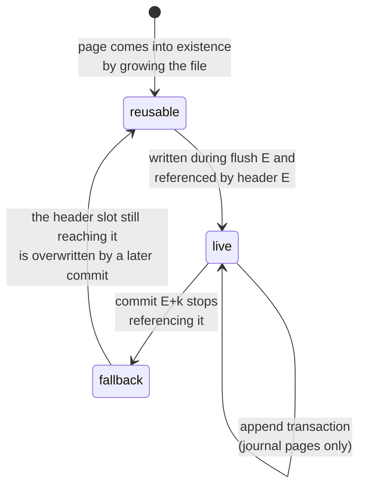

Which pages a write may touch, the protocol that commits a flush, and exactly what survives a crash.

This is the layer that makes durability a **guarantee by prevention** rather than a detection scheme: committed state is never overwritten, so there is nothing to detect.

## What is guaranteed

**Under an application crash** — the process dies, the operating system survives — every mutation whose call has returned survives.
The journal's pages remain in the OS page cache and are written back on the OS's own schedule, which an application crash does not interrupt.

**Under a power cut**, recovery reaches the state of some **transaction boundary**, including at least every transaction folded by the last completed `flush()`.
Transactions issued after that flush survive up to a valid journal prefix, minus whatever the operating system never wrote out.

That last clause is the one worth reading twice.
Journal appends are not fsynced individually, so they sit in the page cache until write-back; a power cut freezes whichever subset of journal pages the OS happened to have written.
Write-back is **not ordered**, so a later journal page can be on disk while an earlier one is not.
The chained, epoch-salted transaction CRCs deliberately refuse to skip such a hole: what recovery keeps is the longest valid *prefix* ending at a transaction boundary, which can be shorter than the raw journal bytes that survived.

**Never guaranteed:** that a partial transaction is visible, or that a flush is partially applied.
Both are excluded by construction rather than by cleanup.

## Page states

Page states are **derived, not stored**.

Define the **world** of a header as everything reachable from it: its address-table pages, the data pages those reference, and the journal segment it names.
At any moment the two on-disk header slots define at most two worlds, and every page is in exactly one of three states:

- **live** — reachable from the newer on-disk header's world;
- **fallback** — reachable only from the older on-disk header's world;
- **reusable** — reachable from neither.

### The reuse rule

> **A flush may write only to reusable pages, or extend the file.**

The whole durability argument rests on this.
In steady state it means a page that the commit of epoch `E` stopped referencing becomes writable in flush `E + 2`: during flush `E + 1` the on-disk headers are those of `E` and `E − 1`, and the page — live in world `E − 1` — is still reachable from the latter; only when commit `E + 1` overwrites header slot `E − 1` does it become unreachable from both.

The same rule covers reopening after a crash with no special cases: whatever headers are on disk define the worlds to respect.

## The flush protocol

Journal segment `E` collects the transactions issued between flush `E − 1` and flush `E`.
Appends to it are protected by the chained, epoch-salted transaction CRCs and are **not** fsynced individually.

Flush `E` then proceeds:

1. **Fold** segment `E` in memory into content descriptions for each allocation's dirty ranges.
2. **Choose target pages**: reusable pages, else grow the file.
3. **Write data pages** for the dirty ranges.
   Remaining space in each new page may be filled with live content relocated from sparse pages — consolidation that costs no extra page writes.
4. **Write further consolidation pages**, within whatever budget the implementation chooses.
5. **Write address-table pages**: the statements describing everything touched in steps 3–4, plus any [tombstones](address-table.md#statement-types).
6. **Choose a reusable start page for journal segment `E + 1`.**
   That page needs no write: segment `E + 1`'s CRC chain is salted with epoch `E + 1`, so whatever stale bytes the page holds cannot validate as journal content.
7. **`fsync`** — the only one.
8. **Write the header** into slot `E mod 2`: epoch `E`, the root address-table payload, segment `E + 1`'s start page, CRC.

Flush `E + 1` may begin immediately; nothing waits for the header write to become durable.

### The two invariants

The protocol maintains exactly two, and they are what the argument rests on.

**I1 — a header is issued only after an `fsync` that covered (i) everything the new header references and (ii) the previous header.**
The header write of epoch `E` happens after `fsync` `E` returns, and `fsync` `E` also flushed the header of epoch `E − 1`, which was issued before it.

*Consequence:* a header found on disk implies its entire world is durable.
There is no such thing as a valid header pointing at missing writes, so recovery never needs to validate a world before trusting it.

**I2 — flush writes touch only pages unreachable from both on-disk headers** (the reuse rule).

*Consequence:* no matter where a power cut lands, both worlds recovery might fall back to are physically intact.

### Why one `fsync` suffices

Because I1 and I2 together mean the only thing a crash can destroy is work that nothing yet points at.
A crashed flush is simply re-run against an untouched previous state; there is no partial application to undo and no write-ahead copy to consult.

Note what makes `flush()`'s return value honest.
When flush `E` returns, `fsync` `E` has completed, so header `E − 1` and segment `E` are durable, so **state `E` is recoverable even though header `E` itself may not be durable yet** — recovery would land on header `E − 1` and replay segment `E` in full.
The header write is a *representation* change, not the durability point; durability is established by the `fsync`, one write earlier than intuition suggests.

This is why kladde needs one `fsync` per flush where a random-access database like LMDB needs two: kladde can afford to let the header lag one write behind and lean on journal replay.

## Recovery

1. Read both header pages; keep the CRC-valid ones; take the one with the **highest epoch**.
2. Bulk-load its world.
3. Replay the valid prefix of the journal segment it names, stopping at the first transaction whose chained CRC fails.

Replay is purely mechanical and involves no application code.

### Case analysis for a power cut during flush `E + 1`

- **Header `E + 1` reached the disk.**
  By I1 its world is durable; recover to state `E + 1`, then replay whatever prefix of segment `E + 2` survived.
- **Header `E + 1` did not reach the disk** — either its write tore, leaving an invalid CRC, or it never arrived, leaving the slot's previous occupant (header `E − 1`, stale but CRC-valid).
  Recovery is indifferent between those sub-cases because it selects the valid header with the *highest* epoch, not merely a valid one.
  The governing header is `E`; by I2 its world is intact; segment `E + 1` was made durable by `fsync` `E + 1` if that call returned, and truncates at its valid prefix otherwise.
  Recovery lands on state `E` plus that prefix — at worst losing transactions that no completed `fsync` ever covered, which is within the guarantee.

A finer-grained walk-through, step by step through one epoch, is in [the implementation notes](../impl/flush.md#walk-through-of-an-epoch).

## `fsync` failure is fatal

After a failed `fsync`, the operating system may mark dirty pages clean without having written them.
The only sound reaction is to **discard all in-memory state and reopen from disk**; an implementation must not retry the `fsync` and must not continue the session.

This is the "fsyncgate" lesson, and it is a requirement rather than a recommendation: continuing after a failed `fsync` can silently publish a header whose world is not durable, which breaks I1 and therefore every guarantee above.

## Headroom

Copy-on-write needs free pages to make progress.
An implementation **must** reserve enough slack, or grow the file early enough, that a nearly-full disk cannot deadlock the very consolidation that would free space.
This is why ZFS reserves slop space, and the failure it prevents is not gradual: without headroom, a full file cannot be compacted, because compacting it requires writing somewhere first.

## What this costs

Stated honestly, because the trade is real.

- **Files are larger during operation.** Superseded pages linger until consolidation rewrites them. The overhead is a policy outcome, not a constant: garbage accrues in proportion to write traffic and drains in proportion to consolidation effort, so enforcing "consolidate until live fraction ≥ τ" bounds the file at `live_size / τ`.
- **Total bytes written exceed an in-place design's**, because cleaning rewrites survivors. The worst case is uniform random small writes across a large file — the workload that hurts every log-structured system.
- **A minimum flush is a handful of pages** (data + address table + header) even for a tiny transaction. The crossover favours this design as soon as writes scatter at all, but frequent single-byte flushes pay more here than an in-place design would.
- **Full trust in `fsync`**, leaned on harder than an in-place design does, mitigated by the epoch cross-checks turning a broken contract into a detected failure.

In exchange, committed bytes are never in the write path, so there is no class of corruption to detect and no recovery path that has to repair anything.
The [superseded in-place flush](../superseded/in-place-flush.md) is what this replaced, and why.
