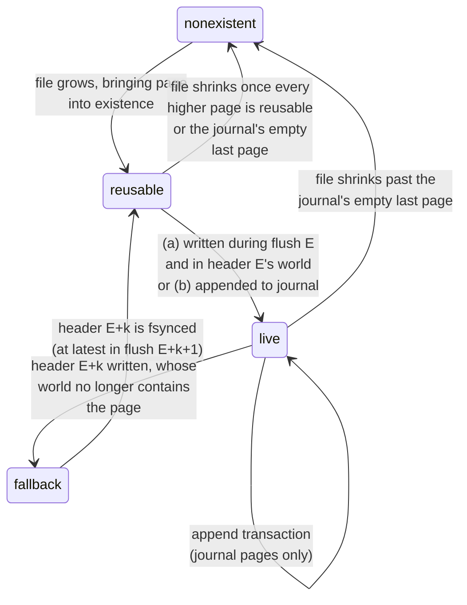

Which pages a write may touch, the protocol that commits a flush, and exactly what survives a crash.

This is the layer that makes durability a **guarantee by prevention** rather than a detection scheme: committed state is never overwritten, so there is nothing to detect.

## What is guaranteed

**Under an application crash** — the process dies, the operating system survives — every mutation whose call returned successfully survives.
The journal's pages remain in the OS page cache and are written back on the OS's own schedule, which an application crash does not interrupt.

**Under a reported error** the same holds, for a simpler reason: the process is still running.
An implementation that cannot complete an operation reports the failure and refuses further work — in Rust by returning `Result::Err` and poisoning the `Kladde<T>`, in C++ by throwing — and every mutation that returned successfully before that is in the journal exactly as if nothing had gone wrong.
The exception is [a failed `fsync`](#fsync-failure-is-fatal), after which the page cache may have discarded writes the kernel had already reported as clean; that is why a failed `fsync` ends the session instead of being reported as an ordinary error.

**Under a power cut**, recovery reaches the state of some **transaction boundary**, including at least every transaction folded by the last completed `flush()`.
Transactions issued after that flush survive up to a valid journal prefix, minus whatever the operating system never wrote out.

That last clause is the one worth reading twice.
Journal appends are not fsynced individually, so they sit in the page cache until write-back; a power cut freezes whichever subset of journal pages the OS happened to have written.
Write-back is **not ordered**, so a later journal page can be on disk while an earlier one is not.
The chained, epoch-salted transaction CRCs deliberately refuse to skip such a hole: what recovery keeps is the longest valid *prefix* ending at a transaction boundary, which can be shorter than the raw journal bytes that survived.

**Never guaranteed:** that a partial transaction is visible, or that a flush is partially applied.
Both are excluded by construction rather than by cleanup.

## Page states

Page states are **derived, not stored**.

Define the **world** of a header as everything reachable from it: its address-table pages, the data pages those reference, and every page of the *next* epoch's **journal segment**, of which the header names only the first page; the rest are reached from it.
At any moment the two on-disk header slots define at most two worlds that can (and typically do) overlap, and every page is in exactly one of three states:

- **live** — in the world of the newer on-disk header;
- **fallback** — in the world of the older on-disk header but not in the world of the newer on-disk header, and the newer header hasn't been `fsync`ed yet;
- **reusable** — in neither on-disk header's world, or only in the older header's world after the newer header has been `fsync`ed.

### The reuse rule

> **A flush may write only to reusable pages, or extend the file.**

The whole durability argument rests on this.
It means a page that the commit of epoch `E` stopped referencing becomes writable in flush `E + 2`: it stays fallback until header `E` is durable, and within a session the `fsync` that makes it so is that of flush `E + 1`, which comes only after that flush has written its pages.

The same rule covers reopening a file: whatever headers are on disk define the worlds to respect.
A load cannot know whether the governing header is durable, so the older world's pages stay fallback until an `fsync` makes it so; [[#Recovery / loading a kladde file|the `fsync` at open]] does, and retires the older world at once.

**The rule assumes that every page consists of whole blocks of the file system.**
A file system that overwrites a block in place writes all of it, and a power cut during that write can corrupt all of it, even the bytes that did not change.
Were a block to span two pages, writing one of them — or appending to the journal's last page — could therefore damage the other, which is exactly what the rule exists to prevent.
4 KiB pages consist of whole blocks on common file systems; a file system with larger blocks needs pages at least as large.

### The truncation rule

> **A file may shrink only past pages that are reusable, and only to a page boundary.**

Truncation is the other way a page can be lost, and it answers to the same argument as reuse: no header that recovery could choose may reach past the new end.
The one exception is the current journal's last page while no transaction has been appended to it: the file may shrink past that page too, since it holds nothing to lose and a reader treats [[file-format#The journal pointer|a journal page past the end of the file]] as empty as well.
So the file can end at its last page of content, which suits the last flush before a file is closed, and an application that leaves a file untouched for a while.
A truncation is not a step of the flush protocol and needs no `fsync` of its own: a power cut that loses it leaves the file longer than necessary, and nothing worse.

**The file always ends at a page boundary.**
It never shrinks into the last page's padding, and a journal page is added to the file whole, before the first transaction is appended to it.
Were the file to end inside a page, the file system would rewrite the block holding that page's end — when a truncation zeroes the rest of the block, and on some file systems again when the file grows past it — and a power cut during that write can corrupt the whole block, even though the page's own bytes do not change.
A page boundary is safe because it is also a block boundary, as [the reuse rule](#the-reuse-rule) assumes.

### Deallocating reusable pages

> **A reusable page's blocks may be given back to the file system without shrinking the file.**

Punching a hole — `fallocate` with `FALLOC_FL_PUNCH_HOLE` on Linux, `fcntl` with `F_PUNCHHOLE` on macOS, `FSCTL_SET_ZERO_DATA` on a sparse file on Windows — releases the page's blocks, and the page reads as zeros until it is written again.
Zeros serve a reusable page as well as any stale bytes do, since nothing reads it.
Like a truncation, it needs no `fsync` of its own: a power cut that loses it leaves the blocks allocated, and nothing worse.
And because every page consists of whole blocks, it never touches a block that holds any part of a live or fallback page.
It returns the space of reusable pages anywhere in the file, where truncation returns only those at its end; the file keeps its length, which tools that copy it without preserving holes will notice.

**A deallocated page needs its blocks back before it is written again.**
A write into a hole can find the disk full only at write-back, which is the [ungraceful way](#detecting-that-the-disk-is-full) to learn it, since a failed `fsync` ends the session.
So an implementation allocates a deallocated page's blocks before writing to it, as it would when extending the file.

## The flush protocol

Journal segment `E` collects the transactions issued between flush `E − 1` and flush `E`.
Appends to it are protected by the chained, epoch-salted transaction CRCs and are **not** fsynced individually.

Flush `E` then proceeds:

1. **Fold** journal `E` in memory into content descriptions for each allocation's dirty ranges.
2. **Choose target pages**: reusable pages, else grow the file.
3. **Write data pages** for the dirty ranges.
   Remaining space in each new page may be filled with live content relocated from sparse pages — consolidation that costs no extra page writes.
4. **Write further consolidation pages**, within whatever budget the implementation chooses.
5. **Write address-table pages**: the statements describing everything touched in steps 3–4, plus any [tombstones](address-table.md#statement-types).
6. **Choose a reusable start page for journal segment `E + 1`.**
   That page needs no write, except in a session's first flush: journal segment `E + 1`'s CRC chain is salted with epoch `E + 1`, so stale bytes in the page cannot validate as journal content unless they belong to a segment whose header a crash lost, and only a session's first flush can re-issue that header's epoch ([details](journal.md#the-start-of-a-session)).
7. **`fsync`**.
8. **Write the header** into slot `E mod 2`: epoch `E`, the root address-table payload, journal segment `E + 1`'s start page, CRC.

No further `fsync` is required, and flush `E + 1` may begin immediately: step 7 already made state `E` recoverable, so nothing waits for the header write of step 8 to become durable.
See [[#why one fsync suffices|below]].

### The two invariants

The protocol maintains exactly two, and they are what the argument rests on.

**I1 — a header is issued only after an `fsync` that covered (i) everything the new header references, except the journal segment it names, and (ii) the previous header.**
The header write of epoch `E` happens after `fsync` `E` returns, and `fsync` `E` also flushed the header of epoch `E − 1`, which was issued before it.

The named new journal segment is exempted from invariant I1 because it is the one part of a world that is still being written after the header is issued: header `E` names journal segment `E + 1`, which is still empty when `fsync` `E` runs.
It needs no protection from I1: it validates itself, transaction by transaction, through the chained epoch-salted CRCs.

*Consequence:* a header found on disk implies that everything in its world except the journal segment it names is durable.
There is no such thing as a valid header pointing at a missing page (except for the journal page it names, which does not need to exist until its first transaction is recorded), so recovery never has to validate a world before trusting it — only the journal it replays.

**I2 — a flush writes only to reusable pages, with one exception: the commit in step 8 overwrites the slot holding the *older* of the two headers** (the reuse rule).

*Consequence:* no matter where a power cut lands, the newer of the two headers and its world are physically intact, and so is the older world for as long as recovery could still choose it.

### Why one `fsync` suffices

Because I1 and I2 together mean the only thing a crash can destroy is the currently active journal or work that nothing yet points at.
A crashed flush is simply re-run against an untouched previous state; there is no partial application to undo and no write-ahead copy to consult.

Note what makes `flush()`'s return value honest.
When flush `E` returns, `fsync` `E` has completed, so header `E − 1` and journal segment `E` are durable, so **state `E` is recoverable even though header `E` itself may not be durable yet** — recovery would land on header `E − 1` and replay journal segment `E` in full.
The header write is a *representation* change, not the durability point; durability is established by the `fsync`.

This is why kladde needs one `fsync` per flush where a random-access database like LMDB needs two: kladde can afford to let the header lag one write behind and lean on journal replay.
By contrast, LMDB has no journal and thus `fsync`s twice: once after writing updates into reusable pages (like kladde does) and again after overwriting the alternating meta page (unless turned off by `MDB_NOMETASYNC`).

## Recovery / loading a kladde file

1. Read both header pages; keep the CRC-valid ones; take the one with the **highest epoch**.
2. Bulk-load its world.
3. Replay the valid prefix of the journal segment it names, stopping at the first transaction whose chained CRC fails.

Thus, recovery happens entirely on the storage layer and is agnostic to the schema.

If both header slots hold a CRC-valid header, the one with the higher epoch governs and the other is ignored.

**A load may retire the older world outright** — all live pages stay live, every fallback page becomes reusable, and none is left in between — **but only once the governing header is durable.**
That is not automatic, because the header of the last flush was [never fsynced](#why-one-fsync-suffices): its slot can still revert to the epoch before it, and recovery would then land on a world the new session has already started overwriting.
One `fsync` at open, after the headers are read and before any page is offered to the allocator, settles it; a failure of it is [fatal](#fsync-failure-is-fatal) like any other.

This is worth a syscall per open, because respecting the older world instead is not free: it means resolving *its* address table as well, purely to learn which pages it reaches.
An implementation that would rather not fsync at open can have the same effect by letting its first flush extend the file rather than reuse anything, since that flush's own `fsync` makes the governing header durable and its commit retires the older world.
The reference implementation uses the "`fsync` at open" option for simplicity.

### Case analysis for a power cut during flush `E`

- **Successful case: header `E` reached the disk whole** — the cut came after step 8, and that write happened to be written back before the power was lost.
  By I1 everything in header `E`'s world except journal segment `E + 1` is durable, and header `E` carries the highest epoch among the CRC-valid headers, so recovery picks it and reaches state `E`.
  It then replays whatever CRC-valid prefix of journal segment `E + 1` it finds, which here is empty: its start page was only chosen in step 6, the writer is blocked for the duration of the flush, and the stale bytes in that page cannot validate as journal content because the chain is salted with epoch `E + 1`.
  So the flushed state `E` is recovered exactly.
- **Error case: header `E` did not reach the disk** — either its write tore, leaving an invalid CRC, or it never arrived, leaving the slot's previous occupant (header `E − 2`, stale but CRC-valid).
  Recovery is indifferent between those sub-cases because it selects the valid header with the *highest* epoch, not merely a valid one.
  The governing header is then `E − 1`, which `fsync` `E` made durable and which I2 leaves untouched; by I2 its world is intact except for journal segment `E`, whose first page it names.
  Recovery lands on state `E − 1` plus any valid prefix of the (possibly torn) journal segment `E` — at worst losing transactions that no completed `fsync` ever covered, which is within the guarantee.

  If the cut came *before* `fsync` `E` returned, header `E − 1` may itself be missing, and its slot holds header `E − 3`.
  Recovery then falls one epoch further back, to header `E − 2` and journal segment `E − 1`, which `fsync` `E − 1` made durable — the same argument one step down, and still within the guarantee.

A finer-grained walk-through, step by step through one epoch, is in [the implementation notes](../impl/flush.md#walk-through-of-an-epoch).

## `fsync` failure is fatal

After a failed `fsync`, the operating system may mark dirty pages clean without having written them.
The only sound reaction is to **discard all in-memory state and reopen from disk**; an implementation must not retry the `fsync` and must not continue the session.

This is the "fsyncgate" lesson, and it is a requirement rather than a recommendation: continuing after a failed `fsync` can silently publish a header whose world is not durable, which breaks I1 and therefore every guarantee above.

## Headroom

Copy-on-write needs free pages to make progress.
An implementation *may* reserve slack, or grow the file early, so that a nearly-full disk cannot deadlock the very consolidation that would free space — this is why ZFS reserves slop space.
It is a quality-of-implementation choice rather than a durability requirement, for two reasons.

**Running out of space costs nothing that was acknowledged.**
This is a *reported* error rather than a crash or a power cut, so the [stronger guarantee](#what-is-guaranteed) is the one in force: the operating system is alive, the process is alive, and every transaction whose call returned successfully is in the journal and stays there.
A journal append that cannot get a page fails its own transaction, which therefore never returned successfully.
A flush that cannot get a page fails in steps 2–5, before the `fsync` of step 7 and therefore before any header is issued; it aborts against a previous state that I2 left untouched, and the journal still describes every acknowledged transaction, so a later flush — once something has been freed — commits exactly what the failed one would have.
What a full disk takes away is **progress**, not durability, which is the whole reason headroom belongs here as a policy rather than as a requirement.

For the session to stay usable afterwards, a flush that fails partway must not leave its in-memory effects half-applied: an implementation either applies them only once the commit succeeds, unwinds them on failure, or poisons the session as it would after a failed `fsync`.

**The commit itself never needs to extend the file.**
Both header pages always exist, and a flush small enough to keep its statements [in the header](../impl/flush.md#the-header-as-write-buffer) writes no other page at all.
So "free something and flush" can commit with zero bytes free on the device, and each such commit retires an older world and turns its pages reusable.
What is left is a file with no reusable page *and* no room to grow, which is a file that is essentially all live — and there "cleaning cannot keep up" and "the file is honestly this large" [coincide](../impl/consolidation.md#pacing).

The reference implementation therefore reserves no slack beyond what a consolidation immediately needs, preferring small files.

### Detecting that the disk is full

An out-of-space failure must not be *deferred past* the `fsync` of step 7, and it cannot be: that `fsync` is the last point before a header is issued, and [a failed `fsync` ends the session](#fsync-failure-is-fatal).
So the choice of how to extend the file is about how *gracefully* the failure arrives, not about whether it is caught.

The graceful form is to extend by **allocating the blocks up front** — `fallocate`, `posix_fallocate`, `F_PREALLOCATE` — which reports out-of-space immediately, as an ordinary error the flush can return while the session stays usable.
The ungraceful form is to extend by **making the file longer without allocating** — `ftruncate`, or a seek past the end — which produces a sparse region that fails only at write-back, turning a recoverable "disk is full" into a fatal `fsync` failure and a forced reopen.

## What this costs

Stated honestly, because the trade is real.

- **Files are larger during operation.** Superseded pages linger until consolidation rewrites them. The overhead is a policy outcome, not a constant: garbage accrues in proportion to write traffic and drains in proportion to consolidation effort, so enforcing "consolidate until live fraction ≥ τ" bounds the file at `live_size / τ`.
- **Total bytes written exceed an in-place design's**, because cleaning rewrites survivors. The worst case is uniform random small writes across a large file — the workload that hurts every log-structured system.
- **A minimum flush is a handful of pages** (data + address table + header) even for a tiny transaction. The crossover favours this design as soon as writes scatter at all, but frequent single-byte flushes pay more here than an in-place design would.
- **Full trust in `fsync`**, leaned on harder than an in-place design does, mitigated by the epoch cross-checks turning a broken contract into a detected failure.

In exchange, committed bytes are never in the write path, so there is no class of corruption to detect and no recovery path that has to repair anything.
The [superseded in-place flush](../superseded/in-place-flush.md) is what this replaced, and why.
