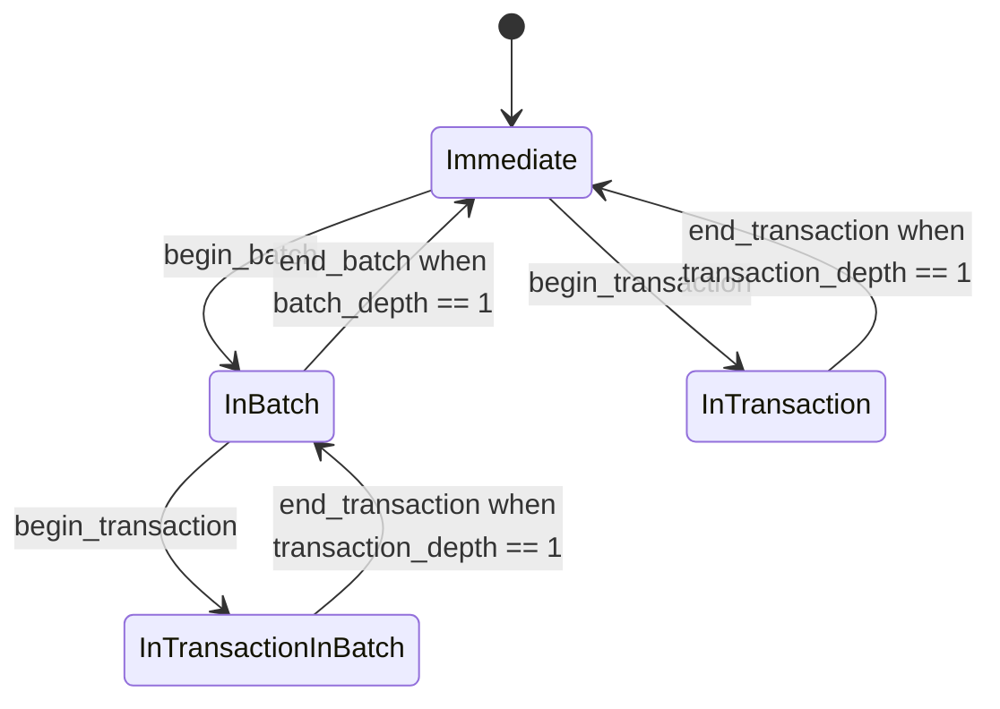

**Status:** not implemented yet, but I'm confident about most of the design apart from the explicitly stated [[#open questions]].
This document currently mixes normative aspects with planned design of the rust implementation.
Once it is settled and implemented, the document should be split up and any rust-specific aspects should go into [kladde-rust](../rust/index).

Application authors and authors of data type implementations can use transactions and batches to group multiple mutations together to achieve atomicity even in case of an application crash (transactions) or higher throughput of very large operations (batches).
Transactions and batches only affect how mutations are persisted to the file.
They do not affect the accompanying mutations of the in-memory representation of the data — in-memory mutations are always immediate (unless a manual implementation of a custom data type does something special).

## Distinction between transaction and batches

The [[journal]] records mutations as a sequence of *transactions*, where each transaction consists of a sequence of operations (*ops*).
Transactions are the unit of atomicity: if the application crashes while application code or a data type implementation is recording a transaction, or while the backend is appending a transaction to the journal, then the next time kladde loads the file it will replay the transaction either completely or not at all.

While the journal only deals with one form of transactions, the backend provides three mechanisms for creating transactions on top of the journal:

| API           | Effect on the journal                                                                                                                                     | Utility                                                                                                                               | When to use                                                                                                               |
| ------------- | --------------------------------------------------------------------------------------------------------------------------------------------------------- | ------------------------------------------------------------------------------------------------------------------------------------- | ------------------------------------------------------------------------------------------------------------------------- |
| `Transaction` | Wraps a sequence of ops in a single transaction that is appended to the journal atomically once the caller commits (or drops) the transaction.            | **correctness:** either all or none of the ops are persisted, so a crash can't lead to any invalid intermediate state.                | Whenever intermediate state would be invalid.                                                                             |
| `Batch`       | Cuts a long sequence of ops into reasonably sized subsequences (respecting [[#nesting\|nested transactions]] and wraps each subsequence in a transaction. | **optimization:** reduces the number of file I/O operations while still bounding the size of the journal and of any individual write. | When potentially many operations are performed at once, with (some) valid intermediate states (e.g., large data imports). |
| `Op`          | Any op performed outside of a batch or transaction is recorded to the journal as its own transaction so that sole ops can never be torn during a crash.   | **simplicity:** by default, changes are persisted immediately.                                                                        | single mutations, prototyping                                                                                             |
In detail,

- **`Transaction`s enforce correctness:** in complex data types, a single semantic operation (e.g., appending an item to a vector) often results in multiple ops being appended to the journal (e.g., growing the vector size and then writing the data).
  These operations have to be executed as one atomic unit since interrupting in-between can lead to an invalid state (e.g., uninitialized data in the vector or a memory leak).
  The same also happens in application code, where a transition from a valid initial to a valid final state sometimes has to go through invalid intermediate states.
  Transactions allow both application authors and authors of data type implementations to prevent any invalid intermediate state from ever being recorded in a kladde file.
- **`Batch`es provide an optimization:** while kladde is designed to handle sequences of many small mutations well, its promise to be crash resistant results in a small amount of unavoidable overhead per transaction.
  This overhead is usually worth the benefits as it is what allows kladde to persist any mutation immediately, but the overhead can add up when some action triggers a large or unbounded burst of mutations all at once (e.g., the user just pasted a large piece of content from the clipboard into some kladde-backed editor).
  Also, for such quick bursts, having each operation persisted immediately would not provide much benefit.
  It might therefore be tempting to wrap quick bursts of activity into a transaction, but very large transactions perform poorly in kladde because they require the journal and therefore the file to temporarily grow proportionally to the number and size of the operations.
  Wrapping a long sequence of operations in a batch provides a the best middle ground: the backend decides by itself how to divide the sequence into appropriately sized transactions, respecting any explicit interactions inside the batch (see [[#nesting]]).

**Recommendations:**
- For most application code, reach for a *batch* or a *free-standing op* by default.
  For multiple operations, batches are cheaper, and even for a single op a batch has no overhead over a free-standing op in terms of I/O, and batches are also virtually free in terms of CPU time (probably even completely free in a compiled language; TODO: verify).
  However, *remember that batches delay persistence*: batches are only guaranteed to be committed by the time you drop or explicitly `.end()` them, so keeping a batched guard around for a long time would delay persistence, defeating kladde's main feature of making persistence immediate.
- Use *transactions* when application logic requires atomicity.
  *Transactions should not be excessively long* because the journal has to grow in size to hold the entire transaction.
  If you find yourself in need of creating a transaction that contains either lots of or an unbounded amount of mutation, then this is almost certainly a sign that either your application logic creates too long sequences of state transformations with invalid intermediate states, or you chose the wrong data types to manage your app state (e.g., a vector where a rope or an ordered tree should be used).
  When atomicity is really required for a large mutation, it can often easily be imposed at the application level (e.g., when importing a large amount of data, use a batch to store the data in a struct that is not yet user facing; only once that's done, store a pointer to that struct in a user-facing field of your persisted data type).
  TODO: code example (including cleanup of memory leaks after a crash, if necessary)
- If you have a long sequence of operations where *some parts* need to be persisted atomically, then use a batch with a few smaller transactions inside.
  Kladde is designed to work performantly with this pattern.

## Nesting

On the level of application code and data type implementations, transactions and batches can be nested arbitrarily.
This allows, e.g., the implementation of `PersistableVec::push` to create a transaction for its operations without having to care about whether the caller already called the method from within a transaction.
The backend flattens nested transactions and batches because the journal ultimately only deals with a flat sequence of transactions.

The following table describes how transactions and batches nest:

| ↓ outer; inner →    | Transaction in a ...            | Batch in a ...                                                |
| ------------------- | ------------------------------- | ------------------------------------------------------------- |
| **... transaction** | only outer transaction survives | only (outer) transaction survives *(shouldn't usually occur)* |
| **... batch**       | both survive                    | only outer batch survives                                     |

**Justifications:**

- **Transaction in a transaction ⇒ outer transaction:** the inner transaction is meaningless because its atomicity is already enforced by the outer transaction.
  This kind of nesting is fine and expected to happen often in composable code.
- **Transaction in a batch ⇒ both survive:** The inner batch enforces atomicity, so when the backend chops up the batch into subsequences, no cutting point is allowed to lie inside the inner batch.
  This kind of nesting is fine and expected to happen often in composable code.
- **Batch in a batch ⇒ only outer batch survives:** the inner batch is meaningless because the outer batch already indicates that commits are allowed to be deferred.
  This kind of nesting is fine but probably not very useful.
- **Batch in a transaction ⇒ only (outer) transaction survives:** the inner batch is meaningless because the outer transaction already forces the batched ops to be committed as a group, even preventing the batch to be broken up into multiple transactions.
  This kind of nesting is a potential code smell: batches are used for large or unbounded operations, but transactions should usually be short sequences.
  Transactions should only be used to prevent invalid states from being committed, so if a long sequence of operations needs to be wrapped in a single transaction then this implies that there is a long chain of state transitions with only invalid intermediate states.
  The concrete effect of a very long transaction is that the journal will grow large, thus leading to a large (intermittent) contribution to the file size, which then has to be fixed over time by compaction.

## Implementation

The `JournaledWriteBackend` maintains an in-memory buffer `ops: VecDeque<u8>` for sequences of serialized ops (not all of which are necessarily already in the file, see below).
It `JournaledWriteBackend` further has private (or maybe `pub(crate)`) methods `.begin_transaction()`, `.end_transaction()`, `.begin_batch()`, and `.end_batch()` that are called by the publicly visible [[#RAII types]].
These methods maintain a state of the following type:

```
enum TransactionState {
	Immediate,
	InBatch { batch_depth: NonZeroU32, committed_cursor: usize },
	InTransaction { transaction_depth: NonZeroU32, batch_depth: u32, committed_cursor: usize },
	InTransactionInBatch { transaction_depth: NonZeroU32, batch_depth: NonZeroU32, committed_cursor: usize, ready_cursor: usize },
}
```

Here,

- `transaction_depth` counts the number of calls to `.begin_transaction()` minus the number of calls to `.end_transaction()`.
- `batch_depth` counts the number of calls to `.begin_batch()` minus the number of calls to `.end_batch()`.

Both have the implied value of zero in any enum variant where they aren't present.

Further, the two cursors `committed_cursor <= ready_cursor <= journal.len()` (see table below for implied values where they are not explicit) divide the sequences of ops that have occurred since the last flush into 3 segments:

- `committed := ops[..committed_cursor]`: persisted ops, i.e., those written to the on-storage representation of the journal; advancing `committed_cursor` (either explicitly or implicitly by appending to `ops` when in `Immediate` state) is always accompanied with writing the ops out to disk.
- `ready := ops[committed_cursor..ready_cursor]`: pending ops of the current batch that are ready to be appended to `committed`.
- `transaction := ops[ready_cursor..]`: pending ops of an ongoing transaction.

Transitions between the 4 enum variants of `TransactionState` are triggered by `.begin_transaction()`, `.end_transaction()`, `.begin_batch()`, and `.end_batch()`:


Upward state transitions and the recording of `Op`s can trigger flushing as follows,

-  **`InTransaction` → `Immediate`:** if `committed` is nonempty and `committed + transaction` would overflow the journal: flush.
   Regardless of whether a flush was performed, then append `transaction` to the on-disk journal (encoded as a single transaction).
	- **Analogously, when recording an `Op` in `Immediate` state:** if `committed` is nonempty and `committed + Op` would overflow the journal: flush.
	  Then, regardless of whether flushing occurred, append `Op` to the on-disk journal (and to the in-memory `ops` buffer).
- **`InTransactionInBatch` → `InBatch`:** if `committed + batch` is nonempty and `committed + batch + transaction` would overflow the journal: append `ready` to the on-storage journal if non-empty (encoded as a single transaction), advance `committed_cursor`, and flush.
  No explicit cursor update necessary since the transition to `InBatch` implicitly advances `ready_cursor` to the end of the journal.
	- **Analogously, when recording an `Op` in `InBatch` state:** if `committed + batch` is nonempty and `committed + batch + Op` would overflow the journal: append `ready` to the on-storage journal if non-empty (encoded as a single transaction), advance `committed_cursor`, and flush.
	  Then, regardless of whether flushing occurred, append `Op` to the in-memory `ops` buffer (but not to the on-disk journal).
- **`InBatch` → `Immediate`:** append `ready` to the on-storage journal (encoded as a single transaction).
  No explicit cursor update necessary since the transition to `Immediate` implicitly advances `committed_cursor` to the end of the journal.
  Don't flush.

The following table describes the states and state transitions in detail: 

|                                       | `Immediate`                    | `InBatch`                                            | `InTransaction`                                                                                  | `InTransactionInBatch`                                    |
| ------------------------------------- | ------------------------------ | ---------------------------------------------------- | ------------------------------------------------------------------------------------------------ | --------------------------------------------------------- |
| **`transaction_depth`:**              | `0` (implicit)                 | `0` (implicit)                                       | `> 0`                                                                                            | `> 0`                                                     |
| **`batch_depth`:**                    | `0` (implicit)                 | `> 0`                                                | any                                                                                              | `> 0`                                                     |
| **`committed_cursor`:**               | `ops.len()` (implicit)         | explicit                                             | explicit                                                                                         | explicit                                                  |
| **`ready_cursor`:**                   | `ops.len()` (implicit)         | `ops.len()` (implicit)                               | `committed_cursor` (implicit)                                                                    | explicit                                                  |
| **Effect of `.begin_transaction()`:** | `InTransaction { t: 1, b: 0 }` | `InTransactionInBatch { t: 1, .. }`                  | `transaction_depth += 1`                                                                         | `transaction_depth += 1`                                  |
| **Effect of `.end_transaction()`:**   | error                          | error                                                | `transaction_depth -= 1;`<br>if it reaches `0`:<br>`Immediate` if `batch_depth == 0`, else error | `transaction_depth -= 1;`<br>if it reaches `0`: `InBatch` |
| **Effect of `.begin_batch()`:**       | `InBatch { b: 1 }`             | `batch_depth += 1`                                   | `batch_depth += 1`                                                                               | `batch_depth += 1`                                        |
| **Effect of `.end_batch()`:**         | error                          | `batch_depth -= 1`<br>if it reaches `0`: `Immediate` | `batch_depth -= 1`                                                                               | `batch_depth -= 1;`<br>if it reaches `0`: error           |

## RAII types

The methods `.begin_transaction()`, `.end_transaction()`, `.begin_batch()`, and `.end_batch()` are private because they are dangerous: it is very easy to forget an `.end_transaction()` call, which will prevent all subsequent mutations from ever being persisted.
The public API provides save access via RAII types `Transaction` and `Batch` that wrap `JournaledWriteBackend` (or `JounaledBackend`?).
The types can be created with public `.transaction()` and `.batch()` methods on `JounaledWriteBackend`, and they can be consumed with `Transaction::commit(self) -> Result<(), ...>` and `Batch::end(self) -> Result<(), ...>`.
The `Drop` implementation should call `commit` / `end` and unwrap the result.

There is no `Transaction::cancel`.
While it would be possible to cancel the effects of the transaction to the file, its effects to the in-memory representation of the persisted data are always immediate.
Redoing them would require reloading the entire affected data type from the file.

### Open Questions

- We should also provide a simple way to turn any guard into a guard that holds `Transaction` or `Batch` instead of the backend itself (or that replicates the RAII behavior of `Transaction` and `Batch` manually?).
  How can this be done generically?
- Possible alternative (or add-on): give the user the choice between guards in immediate, transaction, or batch mode already at the time they create a guard so that it is easier to default to `Batch` for a small sequence of transactions.
  This might be implementable by default-implemented methods on `Persistable`.
- What should happen on unwind, i.e., if code on the caller side panics while holding a `Transaction` or `Batch`?
  Should the backend be set into a poisoned state or is it fine, at least for batches (probably not for transactions), to end them regularly even on unwind?